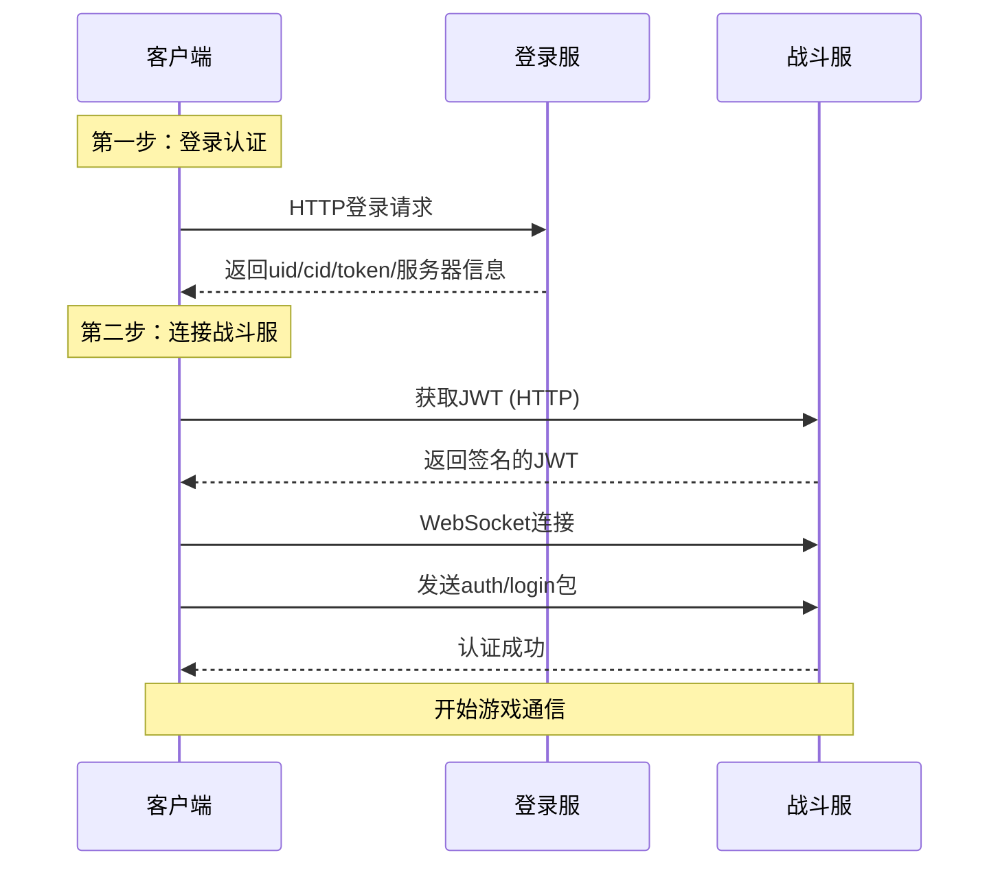

# 网络架构文档

## 概述

游戏采用分层网络架构，通过HTTP进行登录认证，使用WebSocket保持长连接进行实时通信。系统实现了自动重连、消息路由、请求响应管理等核心功能。

## 架构设计

### 整体架构图

```
┌──────────────────────────────────────────┐
│              客户端                        │
├──────────────────────────────────────────┤
│         BattleServerBridge               │  入口层
├──────────────────────────────────────────┤
│     BattleServerConnector                │  连接层
│            ↓                              │
│         MessageHub                        │  消息中心
├──────────────────────────────────────────┤
│     各种Service (Union/Player/...)        │  业务层
└──────────────────────────────────────────┘
                ↓ WebSocket
┌──────────────────────────────────────────┐
│            战斗服务器                      │
└──────────────────────────────────────────┘
```

### 核心组件职责

| 组件 | 职责 | 通信协议 |
|------|------|---------|
| **BattleServerBridge** | 统一连接入口，封装连接流程 | - |
| **BattleServerConnector** | JWT获取、WebSocket连接、认证 | HTTP+WebSocket |
| **MessageHub** | 消息路由、请求管理、重连机制 | WebSocket |
| **Services** | 业务逻辑实现 | 通过MessageHub |

## 连接流程

### 两步认证机制



### 关键代码实现

#### 1. 统一连接入口

```csharp
// BattleServerBridge.cs - 对外统一接口
public static class BattleServerBridge
{
    public static void Connect(
        string loginJson,
        Action<AuthSuccessPayload> onOk,
        Action<string> onFail)
    {
        var info = JsonUtility.FromJson<LoginServResp>(loginJson);
        var connector = BattleServerConnector.Instance;
        
        connector.OnAuthSuccess = onOk;
        connector.OnError = onFail;
        connector.StartConnect(info);
    }
}
```

#### 2. JWT获取与WebSocket连接

```csharp
// BattleServerConnector.cs - 核心连接流程
private IEnumerator Workflow(LoginServResp info)
{
    // Step 1: 获取JWT
    var jwtUrl = $"http://{info.server_ip_address}:{info.server_port}/api/user/GetJWT";
    var jwtResp = yield GetJWT(jwtUrl, info);
    
    // 保存signature
    PlayerData.I.signature = jwtResp.signed_identity.signature;
    
    // Step 2: WebSocket连接
    var wsUrl = $"ws://{info.server_ip_address}:{info.server_port}/ws";
    _ws = new WebSocket(wsUrl);
    
    // 监听connect init消息
    _ws.OnMessage += bytes => {
        if (json.Contains("connect init")) {
            // 发送认证包
            SendAuthLogin(jwtResp.signed_identity);
        }
    };
    
    yield return _ws.Connect();
}
```

## MessageHub消息中心

### 核心功能

1. **请求响应管理** - 通过reqId匹配请求和响应
2. **事件推送** - 处理服务器主动推送
3. **自动重连** - 断线后自动恢复连接
4. **消息路由** - 分发消息到对应处理器

### 请求响应机制

```csharp
// MessageHub.cs - 请求管理
public void Request<T>(
    string method, 
    T data,
    Action<Response> callback,
    float timeout = 8f)
{
    var reqId = ++_idGen;
    
    // 构建请求包
    var packet = new {
        reqId = reqId,
        method = method,
        data = data
    };
    
    // 注册回调
    _pendingId[reqId] = callback;
    
    // 发送请求
    _ws.SendText(JsonUtility.ToJson(packet));
    
    // 启动超时检查
    StartCoroutine(TimeoutCheck(reqId, timeout));
}

// 处理响应
private void OnWsMessage(byte[] bytes)
{
    var json = Encoding.UTF8.GetString(bytes);
    var header = JsonUtility.FromJson<ResponseHeader>(json);
    
    if (_pendingId.TryGetValue(header.reqId, out var callback))
    {
        _pendingId.Remove(header.reqId);
        callback?.Invoke(new Response {
            reqId = header.reqId,
            code = header.code,
            msg = header.msg,
            dataJson = ExtractDataField(json)
        });
    }
}
```

### 增强版重连机制

```csharp
// MessageHub.cs - 自动重连
private IEnumerator EnhancedReconnectLoop()
{
    int retryCount = 0;
    float[] retryDelays = { 1f, 2f, 5f, 10f, 30f };
    
    while (retryCount < 5)
    {
        float delay = retryDelays[retryCount];
        yield return new WaitForSecondsRealtime(delay);
        
        // Step 1: 重新获取JWT
        bool jwtSuccess = false;
        yield return GetNewJWT(success => jwtSuccess = success);
        
        if (!jwtSuccess)
        {
            retryCount++;
            continue;
        }
        
        // Step 2: 重新连接WebSocket
        var wsUrl = $"ws://{PlayerData.I.serverIpAddress}:{PlayerData.I.serverPort}/ws";
        _ws = new WebSocket(wsUrl);
        
        // Step 3: 发送认证
        yield return ConnectAndAuth();
        
        if (authSuccess)
        {
            Debug.Log("[Hub] 重连成功!");
            break;
        }
        
        retryCount++;
    }
}
```

## 业务层Service

### Service基础模式

```csharp
public class UnionService : MonoBehaviour
{
    // 单例访问
    public static UnionService I { get; private set; }
    
    // 统一的请求方法
    public void GetUnionInfo(string unionId, 
                            Action<UnionInfo> onSuccess,
                            Action<string> onError)
    {
        var request = new { union_id = unionId };
        
        MessageHub.I.Request("union/get_union_info", request, response =>
        {
            if (response.code == 0)
            {
                var info = JsonConvert.DeserializeObject<UnionInfo>(response.dataJson);
                onSuccess?.Invoke(info);
            }
            else
            {
                onError?.Invoke(response.msg);
            }
        });
    }
}
```

## 网络优化

### 1. 请求合并

```csharp
// 批量请求示例
public void BatchRequest(List<string> ids)
{
    var request = new { ids = ids };
    MessageHub.I.Request("batch_get", request, HandleBatchResponse);
}
```

### 2. 缓存机制

```csharp
// 缓存管理
private Dictionary<string, CachedData> cache = new();

public void GetData(string id, Action<Data> callback)
{
    if (cache.TryGetValue(id, out var cached) && !cached.IsExpired)
    {
        callback(cached.data);
        return;
    }
    
    // 缓存失效，发起请求
    RequestFromServer(id, callback);
}
```

### 3. 消息队列处理

```csharp
void Update()
{
    #if !UNITY_WEBGL || UNITY_EDITOR
    // 非WebGL平台需要手动处理消息队列
    _ws?.DispatchMessageQueue();
    #endif
}
```

## 错误处理

### 超时机制

```csharp
IEnumerator TimeoutCheck(int id, float timeout)
{
    yield return new WaitForSecondsRealtime(timeout);
    
    if (_pendingId.TryGetValue(id, out var callback))
    {
        _pendingId.Remove(id);
        callback?.Invoke(new Response { 
            reqId = id, 
            code = 999, 
            msg = "timeout" 
        });
    }
}
```

### 错误码规范

| 错误码 | 含义 | 处理方式 |
|--------|------|---------|
| 0 | 成功 | 正常处理 |
| 400 | 参数错误 | 检查请求参数 |
| 401 | 未认证 | 重新登录 |
| 403 | 无权限 | 提示用户 |
| 500 | 服务器错误 | 稍后重试 |
| 999 | 超时 | 重试或提示 |

## 登出处理

### 网络断开流程

```csharp
// LogoutHandler.cs
private static void DisconnectNetwork()
{
    // 1. 关闭BattleServerConnector的WebSocket
    if (BattleServerConnector.Instance != null)
    {
        var ws = GetWebSocket(BattleServerConnector.Instance);
        ws?.Close();
        Destroy(BattleServerConnector.Instance.gameObject);
    }
    
    // 2. 关闭MessageHub的WebSocket
    if (MessageHub.I != null)
    {
        MessageHub.I.CloseConnection();
        Destroy(MessageHub.I.gameObject);
    }
}
```

## 性能监控

### 网络状态监控

```csharp
public class NetworkMonitor
{
    public int PendingRequests => _pendingId.Count;
    public WebSocketState ConnectionState => _ws?.State ?? WebSocketState.Closed;
    public float LastPing { get; private set; }
    
    // 定期Ping检测
    IEnumerator PingCheck()
    {
        while (_ws?.State == WebSocketState.Open)
        {
            var startTime = Time.realtimeSinceStartup;
            
            Request("ping", null, response => {
                LastPing = (Time.realtimeSinceStartup - startTime) * 1000;
            });
            
            yield return new WaitForSeconds(30);
        }
    }
}
```

## 最佳实践

### 1. 统一错误处理

```csharp
// 封装通用错误处理
private void HandleResponse<T>(Response response, 
                               Action<T> onSuccess,
                               Action<string> onError)
{
    if (response.code == 0)
    {
        try
        {
            var data = JsonConvert.DeserializeObject<T>(response.dataJson);
            onSuccess?.Invoke(data);
        }
        catch (Exception e)
        {
            onError?.Invoke($"解析错误: {e.Message}");
        }
    }
    else
    {
        onError?.Invoke(GetErrorMessage(response.code, response.msg));
    }
}
```

### 2. 请求防重

```csharp
private HashSet<string> pendingRequests = new();

public void SafeRequest(string key, Action request)
{
    if (pendingRequests.Contains(key)) return;
    
    pendingRequests.Add(key);
    request();
    
    // 请求完成后移除
    StartCoroutine(RemoveAfterDelay(key, 1f));
}
```

### 3. 连接状态管理

```csharp
public enum ConnectionState
{
    Disconnected,
    Connecting,
    Connected,
    Reconnecting,
    Error
}

// 状态变化通知
public event Action<ConnectionState> OnStateChanged;
```

## 注意事项

1. **WebSocket在不同平台的差异** - WebGL不需要DispatchMessageQueue
2. **JWT过期处理** - 需要定期刷新或重新获取
3. **内存泄漏** - 注意清理事件订阅和协程
4. **并发控制** - 避免同时发送大量请求
5. **断线重连** - 保存必要的状态信息用于恢复