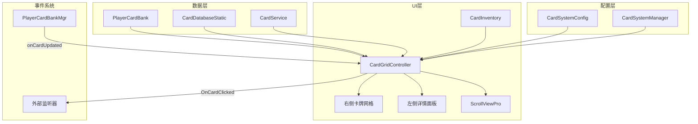

# 卡牌列表UI系统 (CardInventory)

## 系统概述

CardInventory 是游戏中展示和管理所有卡牌的核心UI系统。系统使用 UIToolkit 和 ScrollViewPro 实现虚拟化滚动，支持卡牌筛选、排序、选中展示等功能。系统采用纵向网格布局，左侧显示选中卡牌详情，右侧展示所有卡牌列表。

## 系统架构



## 核心组件

### CardGridController - 网格控制器

主要的卡牌列表控制器，负责管理整个卡牌显示逻辑。

```csharp
public class CardGridController : MonoBehaviour
{
    #region 事件
    /// <summary>
    /// 卡片点击事件
    /// </summary>
    public static event Action<CardInfoStatic, PlayerCard> OnCardClicked;
    #endregion

    #region 私有字段
    // 核心引用
    private CardSystemManager manager;
    private CardSystemConfig config => manager?.Config;
    private ScrollViewPro scrollView;
    private VisualElement gridRoot;
    private Button sortButton;
    private Label loadingLabel;

    // 左侧显示元素缓存
    private VisualElement selectedCardVE;
    private Label cardNameLabel;
    private VisualElement tierDisplay;
    private VisualElement starPanelDisplay;
    private readonly VisualElement[] starElements = new VisualElement[5];

    // 品质筛选相关
    private VisualElement allGroup, sTierGroup, aTierGroup, bTierGroup;
    private VisualElement allClickBg, sClickBg, aClickBg, bClickBg;

    // 排序
    private int sortModeIndex = 0;
    private string[] sortModes => config?.layoutSettings?.sortModeNames ?? 
        new[] { "稀有度", "星级", "等级" };

    // 筛选
    public enum TierFilter { All, S, A, B }
    private TierFilter currentTierFilter = TierFilter.All;

    // 选中状态
    private string selectedCardId;
    private VisualElement currentSelectedContainer;

    // 缓存
    private readonly Dictionary<string, VisualElement> cardElements = new();
    private readonly Dictionary<string, Button> cardBtnMap = new();

    // 数据状态
    private bool isDataLoaded = false;

    // 布局计算
    private int currentColumns = 4;
    private float lastGlobalScale = 1f;
    #endregion
}
```

### 初始化流程

```csharp
public void Initialize(CardSystemManager manager)
{
    this.manager = manager;
    SetupUI();
    CheckDataReady();
}

private void SetupUI()
{
    var root = manager.UIDoc.rootVisualElement;
    
    // 查找并缓存左侧显示元素
    CacheLeftPanelElements(root);
    
    // 设置品质筛选
    SetupTierFilter(root);
    
    // 查找 Cards 面板
    var cardsPanel = root.Q<VisualElement>("Cards");
    
    // 在 Cards 中查找 ScrollView
    scrollView = cardsPanel.Q<ScrollViewPro>("CardScrollView");
    
    // 设置网格根容器
    gridRoot = scrollView.contentContainer;
    
    // 设置排序按钮
    SetupSortButton(root);
    
    // 监听卡片更新
    if (PlayerCardBankMgr.I != null)
    {
        PlayerCardBankMgr.I.onCardChanged += OnCardStatChanged;
        PlayerCardBankMgr.I.onCardUpdated += OnCardUpdated;
    }
}
```

## 筛选系统

### 品质筛选

```csharp
private void OnTierFilterClicked(TierFilter filter)
{
    currentTierFilter = filter;
    UpdateTierFilterVisual();
    RefreshDisplay();
}

private bool FilterByTier(CardInfoStatic card)
{
    return currentTierFilter switch
    {
        TierFilter.S => card.tier == Tier.S,
        TierFilter.A => card.tier == Tier.A,
        TierFilter.B => card.tier == Tier.B,
        _ => true // All
    };
}

private void UpdateTierFilterVisual()
{
    // 隐藏所有选中背景
    allClickBg?.SetDisplay(DisplayStyle.None);
    sClickBg?.SetDisplay(DisplayStyle.None);
    aClickBg?.SetDisplay(DisplayStyle.None);
    bClickBg?.SetDisplay(DisplayStyle.None);
    
    // 显示当前选中的背景
    switch (currentTierFilter)
    {
        case TierFilter.All:
            allClickBg?.SetDisplay(DisplayStyle.Flex);
            break;
        case TierFilter.S:
            sClickBg?.SetDisplay(DisplayStyle.Flex);
            break;
        case TierFilter.A:
            aClickBg?.SetDisplay(DisplayStyle.Flex);
            break;
        case TierFilter.B:
            bClickBg?.SetDisplay(DisplayStyle.Flex);
            break;
    }
}
```

## 排序系统

### 排序模式

```csharp
// CardSystemConfig.cs
public string[] sortModeNames = { 
    "<u>稀有度</u>排序", 
    "<u>星级</u>排序", 
    "<u>等级</u>排序" 
};
```

### 排序实现

```csharp
private void OnSortButtonClicked()
{
    if (!isDataLoaded) return;
    
    sortModeIndex = (sortModeIndex + 1) % sortModes.Length;
    UpdateSortButtonText();
    ApplySort();
}

private List<CardInfoStatic> GetSortedCards()
{
    if (config?.cardDatabase == null) return new List<CardInfoStatic>();
    
    var cards = config.cardDatabase.AllCards.ToList();
    
    // 先应用品质筛选
    if (currentTierFilter != TierFilter.All)
    {
        cards = cards.Where(c => FilterByTier(c)).ToList();
    }
    
    // 再应用排序
    switch (sortModeIndex)
    {
        case 0: // 稀有度排序
            cards.Sort(CompareByRarity);
            break;
        case 1: // 星级排序
            cards.Sort(CompareByStar);
            break;
        case 2: // 等级排序
            cards.Sort(CompareByLevel);
            break;
    }
    
    return cards;
}

private int CompareByRarity(CardInfoStatic a, CardInfoStatic b)
{
    return CompareCards(a, b, (dynA, dynB, infoA, infoB) =>
    {
        // 品质优先 (S > A > B)
        int tierCmp = infoA.tier.CompareTo(infoB.tier);
        if (tierCmp != 0) return tierCmp;
        
        // 星级次之 (高星优先)
        int starCmp = (dynB?.star ?? -1).CompareTo(dynA?.star ?? -1);
        if (starCmp != 0) return starCmp;
        
        // 等级最后 (高等级优先)
        return (dynB?.level ?? -1).CompareTo(dynA?.level ?? -1);
    });
}

private int CompareCards(CardInfoStatic a, CardInfoStatic b, 
    Func<PlayerCard, PlayerCard, CardInfoStatic, CardInfoStatic, int> comparison)
{
    var dynA = PlayerCardBank.I.Get(a.id);
    var dynB = PlayerCardBank.I.Get(b.id);
    
    // 已拥有的卡牌排在前面
    bool ownedA = dynA != null;
    bool ownedB = dynB != null;
    if (ownedA && !ownedB) return -1;
    if (!ownedA && ownedB) return 1;
    
    return comparison(dynA, dynB, a, b);
}
```

## 网格布局

### 动态列数计算

```csharp
private int CalculateColumns(float containerWidth)
{
    if (containerWidth <= 0) return 4; // 默认值
    
    var settings = config?.layoutSettings;
    if (settings == null) return 4;
    
    // 使用配置的固定列数
    if (settings.columns > 0)
    {
        return settings.columns;
    }
    
    // 动态计算列数
    float availableWidth = containerWidth - 40; // 减去内边距
    float cardWithGap = settings.cardWidth + settings.colGap;
    
    // 计算能放置的最大列数
    int maxColumns = Mathf.Max(1, Mathf.FloorToInt((availableWidth + settings.colGap) / cardWithGap));
    
    // 应用列数使用率
    int adjustedColumns = Mathf.Max(settings.minColumns, 
        Mathf.FloorToInt(maxColumns * settings.columnUtilization));
    
    return Mathf.Max(settings.minColumns, adjustedColumns);
}
```

### 网格构建

```csharp
private void BuildGrid(List<CardInfoStatic> cards)
{
    if (cards == null) return;
    
    var containerWidth = scrollView.contentContainer.resolvedStyle.width;
    if (float.IsNaN(containerWidth) || containerWidth <= 0)
    {
        // 延迟执行直到容器宽度就绪
        scrollView.schedule.Execute(() =>
        {
            BuildGrid(cards);
        }).ExecuteLater(10);
        return;
    }
    
    currentColumns = CalculateColumns(containerWidth);
    
    // 清空现有网格
    gridRoot.Clear();
    cardElements.Clear();
    cardBtnMap.Clear();
    
    // 分组成行
    var rows = GroupIntoRows(cards, currentColumns);
    
    // 创建行容器
    foreach (var (row, rowIndex) in rows.Select((r, i) => (r, i)))
    {
        var rowContainer = CreateRowContainer(rowIndex);
        
        foreach (var card in row)
        {
            var cardContainer = CreateCardContainer(card);
            rowContainer.Add(cardContainer);
            cardElements[card.id] = cardContainer;
        }
        
        gridRoot.Add(rowContainer);
    }
    
    ScheduleVhSizerApply();
}

private VisualElement CreateCardContainer(CardInfoStatic info)
{
    var container = config.cardTemplate.Instantiate();
    var btn = container.Q<Button>("CardSlot");
    
    // 设置卡片数据
    var pCard = PlayerCardBank.I.Get(info.id);
    bool isOwned = pCard != null;
    
    // 设置图标
    var icon = btn.Q<VisualElement>("Icon");
    if (icon != null && info.iconSprite != null)
    {
        icon.style.backgroundImage = new StyleBackground(info.iconSprite);
    }
    
    // 设置品质边框颜色
    var tierColor = GetTierColor(info.tier);
    btn.style.borderTopColor = tierColor;
    btn.style.borderRightColor = tierColor;
    btn.style.borderBottomColor = tierColor;
    btn.style.borderLeftColor = tierColor;
    
    // 设置星级
    var starPanel = btn.Q<VisualElement>("StarPanel");
    if (starPanel != null && pCard != null)
    {
        FillStars(starPanel, pCard.star);
    }
    
    // 设置未拥有的遮罩
    if (!isOwned)
    {
        btn.style.unityBackgroundImageTintColor = new Color(0.3f, 0.3f, 0.3f, 0.5f);
    }
    
    // 註册点击事件
    btn.clicked += () => OnCardClicked(info, btn);
    cardBtnMap[info.id] = btn;
    
    return container;
}
```

## 选中状态管理

### 卡片选中

```csharp
private void OnCardClicked(CardInfoStatic info, Button btn)
{
    if (info == null || btn == null) return;
    
    selectedCardId = info.id;
    var container = btn.parent;
    
    // 清除之前的选中状态
    if (currentSelectedContainer != null)
    {
        SetCardSelectedVisual(currentSelectedContainer, null, false);
    }
    
    // 设置新的选中状态
    currentSelectedContainer = container;
    SetCardSelectedVisual(container, info, true);
    
    // 显示选中卡片信息
    ShowSelected(info, PlayerCardBank.I.Get(info.id));
    
    // 触发选中事件
    OnCardClicked?.Invoke(info, PlayerCardBank.I.Get(info.id));
    
    // 刷新装备槽显示
    RefreshEquipSlots(PlayerCardBank.I.Get(info.id), container);
}

private void SetCardSelectedVisual(VisualElement container, CardInfoStatic info, bool isSelected)
{
    if (container == null) return;
    
    var btn = container.Q<Button>("CardSlot");
    if (btn == null) return;
    
    if (isSelected)
    {
        // 添加白色边框表示选中
        btn.style.borderTopColor = Color.white;
        btn.style.borderRightColor = Color.white;
        btn.style.borderBottomColor = Color.white;
        btn.style.borderLeftColor = Color.white;
        btn.style.borderTopWidth = 8;
        btn.style.borderRightWidth = 8;
        btn.style.borderBottomWidth = 8;
        btn.style.borderLeftWidth = 8;
    }
    else
    {
        // 恢复原本的品质边框
        if (info != null)
        {
            var tierColor = GetTierColor(info.tier);
            btn.style.borderTopColor = tierColor;
            btn.style.borderRightColor = tierColor;
            btn.style.borderBottomColor = tierColor;
            btn.style.borderLeftColor = tierColor;
        }
        btn.style.borderTopWidth = 2;
        btn.style.borderRightWidth = 2;
        btn.style.borderBottomWidth = 2;
        btn.style.borderLeftWidth = 2;
    }
}
```

## 左侧详情显示

### 显示选中卡片

```csharp
private void ShowSelected(CardInfoStatic info, PlayerCard dyn)
{
    if (info == null) return;
    
    // 处理幻影卡：获取实际显示的数据
    var (displayStatic, displayDynamic) = GetDisplayCardData(info, dyn);
    
    // 更新名称
    if (cardNameLabel != null)
    {
        cardNameLabel.text = displayStatic.displayName;
        cardNameLabel.style.color = GetTierColor(displayStatic.tier);
    }
    
    // 更新立绘
    if (selectedCardVE != null && displayStatic.fullBodySprite != null)
    {
        selectedCardVE.style.backgroundImage = new StyleBackground(displayStatic.fullBodySprite);
    }
    
    // 更新品质显示
    if (tierDisplay != null)
    {
        UpdateTierDisplay(displayStatic.tier);
    }
    
    // 更新星级显示
    if (starPanelDisplay != null && displayDynamic != null)
    {
        UpdateStarDisplay(displayDynamic.star);
    }
}

private (CardInfoStatic, PlayerCard) GetDisplayCardData(CardInfoStatic info, PlayerCard dyn)
{
    // 如果是幻影卡，显示复制目标的数据
    if (dyn?.isPhantom == true && !string.IsNullOrEmpty(dyn.cloneOn))
    {
        var targetCard = PlayerCardBank.I.Get(dyn.cloneOn);
        if (targetCard != null)
        {
            var targetStatic = config.cardDatabase.GetCard(targetCard.id);
            if (targetStatic != null)
            {
                return (targetStatic, targetCard);
            }
        }
    }
    
    return (info, dyn);
}
```

## 实时更新

### 卡片数据更新

```csharp
private void OnCardUpdated(string id)
{
    RefreshCard(id);
    
    // 如果更新的是当前选中的卡片，更新左侧显示
    if (selectedCardId == id)
    {
        var pCard = PlayerCardBank.I.Get(id);
        var info = config.cardDatabase.Get(id);
        if (info != null && pCard != null)
        {
            ShowSelected(info, pCard);
        }
    }
    
    // 如果选中的是幻影卡，且更新的是其复制目标，也需要更新显示
    if (!string.IsNullOrEmpty(selectedCardId))
    {
        var selectedCard = PlayerCardBank.I.Get(selectedCardId);
        if (selectedCard != null && selectedCard.isPhantom && selectedCard.cloneOn == id)
        {
            var selectedInfo = config.cardDatabase.Get(selectedCardId);
            if (selectedInfo != null)
            {
                ShowSelected(selectedInfo, selectedCard);
            }
        }
    }
}

private void RefreshCard(string cardId)
{
    if (cardBtnMap.TryGetValue(cardId, out var btn))
    {
        var info = config.cardDatabase.Get(cardId);
        var pCard = PlayerCardBank.I.Get(cardId);
        
        if (info != null)
        {
            // 更新星级
            var starPanel = btn.Q<VisualElement>("StarPanel");
            if (starPanel != null)
            {
                FillStars(starPanel, pCard?.star ?? 0);
            }
            
            // 更新装备槽
            RefreshEquipSlots(pCard, btn.parent);
        }
    }
}
```

## 公共方法

### 导航支持

```csharp
/// <summary>
/// 获取当前排序和筛选后的卡片列表
/// </summary>
public List<CardInfoStatic> GetCurrentSortedCards()
{
    if (!isDataLoaded) return new List<CardInfoStatic>();
    return GetSortedCards();
}

/// <summary>
/// 选择指定的卡片
/// </summary>
public void SelectCard(string cardId)
{
    selectedCardId = cardId;
    RestoreSelection();
}

/// <summary>
/// 滚动到指定的卡片
/// </summary>
public void ScrollToCard(string cardId)
{
    if (string.IsNullOrEmpty(cardId) || scrollView == null) return;
    
    if (!cardElements.TryGetValue(cardId, out var cardElement))
    {
        return;
    }
    
    scrollView.schedule.Execute(() =>
    {
        var rowContainer = cardElement.parent;
        if (rowContainer == null) return;
        
        // 使用 ScrollViewPro 的滚动功能
        scrollView.ScrollTo(rowContainer);
    }).ExecuteLater(50);
}

/// <summary>
/// 导航到相邻的卡片
/// </summary>
public void NavigateCard(int direction)
{
    var cards = GetSortedCards();
    if (cards.Count <= 1) return;
    
    int currentIndex = GetSelectedCardIndex();
    if (currentIndex == -1) currentIndex = 0;
    
    // 计算新索引（循环）
    int newIndex = currentIndex + direction;
    if (newIndex < 0)
        newIndex = cards.Count - 1;
    else if (newIndex >= cards.Count)
        newIndex = 0;
    
    SelectCardByIndex(newIndex);
}
```

## 性能优化

### 虚拟化滚动

系统使用 ScrollViewPro 实现虚拟化滚动，只渲染可见区域的卡片：

```csharp
// ScrollViewPro 配置
<Kamgam.UIToolkitScrollViewPro.ScrollViewPro 
    name="CardScrollView"
    snap-edge-clamp-y="true"
    touch-scroll-type="Elastic"
    scroller-buttons="false"
    vertical-scroller-visibility="Hidden">
```

### 缓存策略

```csharp
// 缓存卡片元素和按钮引用
private readonly Dictionary<string, VisualElement> cardElements = new();
private readonly Dictionary<string, Button> cardBtnMap = new();

// 重用现有元素而非重建
private void ReorderGrid(List<CardInfoStatic> cards)
{
    // 重新排序而非重建整个网格
    var orderedElements = cards
        .Select(c => cardElements.TryGetValue(c.id, out var el) ? el : null)
        .Where(el => el != null)
        .ToList();
    
    // 重新组织成行...
}
```

## 配置文件

### CardSystemConfig

```csharp
[CreateAssetMenu(fileName = "CardSystemConfig", menuName = "Card/System Config")]
public class CardSystemConfig : ScriptableObject
{
    [Header("布局设置")]
    public LayoutSettings layoutSettings;
    
    [Header("模板")]
    public VisualTreeAsset cardTemplate;
    
    [Header("数据库")]
    public CardDatabaseStatic cardDatabase;
}

[Serializable]
public class LayoutSettings
{
    [Header("卡片尺寸")]
    public float cardWidth = 280f;
    public float cardHeight = 380f;
    
    [Header("间距")]
    public float colGap = 25f;
    public float rowGap = 30f;
    
    [Header("列数设置")]
    public int columns = 0;        // 0=自动计算
    public int minColumns = 3;     // 最小列数
    public float columnUtilization = 0.9f; // 列数使用率
    
    [Header("排序")]
    public string[] sortModeNames = { 
        "<u>稀有度</u>排序", 
        "<u>星级</u>排序", 
        "<u>等级</u>排序" 
    };
    public int defaultSortMode = 0;
}
```

## 注意事项

1. **初始化时机**
   - 必须等待 CardService 数据就绪
   - 延迟执行布局计算确保容器宽度就绪

2. **幻影卡处理**
   - 显示时使用复制目标的数据
   - 更新时需要同步刷新相关卡片

3. **性能考虑**
   - 使用虚拟化滚动减少渲染压力
   - 缓存元素引用避免重复查找
   - 批量更新时使用重排序而非重建

4. **响应式布局**
   - 动态计算列数适应不同屏幕
   - 监听容器尺寸变化重新布局

5. **事件处理**
   - 正确订阅和取消订阅事件
   - 避免内存泄漏

## 相关文档

- [卡牌系统概述](./card-overview.md)
- [卡牌数据模型](./card-data-model.md)
- [CardService](./card-service.md)
- [UI系统](./card-ui-system.md)