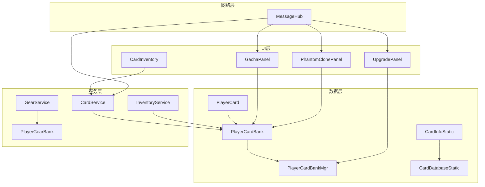
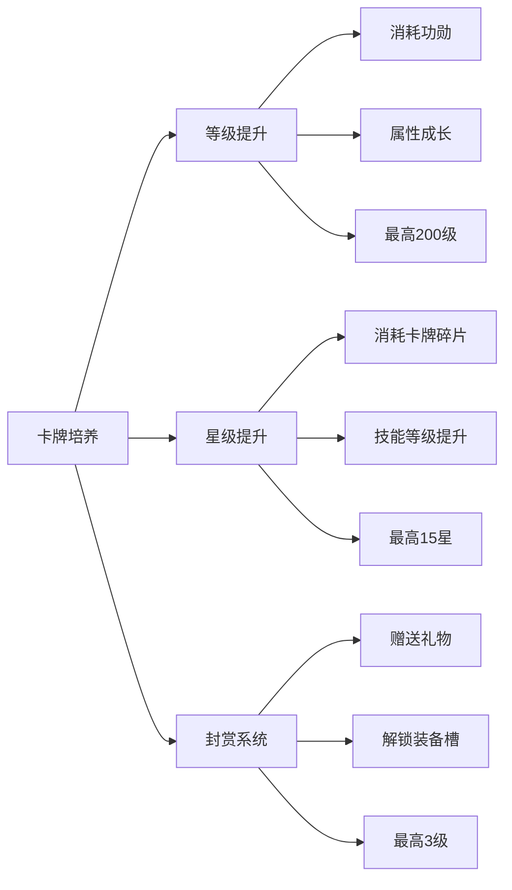

# 卡牌系统概述

## 系统简介

卡牌系统是游戏的核心玩法系统，提供完整的卡牌收集、培养、战斗体系。系统包含普通卡牌、幻影卡和主公卡，支持升级、升星、封赏等多维度培养，以及装备、技能等深度玩法。

## 系统架构



## 核心概念

### 1. 卡牌类型

#### 普通卡牌
- **卡牌ID格式**：S1, S2, A1, A2, B1, B2 等
- **获取方式**：抽卡、活动奖励、任务奖励
- **培养维度**：等级、星级、封赏等级
- **装备系统**：可装备武器、护甲、坐骑
- **技能系统**：1个主动技能 + 2个被动技能

#### 幻影卡
- **特殊机制**：复制其他已拥有卡牌的属性
- **限制条件**：
  - 不能独立升级、升星、封赏
  - 属性跟随复制目标同步
  - 可能有时间限制（expireTime）
  - 不能装备道具
- **使用场景**：临时增强阵容、体验高级卡牌

#### 主公卡
- **卡牌ID**：LORD
- **特殊性**：玩家角色本身，有独立的升级系统
- **装备槽**：默认全部解锁

### 2. 卡牌品质

| 品质 | 标识 | 颜色 | 示例ID |
|------|------|------|--------|
| **S** | Tier.S | 金色 | S1, S2, S3... |
| **A** | Tier.A | 紫色 | A1, A2, A3... |
| **B** | Tier.B | 蓝色 | B1, B2, B3... |

### 3. 培养系统



## 数据模型

### PlayerCard - 动态数据

```csharp
[Serializable]
public class PlayerCard
{
    public string id;           // 卡牌ID (如: "S1", "A1", "LORD")
    public int level = 1;       // 等级 1-200
    public int star = 0;        // 星级 0-15
    public int copies = 0;      // 拥有的碎片数量
    
    // 封赏系统
    public int giftLv = 0;      // 封赏等级 0-3
    public int giftExp = 0;     // 封赏经验（累计值）
    
    // 幻影卡相关
    public bool isPhantom;      // 是否为幻影卡
    public string cloneOn;      // 复制的目标卡牌ID
    public string clonedBy;     // 被哪张幻影卡复制
    public long expireTime;     // 过期时间戳
    
    // 装备信息
    public CardEquip equip = new CardEquip();
    
    // 元数据
    public long updatedAt;      // 更新时间戳
}
```

### CardEquip - 装备数据

```csharp
[Serializable]
public class CardEquip
{
    public string weaponUuid;      // 武器UUID
    public string armorUuid;       // 护甲UUID
    public string accessoryUuid;   // 坐骑UUID
    
    public bool weaponUnlocked;    // 武器槽已解锁（封赏1级）
    public bool armorUnlocked;     // 护甲槽已解锁（封赏2级）
    public bool mountUnlocked;     // 坐骑槽已解锁（封赏3级）
}
```

### CardInfoStatic - 静态配置

```csharp
[Serializable]
public class CardInfoStatic
{
    public string id;                      // 卡牌ID (S1, A1等)
    public string displayName;             // 显示名称
    public Tier tier;                      // 品质等级
    public Faction faction;                // 阵营
    public Sprite iconSprite;              // 头像
    public Sprite fullBodySprite;          // 全身立绘
    
    // 技能配置
    public string activeSkillId;           // 主动技能ID
    public string passiveOneId;            // 被动技能1 ID
    public string passiveTwoId;            // 被动技能2 ID
    
    // 属性成长
    public float[] base_value_multiplier;  // 基础属性倍率 [攻,防,智,统]
    
    [TextArea] 
    public string description;             // 卡牌描述
}
```

## 核心管理器

### PlayerCardBank - 卡牌仓库

```csharp
public class PlayerCardBank
{
    // 单例访问
    public static PlayerCardBank I { get; private set; }
    
    // 所有卡牌列表
    public List<PlayerCard> cards = new();
    
    // 快速查找字典
    private Dictionary<string, PlayerCard> _lookup;
    
    // 核心方法
    public PlayerCard Get(string id);           // 获取卡牌
    public void AddCard(PlayerCard card);       // 添加卡牌
    public void RemoveCard(string cardId);      // 移除卡牌
    public void UpdateOrAdd(string id, long copies); // 更新碎片
    public void Clear();                        // 清空所有
}
```

### PlayerCardBankMgr - 业务管理器

```csharp
public class PlayerCardBankMgr : MonoBehaviour
{
    // 单例访问
    public static PlayerCardBankMgr I { get; private set; }
    
    // 事件通知
    public Action<string> onCardChanged;   // 卡牌变化
    public Action<string> onCardUpdated;   // 卡牌更新
    
    // 升级相关
    public void Upgrade(string id);                    // 升级
    public void UpgradeStar(string id, bool useGen);   // 升星
    public void AddGiftExp(string id, int exp);        // 添加封赏经验
    
    // 装备相关
    public void EquipWeapon(string id, string weaponId);
    public void EquipArmor(string id, string armorId);
    public void EquipMount(string id, string mountId);
    
    // 幻影卡相关
    public void SyncPhantomsForCard(string originalCardId);
    public void RemoveExpiredPhantoms();
}
```

## 数据流

### 1. 服务器数据格式

```csharp
// 从服务器获取的卡牌数据
public class ServerCardData
{
    public string card_id;      // 卡牌ID: "S1", "A1" 等
    public int level;           // 等级
    public int star;            // 星级
    public int gift_level;      // 封赏等级
    public int gift_progress;   // 封赏进度
    
    // 幻影卡
    public int is_phantom;      // 0=普通, 1=幻影
    public string clone_on;     // 复制目标
    public long expire_time;    // 过期时间
    
    // 装备
    public string weapon_id;    // 武器ID
    public string armor_id;     // 护甲ID
    public string horse_id;     // 坐骑ID
}
```

### 2. 抽卡获得格式

```csharp
// 抽卡时的格式
"Card_S1"  // 获得S1卡牌
"Card_A1"  // 获得A1卡牌

// 碎片格式
"HeroCrest_S1"        // S1的专属碎片
"HeroCrest_SGeneral"  // S级通用碎片
"HeroCrest_AGeneral"  // A级通用碎片
"HeroCrest_BGeneral"  // B级通用碎片
```

## 模块依赖

| 模块 | 依赖模块 | 说明 |
|------|---------|------|
| **升级系统** | CardBank, ResourceBank | 需要读写卡牌数据和消耗资源 |
| **升星系统** | CardBank, InventoryService | 需要消耗碎片道具 |
| **封赏系统** | CardBank, InventoryService | 需要消耗礼物道具 |
| **抽卡系统** | CardBank, GachaConfig | 需要添加新卡和读取概率配置 |
| **幻影卡系统** | CardBank, CardService | 需要同步复制目标数据 |
| **装备系统** | CardBank, GearService, HorseService | 需要管理装备状态 |

## 快速开始

### 1. 获取卡牌数据

```csharp
// 获取所有卡牌
var allCards = PlayerCardBank.I.cards;

// 获取特定卡牌
var s1Card = PlayerCardBank.I.Get("S1");
var lordCard = PlayerCardBank.I.Get("LORD");

// 筛选普通卡牌
var normalCards = allCards.Where(c => !c.isPhantom).ToList();

// 筛选幻影卡
var phantomCards = allCards.Where(c => c.isPhantom).ToList();
```

### 2. 卡牌升级

```csharp
// 检查升级条件
var card = PlayerCardBank.I.Get("S1");
var cost = LevelStatCalculator.GetUpgradeCost(card.level);

if (PlayerResourceBank.I.Get(ResourceType.Merit) >= cost.exp)
{
    // 发起升级请求
    var request = new CardUpgradeRequest { card_id = "S1" };
    MessageHub.I.Request("card/upgrade", request, OnUpgradeResponse, 10f);
}
```

### 3. 卡牌升星

```csharp
// 获取升星规则
var card = PlayerCardBank.I.Get("S1");
var rule = CardDatabaseStatic.Instance.GetStar(card.star + 1);
if (rule != null)
{
    int needShards = rule.shardsRequired;
    
    // 检查碎片（专属或通用）
    int specificShards = InventoryService.I.GetItemCount("HeroCrest_S1");
    int generalShards = InventoryService.I.GetItemCount("HeroCrest_SGeneral");
    
    if (specificShards >= needShards || 
        specificShards + generalShards >= needShards)
    {
        // 执行升星
        var request = new CardUpgradeStarRequest 
        { 
            card_id = "S1",
            use_general_crest = 1  // 使用通用碎片
        };
        MessageHub.I.Request("card/upgrade_star", request, OnResponse, 10f);
    }
}
```

### 4. 监听卡牌变化

```csharp
void OnEnable()
{
    PlayerCardBankMgr.I.onCardUpdated += OnCardUpdated;
}

void OnDisable()
{
    PlayerCardBankMgr.I.onCardUpdated -= OnCardUpdated;
}

void OnCardUpdated(string cardId)
{
    Debug.Log($"Card {cardId} has been updated");
    RefreshUI();
}
```

## 封赏等级系统

### 封赏等级与经验阈值

| 等级 | 名称 | 累计经验 | 解锁内容 |
|------|------|---------|---------|
| 0 | 未封赏 | 0 | - |
| 1 | 拜将 | 500 | 武器槽 |
| 2 | 授甲 | 5500 | 护甲槽 |
| 3 | 赐骑 | 20500 | 坐骑槽 |

### 礼物经验值

```csharp
// 礼物定义
private static readonly Dictionary<string, int> GIFT_VALUES = new Dictionary<string, int>
{
    { "Gift_dessert", 50 },     // 糕点
    { "Gift_wine", 100 },        // 美酒
    { "Gift_silk", 200 },        // 丝绸
    { "Gift_sword", 500 },       // 佩刀
    { "Gift_painting", 1000 },   // 字画
    { "Gift_jade", 1500 },       // 玉石
    { "Gift_porcelain", 2000 },  // 瓷器
};
```

## 配置文件位置

| 配置类型 | 路径 | 说明 |
|---------|------|------|
| **卡牌数据库** | `Resources/CardDatabaseStatic` | 所有卡牌的静态配置 |
| **升星规则** | `Resources/CardDatabaseStatic` | 包含在卡牌数据库中 |
| **技能数据** | `Resources/ActiveSkillDatabase` | 主动技能配置 |
| **被动技能** | `Resources/PassiveSkillDatabase` | 被动技能配置 |
| **礼物数据** | `Resources/GiftDatabase` | 礼物类型和经验值 |
| **抽卡配置** | `Resources/GachaConfig` | 概率和保底规则 |

## 调试工具

### 日志标签

```csharp
// 各模块使用统一的日志标签
Debug.Log("[PlayerCardBank] ...");
Debug.Log("[CardService] ...");
Debug.Log("[GachaPanel] ...");
Debug.Log("[PhantomClonePanel] ...");
```

## 性能优化建议

### 1. 数据缓存
- 使用Dictionary缓存频繁查询的卡牌
- 静态数据使用ScriptableObject
- 避免每帧查询PlayerCardBank

### 2. UI优化
- 使用ScrollViewPro替代默认ScrollView
- 卡牌列表使用虚拟化
- 图片资源使用Addressables异步加载

### 3. 网络优化
- 批量更新卡牌数据
- 使用增量更新而非全量同步
- 本地缓存服务器响应

## 常见问题

### Q: 卡牌ID的命名规则？

**A:** 
- S级：S1, S2, S3...
- A级：A1, A2, A3...  
- B级：B1, B2, B3...
- 主公：LORD
- 服务器返回时会带前缀，如 Card_S1 表示获得S1卡牌

### Q: 幻影卡为什么不能升级？

**A:** 幻影卡的设计理念是"镜像复制"，它的所有属性都来自复制目标。允许独立升级会破坏这个核心机制。

### Q: 卡牌数据什么时候从服务器同步？

**A:** 
- 登录时全量同步（CardService.Init）
- 执行操作后增量更新
- 切换场景时检查更新

### Q: 碎片如何获取和使用？

**A:** 
- 专属碎片：HeroCrest_S1（S1的碎片）
- 通用碎片：HeroCrest_SGeneral（S级通用）
- 使用优先级：先用专属，再用通用补充

