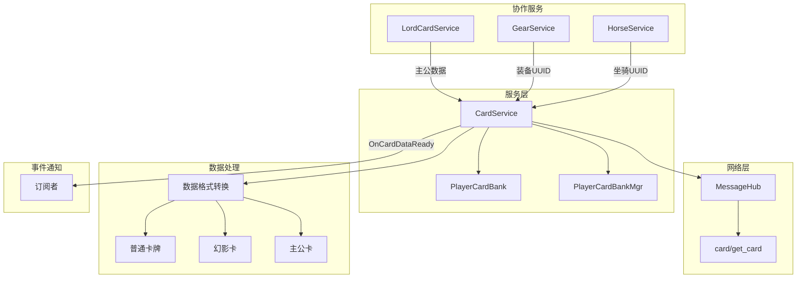
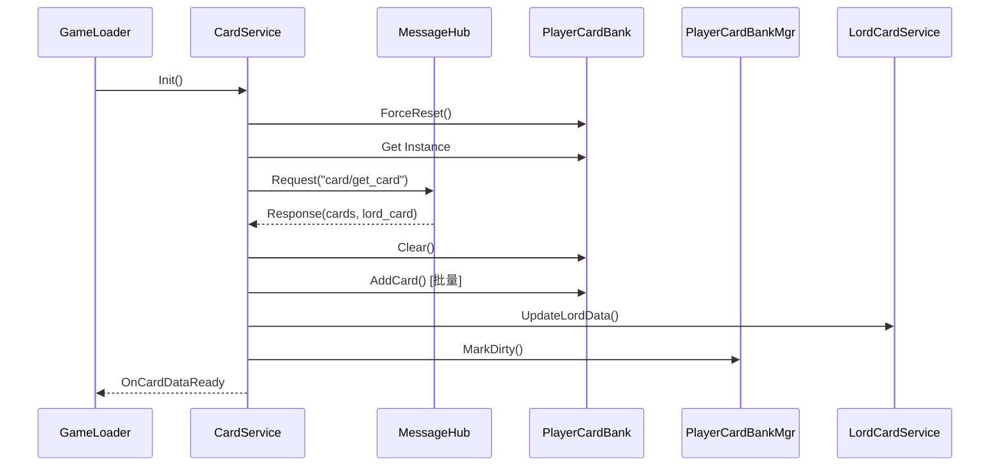

# 卡牌数据同步服务 (CardService)

## 系统概述

CardService 是负责从服务器同步所有卡牌数据的核心服务。服务在登录后初始化，通过全量同步方式获取玩家的所有卡牌数据，包括普通卡牌、幻影卡和主公卡。系统负责数据格式转换、装备信息处理、幻影卡过期检查等功能。

## 系统架构



## 核心组件

### CardService - 主服务类

```csharp
public class CardService : MonoBehaviour
{
    /*──────── 单例 ────────*/
    public static CardService I { get; private set; }
    public bool IsInited { get; private set; }

    /*──────── 事件 ────────*/
    public event Action OnCardDataReady;

    /*──────── 请求方法 ────────*/
    const string kGetCardMethod = "card/get_card";
    
    /*──────── 主公数据 ────────*/
    private LordCardItem _lordCardData;
    public LordCardItem LordCardData => _lordCardData;

    /*──────── 生命周期 ────────*/
    void Awake()
    {
        if (I != null && I != this) 
        { 
            Destroy(gameObject); 
            return; 
        }
        I = this;
        DontDestroyOnLoad(gameObject);
    }
}
```

## 数据结构

### 服务器响应结构

```csharp
[Serializable]
private class GetCardResp
{
    public List<CardItem> card;      // 普通卡牌列表
    public LordCardItem lord_card;   // 主公数据
}
```

### 普通卡牌数据

```csharp
[Serializable]
private class CardItem
{
    public string cid;              // 卡牌唯一ID（服务器生成）
    public string card_id;          // 卡牌类型ID（S1, A1等）
    public int level;               // 等级
    public int star;                // 星级
    
    // 幻影卡相关
    public int is_phantom;          // 是否为幻影卡（0=否，1=是）
    public string clone_on;         // 幻影卡复制的目标
    public string cloned_by;        // 被哪张幻影卡复制
    public long expire_time;        // 过期时间戳（毫秒）
    
    // 封赏系统
    public int gift_level;          // 封赏等级 0-3
    public int gift_progress;       // 封赏进度值
    
    // 装备信息（静态ID，需要转换为UUID）
    public string weapon_id;        // 武器ID
    public int? weapon_level;       // 武器等级
    public string armor_id;         // 护甲ID
    public int? armor_level;        // 护甲等级
    public string horse_id;         // 坐骑ID
    public int? horse_level;        // 坐骑等级
    
    // 元数据
    public long updated_at;         // 更新时间戳
}
```

### 主公卡数据

```csharp
[Serializable]
public class LordCardItem
{
    public string cid;
    public int level;
    
    // 技能配置
    public string active_skill_id;
    public string passive_skill_one_id;
    public string passive_skill_two_id;
    public int active_skill_level;
    public int passive_skill_one_level;
    public int passive_skill_two_level;
    
    // 技能点
    public int total_skill_point;
    public int remaining_skill_point;
    public int attack_point;
    public int defense_point;
    public int wit_point;
    
    // 装备信息
    public string weapon_id;
    public int? weapon_level;
    public string armor_id;
    public int? armor_level;
    public string horse_id;
    public int? horse_level;
    
    public long updated_at;
}
```

## 初始化流程

### 服务初始化

```csharp
public void Init()
{
    if (IsInited) return;
    
    Debug.Log("[CardService] Initializing...");
    
    // 强制重置 PlayerCardBank 单例，确保新账号获得全新实例
    PlayerCardBank.ForceReset();
    
    // 获取新的 PlayerCardBank 实例
    var bank = PlayerCardBank.I;
    if (bank == null)
    {
        Debug.LogError("[CardService] Failed to create PlayerCardBank instance!");
        return;
    }
    
    // 验证数据为空
    Debug.Log($"[CardService] PlayerCardBank initialized with {bank.cards.Count} cards (should be 0)");
    
    // 发送获取卡牌请求
    MessageHub.I.Request(kGetCardMethod, new { }, OnGetCardResp, 10f);
}
```

### 响应处理

```csharp
void OnGetCardResp(MessageHub.Response resp)
{
    if (resp == null || resp.code != 0)
    {
        Debug.LogError($"[CardService] Get card failed: {resp?.msg ?? "network error"}");
        IsInited = true;
        OnCardDataReady?.Invoke();
        return;
    }

    try
    {
        // 使用 Newtonsoft.Json 而不是 JsonUtility
        var data = JsonConvert.DeserializeObject<GetCardResp>(resp.dataJson);
        
        // 处理主公数据
        if (data?.lord_card != null)
        {
            _lordCardData = data.lord_card;
            Debug.Log($"[CardService] Lord card data received - Level: {data.lord_card.level}");
            
            // 如果 LordCardService 已经初始化，通知它更新数据
            if (LordCardService.I != null)
            {
                LordCardService.I.UpdateLordData(data.lord_card);
            }
        }
        
        // 处理普通卡牌数据
        if (data?.card != null)
        {
            Debug.Log($"[CardService] Received {data.card.Count} cards");
            ProcessCardData(data.card);
        }
    }
    catch (Exception e)
    {
        Debug.LogError($"[CardService] Exception processing card data: {e}");
    }
    finally
    {
        IsInited = true;
        OnCardDataReady?.Invoke();
    }
}
```

## 数据处理

### 批量处理卡牌

```csharp
void ProcessCardData(List<CardItem> cardList)
{
    // 确保 PlayerCardBank 存在
    if (PlayerCardBank.I == null)
    {
        Debug.LogError("[CardService] PlayerCardBank.I is null! Cannot process card data.");
        return;
    }

    // 清空现有数据（全量更新）
    ClearAllCards();

    // 如果没有卡牌，直接返回
    if (cardList == null || cardList.Count == 0)
    {
        Debug.Log("[CardService] No cards to process");
        return;
    }

    // 首先清理过期的幻影卡
    long currentTime = DateTimeOffset.UtcNow.ToUnixTimeMilliseconds();
    cardList.RemoveAll(item => 
        item.is_phantom == 1 && 
        item.expire_time > 0 && 
        item.expire_time < currentTime
    );

    // 批量添加卡牌
    int successCount = 0;
    foreach (var item in cardList)
    {
        try
        {
            AddOrUpdateCard(item);
            successCount++;
        }
        catch (Exception e)
        {
            Debug.LogError($"[CardService] Failed to add card {item.card_id}: {e}");
        }
    }

    Debug.Log($"[CardService] Successfully updated {successCount}/{cardList.Count} cards");
    
    // 触发保存
    if (PlayerCardBankMgr.I != null)
    {
        PlayerCardBankMgr.I.MarkDirty(null);
    }
}
```

### 单张卡牌处理

```csharp
void AddOrUpdateCard(CardItem item)
{
    if (PlayerCardBank.I == null) return;

    // 创建新的 PlayerCard
    var playerCard = new PlayerCard
    {
        id = item.card_id,
        level = item.level,
        star = item.star,
        copies = 0,  // 服务器暂时没有碎片数据
        
        // 使用服务器返回的gift数据
        giftLv = item.gift_level,
        giftExp = item.gift_progress,
        
        // 幻影卡相关字段
        isPhantom = item.is_phantom == 1,
        cloneOn = item.clone_on ?? "",
        clonedBy = item.cloned_by ?? "",
        expireTime = item.expire_time,
        
        updatedAt = item.updated_at
    };

    // 设置装备槽解锁状态（非幻影卡）
    if (!playerCard.isPhantom)
    {
        playerCard.equip.weaponUnlocked = playerCard.giftLv >= 1;
        playerCard.equip.armorUnlocked = playerCard.giftLv >= 2;
        playerCard.equip.mountUnlocked = playerCard.giftLv >= 3;
    }
    
    // 处理装备UUID（查找或创建对应的装备实例）
    if (!string.IsNullOrEmpty(item.weapon_id))
    {
        playerCard.equip.weaponUuid = FindOrCreateGearUuid(
            item.weapon_id, item.weapon_level ?? 1, 
            item.card_id, "weapon"
        );
    }
    
    if (!string.IsNullOrEmpty(item.armor_id))
    {
        playerCard.equip.armorUuid = FindOrCreateGearUuid(
            item.armor_id, item.armor_level ?? 1, 
            item.card_id, "armor"
        );
    }
    
    if (!string.IsNullOrEmpty(item.horse_id))
    {
        playerCard.equip.accessoryUuid = FindOrCreateHorseUuid(
            item.horse_id, item.horse_level ?? 1, 
            item.card_id
        );
    }

    // 添加到 PlayerCardBank
    PlayerCardBank.I.AddCard(playerCard);
    
    // 处理幻影卡的双向引用
    if (playerCard.isPhantom && !string.IsNullOrEmpty(playerCard.cloneOn))
    {
        var targetCard = PlayerCardBank.I.Get(playerCard.cloneOn);
        if (targetCard != null)
        {
            targetCard.clonedBy = playerCard.id;
        }
    }
}
```

## 装备UUID转换

### 查找或创建装备UUID

```csharp
string FindOrCreateGearUuid(string staticId, int level, string cardId, string type)
{
    if (string.IsNullOrEmpty(staticId)) return "";
    
    // 如果已经是UUID格式，直接返回
    if (staticId.Contains("-")) return staticId;
    
    // 尝试查找已存在的装备
    if (PlayerGearBank.I != null)
    {
        // 查找装备在该卡牌上的装备
        var gear = PlayerGearBank.I.All.FirstOrDefault(g => 
            g.staticId == staticId && g.equippedById == cardId);
        
        // 如果找不到，创建新的
        if (gear == null)
        {
            gear = PlayerGearBank.I.Add(staticId, level);
            gear.equippedById = cardId;
            PlayerGearBank.I.MarkDirty(gear.uuid);
        }
        
        return gear.uuid;
    }
    
    // 如果 GearBank 不存在，返回空（等待 GearService 初始化）
    return "";
}

string FindOrCreateHorseUuid(string staticId, int level, string cardId)
{
    if (string.IsNullOrEmpty(staticId)) return "";
    
    // 如果已经是UUID格式，直接返回
    if (staticId.Contains("-")) return staticId;
    
    // 尝试查找已存在的坐骑
    if (PlayerHorseBank.I != null)
    {
        var horse = PlayerHorseBank.I.All.FirstOrDefault(h => 
            h.staticId == staticId && h.equippedById == cardId);
        
        // 如果找不到，创建新的
        if (horse == null)
        {
            horse = new PlayerHorse
            {
                staticId = staticId,
                level = level,
                equippedById = cardId,
                unlocked = true
            };
            horse.EnsureUuid();
            PlayerHorseBank.I.Add(horse);
        }
        
        return horse.uuid;
    }
    
    return "";
}
```

## 公共方法

### 数据查询

```csharp
/// <summary>
/// 检查服务是否就绪
/// </summary>
public bool IsReady()
{
    return IsInited && PlayerCardBank.I != null;
}

/// <summary>
/// 获取卡牌数量
/// </summary>
public int GetCardCount()
{
    return PlayerCardBank.I?.cards?.Count ?? 0;
}

/// <summary>
/// 获取调试信息
/// </summary>
public string GetDebugInfo()
{
    var sb = new System.Text.StringBuilder();
    sb.AppendLine("=== CardService Debug Info ===");
    sb.AppendLine($"- Service Status: {(IsInited ? "Initialized" : "Not Initialized")}");
    sb.AppendLine($"- PlayerCardBank: {(PlayerCardBank.I != null ? "Valid" : "Null")}");
    
    if (PlayerCardBank.I != null)
    {
        sb.AppendLine($"- Card Count: {GetCardCount()}");
        sb.AppendLine(PlayerCardBank.I.GetDebugInfo());
    }
    
    sb.AppendLine($"- Event Subscribers: {OnCardDataReady?.GetInvocationList()?.Length ?? 0}");
    
    return sb.ToString();
}
```

### 更新操作

```csharp
/// <summary>
/// 更新卡牌封赏等级（供其他服务调用）
/// </summary>
public void UpdateCardGiftLevel(string cardId, int newLevel, int newProgress)
{
    var card = PlayerCardBank.I?.Get(cardId);
    if (card == null) return;
    
    card.giftLv = newLevel;
    card.giftExp = newProgress;
    
    // 更新装备槽解锁状态
    if (!card.isPhantom)
    {
        card.equip.weaponUnlocked = newLevel >= 1;
        card.equip.armorUnlocked = newLevel >= 2;
        card.equip.mountUnlocked = newLevel >= 3;
    }
    
    PlayerCardBankMgr.I?.BroadcastCardUpdated(cardId);
}
```

## 用户切换处理

### 登出清理

```csharp
public static void OnUserChange(string currentUserId, string newUserId)
{
    string userInfo = string.IsNullOrEmpty(currentUserId) 
        ? "(No previous user)" 
        : $"(User: {currentUserId})";
    
    Debug.Log($"[CardService] User change detected {userInfo}, cleaning up data...");
    
    // 重置 PlayerCardBank 单例
    PlayerCardBank.ForceReset();
    
    // 重置 CardService 状态
    if (I != null)
    {
        I.IsInited = false;
        I.OnCardDataReady = null; // 清理事件订阅，避免内存泄漏
        I._lordCardData = null;
    }
    
    Debug.Log("[CardService] Data cleanup completed, ready for new user");
}

public static void OnUserLogout()
{
    Debug.Log("[CardService] User logout detected, cleaning up...");
    
    // 清理数据
    PlayerCardBank.ForceReset();
    
    // 重置服务状态
    if (I != null)
    {
        I.IsInited = false;
        I.OnCardDataReady = null;
        I._lordCardData = null;
    }
}
```

## 与其他服务的协作

### 与LordCardService协作

```csharp
// 处理主公数据
if (data?.lord_card != null)
{
    _lordCardData = data.lord_card;
    
    // 通知 LordCardService
    if (LordCardService.I != null)
    {
        LordCardService.I.UpdateLordData(data.lord_card);
    }
}
```

### 与MessageHub协作

```csharp
// 使用MessageHub发送请求
MessageHub.I.Request(kGetCardMethod, new { }, OnGetCardResp, 10f);

// MessageHub自动处理物品更新
// card/upgrade_level 响应中的 current_balance 会自动更新到 InventoryService
```

## 初始化时序



## 错误处理

### 网络错误

```csharp
if (resp == null || resp.code != 0)
{
    Debug.LogError($"[CardService] Get card failed: {resp?.msg ?? "network error"}");
    
    // 即使失败也要标记为已初始化，避免卡住游戏流程
    IsInited = true;
    OnCardDataReady?.Invoke();
    return;
}
```

### 数据解析错误

```csharp
try
{
    var data = JsonConvert.DeserializeObject<GetCardResp>(resp.dataJson);
    ProcessCardData(data.card);
}
catch (Exception e)
{
    Debug.LogError($"[CardService] Exception processing card data: {e}");
    // 继续执行，不影响游戏
}
finally
{
    IsInited = true;
    OnCardDataReady?.Invoke();
}
```

## 注意事项

1. **初始化顺序**
   - 必须在MessageHub连接后初始化
   - 需要先于依赖卡牌数据的UI初始化

2. **全量同步**
   - 每次初始化都是全量同步
   - 清空现有数据再添加新数据

3. **幻影卡处理**
   - 自动清理过期的幻影卡
   - 维护双向引用关系

4. **装备UUID转换**
   - 服务器返回静态ID
   - 本地需要转换为UUID
   - 依赖GearService和HorseService

5. **事件通知**
   - IsInited标记必须设置
   - OnCardDataReady必须触发
   - 即使失败也要通知

6. **内存管理**
   - 用户切换时清理数据
   - 取消事件订阅避免泄漏

## 相关文档

- [卡牌系统概述](./card-overview.md)
- [卡牌数据模型](./card-data-model.md)
- [主公卡系统](./lord-card-system.md)
- [装备系统](./card-equipment-system.md)
- [网络同步](./network-sync.md)