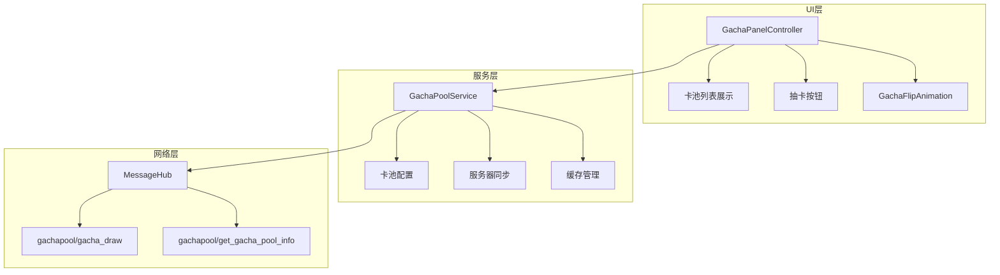

# 抽卡系统

## 系统概述

抽卡系统提供玩家获取卡牌的主要途径，支持单抽和十连抽，包含多个卡池、限时活动、保底机制和翻卡动画。系统通过服务器控制概率和奖励，确保公平性。

## 系统架构



## 核心组件

### GachaPanelController - 主控制器

```csharp
[RequireComponent(typeof(UIDocument))]
public class GachaPanelController : MonoBehaviour
{
    // 模板和引用
    [SerializeField] private VisualTreeAsset poolTemplate;
    [SerializeField] private CardSystemConfig config;
    [SerializeField] private GachaFlipAnimationController flipAnimationController;
    
    // 服务
    private GachaPoolService poolService;
    const string kDrawMethod = "gachapool/gacha_draw";
    
    // UI元素
    ScrollViewPro scroll;
    VisualElement listRoot, selectedItem;
    Button oneBtn, tenBtn, returnBtn;
    Label ticketLbl;
    
    // 运行时状态
    Action<ResourceType,long> bankHandler;
}
```

### GachaPoolService - 卡池服务

```csharp
public class GachaPoolService : MonoBehaviour
{
    public static GachaPoolService I { get; private set; }
    
    // 卡池数据
    readonly List<GachaPoolInfo> _pools = new();
    public List<GachaPoolInfo> Pools => _pools;
    
    // 事件
    public event Action<List<GachaPoolInfo>> OnPoolListReady;
    
    // 状态
    public bool IsInited { get; private set; }
    public static long ServerDeltaSec = 0;
    
    // 缓存
    const string CacheFile = "gacha_pools.json";
    
    // 方法
    public void Init();
    void LoadCache();
    void SaveCache(string json);
    void DownloadAllBanners(IEnumerable<GachaPoolInfo> pools);
}
```

## 数据模型

### GachaPoolInfo - 卡池信息

```csharp
[Serializable]
public class GachaPoolInfo
{
    public int id;              // 卡池ID
    public string title;        // 卡池名称
    public int costx1;          // 单抽消耗
    public int costx10;         // 十连消耗
    
    // 倒计时
    public bool showCountdown;  // 是否显示倒计时
    public long endUtcSeconds;  // 结束时间（UTC秒）
    
    // Banner图片
    public Sprite banner;        // UI使用的图片
    public string poolImageUrl;  // 服务器图片URL
}
```

### 网络协议

#### 抽卡请求

```csharp
[Serializable]
private struct DrawInput 
{ 
    public int pool_id;    // 卡池ID
    public int amount;     // 抽卡数量（1或10）
}
```

#### 抽卡响应

```json
{
    "consumption_current_balance": {
        "SummonWrit": 1800  // 消耗的征才令
    },
    "gain_current_balance": {
        "Card_S1": "unlocked",           // 新解锁的卡牌
        "HeroCrest_S2": 200,            // 获得的碎片
        "Gift_wine": 5                  // 获得的礼物
    },
    "draw_details": [
        "Card_S1",      // 抽到的物品列表
        "Card_S2",
        "Card_S2",      // 重复卡牌会转换为碎片
        "Gift_wine",
        "Gift_silk"
    ]
}
```

## 抽卡流程

### 1. 选择卡池

```csharp
void SelectPool(VisualElement item)
{
    if (selectedItem == item) return;
    
    // 更新选中状态
    selectedItem?.RemoveFromClassList("selected");
    selectedItem = item;
    selectedItem.AddToClassList("selected");
    
    // 更新其他卡池的遮罩
    foreach (var child in listRoot.Children())
    {
        child.Q<VisualElement>("BlackDim")
             ?.SetDisplay(child == item ? DisplayStyle.None : DisplayStyle.Flex);
    }
    
    // 更新按钮显示
    if (item.userData is GachaPoolInfo g)
    {
        oneBtn.text = $"1x ({g.costx1})";
        tenBtn.text = $"10x ({g.costx10})";
    }
    
    scroll.ScrollTo(item);
}
```

### 2. 检查资源

```csharp
void Roll(int count)
{
    if (selectedItem?.userData is not GachaPoolInfo info) return;
    
    // 计算消耗
    int cost = (count == 1) ? info.costx1 : info.costx10;
    
    // 检查征才令
    if (PlayerResourceBank.I[ResourceType.SummonWrit] < cost)
    {
        PopupManager.Show("抽奖失败", $"征才令不够！需要 {cost} 个征才令。");
        return;
    }
    
    // 发送请求
    var input = new DrawInput { pool_id = info.id, amount = count };
    MessageHub.I.Request(kDrawMethod, input, OnDrawResp, 10f);
}
```

### 3. 处理抽卡结果

```csharp
void OnDrawResp(MessageHub.Response resp)
{
    if (resp == null || resp.code != 0)
    {
        PopupManager.Show("抽奖失败", resp?.msg ?? "网络错误");
        return;
    }
    
    try
    {
        var jsonObj = JObject.Parse(resp.dataJson);
        
        // 1. 处理消耗的资源
        var consumption = jsonObj["consumption_current_balance"]?.ToObject<Dictionary<string, long>>();
        if (consumption != null)
        {
            ApplyConsumption(consumption);
        }
        
        // 2. 处理获得的物品
        var gains = jsonObj["gain_current_balance"] as JObject;
        if (gains != null)
        {
            ApplyGains(gains);
        }
        
        // 3. 显示抽奖动画
        var drawDetails = jsonObj["draw_details"]?.ToObject<List<string>>();
        if (drawDetails != null && drawDetails.Count > 0)
        {
            if (flipAnimationController != null)
            {
                // 显示翻卡动画
                flipAnimationController.ShowGachaAnimation(
                    drawDetails,
                    () => { /* 动画结束回调 */ },
                    () => { Roll(10); }  // 再抽10次回调
                );
            }
        }
    }
    catch (Exception e)
    {
        Debug.LogError($"[OnDrawResp] Exception: {e}");
        PopupManager.Show("抽奖失败", "数据处理异常");
    }
}
```

## 奖励处理

### 1. 新卡与碎片转换

```csharp
void ApplyGains(JObject gains)
{
    foreach (var property in gains.Properties())
    {
        string itemId = property.Name;
        JToken value = property.Value;
        
        // 1. 处理卡牌
        if (itemId.StartsWith("Card_"))
        {
            string cardId = itemId.Substring(5);  // 移除 "Card_" 前缀
            
            if (value.ToString() == "unlocked")
            {
                // 新解锁的卡牌
                HandleNewCard(cardId);
            }
            else if (value.Type == JTokenType.Integer)
            {
                // 转换为碎片（重复卡牌）
                int shardCount = value.ToObject<int>();
                HandleCardShards(cardId, shardCount);
            }
        }
        // 2. 处理碎片
        else if (itemId.StartsWith("HeroCrest_"))
        {
            int count = value.ToObject<int>();
            UpdateShardInventory(itemId, count);
        }
        // 3. 处理其他物品
        else
        {
            HandleOtherItems(itemId, value);
        }
    }
}
```

### 2. 卡牌解锁处理

```csharp
void HandleNewCard(string cardId)
{
    // 检查是否已拥有
    var existingCard = PlayerCardBank.I.Get(cardId);
    
    if (existingCard == null)
    {
        // 添加新卡
        var newCard = new PlayerCard
        {
            id = cardId,
            level = 1,
            star = 0,  // 初始0星
            isPhantom = false
        };
        
        PlayerCardBank.I.AddCard(newCard);
        PlayerCardBankMgr.I?.onCardChanged?.Invoke(cardId);
        
        Debug.Log($"[Gacha] 新卡解锁: {cardId}");
    }
    else
    {
        // 已拥有，转换为碎片
        Debug.Log($"[Gacha] 卡牌 {cardId} 已拥有，转换为碎片");
    }
}
```

## 翻卡动画

### GachaFlipAnimationController

```csharp
public class GachaFlipAnimationController : MonoBehaviour
{
    [SerializeField] private float cardFlipDelay = 0.15f;
    [SerializeField] private float cardFlipDuration = 0.6f;
    [SerializeField] private float glowFadeDuration = 1.0f;
    
    // 显示抽卡动画
    public void ShowGachaAnimation(
        List<string> items,
        Action onConfirm,
        Action onDrawAgain)
    {
        // 创建卡片UI
        CreateCardGrid(items);
        
        // 播放翻卡动画
        StartCoroutine(PlayFlipAnimation(items));
        
        // 设置按钮回调
        SetupButtons(onConfirm, onDrawAgain);
    }
    
    // 翻卡动画协程
    IEnumerator PlayFlipAnimation(List<string> items)
    {
        for (int i = 0; i < items.Count; i++)
        {
            // 延迟翻开每张卡
            yield return new WaitForSeconds(cardFlipDelay);
            
            // 播放翻转动画
            FlipCard(i);
            
            // 播放音效
            PlayCardFlipSound();
            
            // 显示光效（根据稀有度）
            ShowCardGlow(i, GetItemRarity(items[i]));
        }
        
        // 显示确认按钮
        ShowConfirmButtons();
    }
}
```

## 卡池管理

### 1. 卡池列表构建

```csharp
void BuildPoolList(List<GachaPoolInfo> pools)
{
    listRoot.Clear();
    const float poolW = 500f, poolH = 420f, gap = 32f;
    
    foreach (var info in pools)
    {
        // 创建卡池容器
        var container = poolTemplate.Instantiate();
        container.userData = info;
        
        // 设置尺寸
        container.style.width = poolW;
        container.style.height = poolH;
        container.style.flexBasis = poolW;
        container.style.flexShrink = 0;
        container.style.marginRight = gap;
        
        // 设置标题
        var titleLbl = container.Q<Label>("PoolTitle");
        if (titleLbl != null) titleLbl.text = info.title;
        
        // 设置Banner图
        var poolBtn = container.Q<Button>("PoolBtn");
        if (poolBtn != null && info.banner != null)
            poolBtn.style.backgroundImage = new StyleBackground(info.banner);
        
        // 添加点击事件
        (poolBtn ?? container)
            .RegisterCallback<ClickEvent>(_ => SelectPool(container));
        
        // 添加倒计时（如果有）
        AttachCountdown(container, info.showCountdown, info.endUtcSeconds);
        
        listRoot.Add(container);
    }
    
    scroll.RefreshAfterHierarchyChange();
}
```

### 2. 限时活动倒计时

```csharp
void AttachCountdown(VisualElement container, bool enable, long endUtcSeconds)
{
    var label = container.Q<Label>("RemainLbl");
    if (label == null) return;
    
    if (!enable || endUtcSeconds <= 0)
    {
        label.style.display = DisplayStyle.None;
        return;
    }
    
    void Refresh()
    {
        long now = DateTimeOffset.UtcNow.ToUnixTimeSeconds() 
                 + GachaPoolService.ServerDeltaSec;
        long diff = endUtcSeconds - now;
        
        if (diff <= 0)
        {
            label.text = "已结束";
            return;
        }
        
        var left = TimeSpan.FromSeconds(diff);
        label.text = $"剩余 {left:dd\\天hh\\:mm\\:ss}";
        label.schedule.Execute(Refresh).ExecuteLater(1000);
    }
    
    Refresh();
}
```

## 缓存机制

### 卡池信息缓存

```csharp
// GachaPoolService.cs
void LoadCache()
{
    string path = Path.Combine(Application.persistentDataPath, CacheFile);
    if (!File.Exists(path)) return;
    
    var list = ParseRemotePools(File.ReadAllText(path));
    if (list?.Count > 0)
    {
        _pools.AddRange(list);
        DownloadAllBanners(_pools);
    }
}

void SaveCache(string json)
{
    string path = Path.Combine(Application.persistentDataPath, CacheFile);
    File.WriteAllText(path, json);
}
```

### Banner图片下载

```csharp
void DownloadAllBanners(IEnumerable<GachaPoolInfo> pools)
{
    foreach (var g in pools)
    {
        if (string.IsNullOrEmpty(g.poolImageUrl)) continue;
        if (g.banner != null) continue;  // 已有本地Sprite
        
        BannerCache.I.GetSprite(g.poolImageUrl, sp => 
        {
            if (sp != null) g.banner = sp;
        });
    }
}
```

## 测试工具

### 获取测试资源

```csharp
// 测试按钮：获取抽卡资源
void OnTestButtonClicked()
{
    var req = new GetItemInput
    {
        all = 0,
        item_id = new List<string> 
        { 
            "SummonWrit",           // 征才令（抽卡券）
            "HeroCrest_SGeneral",   // S级通用碎片
            "HeroCrest_AGeneral",   // A级通用碎片
            "HeroCrest_BGeneral",   // B级通用碎片
            "Gift_wine",            // 礼物
            "Gift_silk"
        },
        amount = 10000
    };
    
    MessageHub.I.Request("test/GetItem", req, OnGetItemResp, 8f);
}
```

## 智能结果显示

```csharp
void ShowDrawResultSmart(List<string> drawDetails, JObject gains)
{
    var lines = new List<string>();
    
    // 统计抽到的卡片
    var cardCount = new Dictionary<string, int>();
    foreach (var item in drawDetails)
    {
        if (item.StartsWith("Card_"))
        {
            cardCount[item] = cardCount.ContainsKey(item) ? cardCount[item] + 1 : 1;
        }
    }
    
    // 分析每种卡片
    foreach (var kv in cardCount)
    {
        string cardId = kv.Key.Substring(5);
        int totalCount = kv.Value;
        
        var cardInfo = GetCardInfo(cardId);
        if (cardInfo == null) continue;
        
        string tierTag = GetTierTag(cardInfo.tier);
        string cardName = cardInfo.displayName;
        
        // 检查是否有新卡解锁
        bool hasNewCard = gains?[kv.Key]?.ToString() == "unlocked";
        
        if (hasNewCard)
        {
            lines.Add($"{tierTag} {cardName}");
            
            // 多余的转为碎片
            if (totalCount > 1)
            {
                int shardsCount = (totalCount - 1) * 100;
                lines.Add($"{tierTag} {cardName}碎片 x{shardsCount}");
            }
        }
        else
        {
            // 全部转为碎片
            int shardsCount = totalCount * 100;
            lines.Add($"{tierTag} {cardName}碎片 x{shardsCount}");
        }
    }
    
    string message = lines.Count > 0 ? string.Join("\n", lines) : "没有获得任何物品";
    PopupManager.Show("抽奖结果", message);
}
```

## 特殊规则

### 1. 重复卡牌转换

- 第一次获得：解锁新卡
- 重复获得：自动转换为100个碎片
- 碎片用于卡牌升星

### 2. 保底机制

- 服务器控制概率
- 十连抽通常有保底（至少一个高品质）
- 累计抽卡次数保底（服务器记录）

### 3. 消耗与折扣

```csharp
// 十连抽折扣
单抽消耗：200征才令
十连消耗：1800征才令（9折）
```

### 4. 卡池类型

- **常驻卡池**：永久开放
- **限时卡池**：有倒计时，到期关闭
- **新手卡池**：特殊优惠，限定次数

## 注意事项

1. **网络同步**
   - 所有抽卡必须通过服务器
   - 本地不存储概率配置
   - 结果由服务器决定

2. **动画优化**
   - 翻卡动画可跳过
   - 十连抽批量显示
   - 预加载卡片资源

3. **错误处理**
   - 网络失败重试机制
   - 资源不足提示
   - 服务器错误码处理

4. **性能优化**
   - 卡池信息缓存
   - Banner图异步下载
   - 虚拟化卡池列表

5. **UI适配**
   - 横向滚动卡池列表
   - 响应式布局
   - 移动端手势支持

## 相关文档

- [卡牌系统概述](./card-overview.md)
- [卡牌数据模型](./card-data-model.md)
- [升星系统](./card-star-system.md)
- [网络同步](./card-service.md)