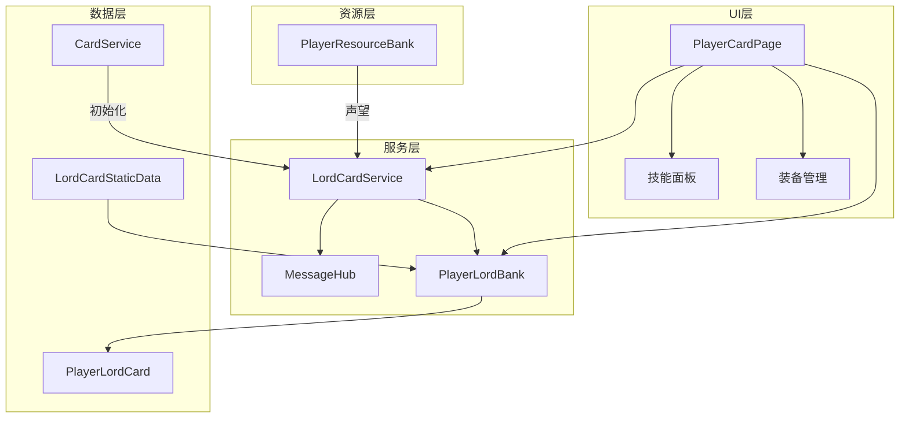

# 主公卡系统

## 系统概述

主公卡系统是游戏中玩家角色的核心系统，与普通卡牌有独立的升级机制和属性体系。主公卡使用声望（Fame）进行升级，升级获得技能点可分配到攻击、防御、智力三个属性。系统支持技能学习、升级、洗点等功能。

## 系统架构



## 核心数据模型

### PlayerLordCard - 主公卡数据

```csharp
namespace Game.Data
{
    [Serializable]
    public class PlayerLordCard
    {
        // ===== 基础信息 =====
        public int currentLevel = 1;          // 当前等级
        public int totalSkillPointsEarned;    // 累计获得的技能点
        public int availableSkillPoints;      // 可用技能点
        public int currentFame;               // 当前声望（已废弃）
        
        // ===== 技能配置 =====
        public string activeSkillId;          // 主动技能ID
        public string passiveOneId;           // 被动技能1 ID
        public string passiveTwoId;           // 被动技能2 ID
        
        public int activeSkillLv = 0;         // 主动技能等级
        public int passiveOneLv = 0;          // 被动技能1等级
        public int passiveTwoLv = 0;          // 被动技能2等级
        
        // ===== 基础属性 =====
        [Header("基础属性")]
        public int baseAtk = 50;
        public int baseDef = 50;
        public int baseIQ = 20;
        
        // ===== 已分配技能点 =====
        [Header("各项已用技能点")]
        public int atkPointsUsed = 0;         // 攻击已用点数
        public int defPointsUsed = 0;         // 防御已用点数
        public int iqPointsUsed = 0;          // 智力已用点数
        
        // ===== 当前属性（计算后）=====
        public int atk => baseAtk + (atkPointsUsed * 5);  // 每点+5攻击
        public int def => baseDef + (defPointsUsed * 5);   // 每点+5防御
        public int iq => baseIQ + (iqPointsUsed * 5);      // 每点+5智力
    }
}
```

### LordCardServerData - 服务器数据结构

```csharp
[Serializable]
public class LordCardServerData
{
    public string cid;
    public int level;
    public string active_skill_id;
    public string passive_skill_one_id;
    public string passive_skill_two_id;
    public int active_skill_level;
    public int passive_skill_one_level;
    public int passive_skill_two_level;
    public int total_skill_point;
    public int remaining_skill_point;
    public int attack_point;
    public int defense_point;
    public int wit_point;
    public long updated_at;
    public string weapon_id;
    public int? weapon_level;
    public string armor_id;
    public int? armor_level;
    public string horse_id;
    public int? horse_level;
}
```

## 主公等级系统

### 升级机制

主公卡使用声望（Fame）而非功勋（Merit）进行升级：

```csharp
// LordCardService.cs
public void UpgradeLevel(Action onSuccess = null, Action<string> onError = null)
{
    var req = new EmptyRequest();
    
    // 注意路径：card/lordcard_upgrade_level（不同于普通卡牌）
    MessageHub.I.Request("card/lordcard_upgrade_level", req,
        resp => {
            if (resp.code != 0)
            {
                string errorMsg = HandleLevelError(resp);
                onError?.Invoke(errorMsg);
                return;
            }
            
            var data = JsonConvert.DeserializeObject<LordUpgradeLevelResponse>(resp.dataJson);
            
            // 计算获得的技能点
            int oldLevel = PlayerLordBank.I.LordData?.currentLevel ?? 1;
            int newLevel = data.new_lord_level;
            int skillPointsGained = 0;
            
            var staticData = PlayerLordBank.I.StaticData;
            if (staticData != null)
            {
                for (int i = oldLevel + 1; i <= newLevel; i++)
                {
                    var levelData = staticData.GetLevel(i);
                    if (levelData != null)
                        skillPointsGained += levelData.skillPoints;
                }
            }
            
            // 更新本地数据
            PlayerLordBank.I.UpdateLevel(newLevel, skillPointsGained);
            
            onSuccess?.Invoke();
        },
        10f
    );
}
```

### 等级配置

```csharp
// LordCardStaticData中的等级数据
[Serializable]
public class LevelEntry
{
    public int level;           // 等级
    public long requiredFame;   // 所需声望
    public int skillPoints;     // 获得技能点
}
```

## 技能点系统

### 属性加点

```csharp
// 属性类型
public enum AttributeType { Atk, Def, IQ }

// 加点请求
[Serializable]
private class AddSkillPointRequest
{
    public int attack;
    public int defense;
    public int wit;
}

// LordCardService中的加点方法
public void AddSkillPoint(string attributeType, int points, 
    Action onSuccess = null, Action<string> onError = null)
{
    var req = new AddSkillPointRequest
    {
        attack = 0,
        defense = 0,
        wit = 0
    };
    
    // 根据属性类型设置点数
    switch (attributeType.ToLower())
    {
        case "atk":
        case "attack":
            req.attack = points;
            break;
        case "def":
        case "defense":
            req.defense = points;
            break;
        case "iq":
        case "wit":
            req.wit = points;
            break;
    }
    
    MessageHub.I.Request("card/lordcard_add_skillpoint", req,
        resp => {
            if (resp.code == 0)
            {
                var data = JsonConvert.DeserializeObject<LordAddSkillPointSuccessResponse>(resp.dataJson);
                
                // 更新本地数据
                PlayerLordBank.I.UpdateSkillPoints(
                    data.attack, 
                    data.defense, 
                    data.wit, 
                    data.remaining_skill_point
                );
                
                onSuccess?.Invoke();
            }
        },
        10f
    );
}
```

### 洗点功能

```csharp
public void ResetSkillPoints(Action onSuccess = null, Action<string> onError = null)
{
    var req = new EmptyRequest();
    
    MessageHub.I.Request("card/lordcard_reset_skillpoint", req,
        resp => {
            if (resp.code == 0)
            {
                var data = JsonConvert.DeserializeObject<LordResetSkillPointSimpleResponse>(resp.dataJson);
                
                // 重置本地数据
                PlayerLordBank.I.ResetSkillPoints(data.remaining_skill_point);
                
                onSuccess?.Invoke();
            }
        },
        10f
    );
}
```

## 技能系统

### 技能槽定义

```csharp
public enum SkillSlot 
{ 
    Active,      // 主动技能
    Passive1,    // 被动技能1
    Passive2     // 被动技能2
}
```

### 技能升级

```csharp
[Serializable]
private class UpgradeSkillRequest
{
    public string skill_type;  // "active" 或 "passive"
    public string skill_id;    // 技能ID
}

public void UpgradeSkill(string skillType, string skillId, 
    Action onSuccess = null, Action<string> onError = null)
{
    var req = new UpgradeSkillRequest
    {
        skill_type = skillType,
        skill_id = skillId
    };
    
    MessageHub.I.Request("card/lordcard_upgrade_skill", req,
        resp => {
            if (resp.code == 0)
            {
                var data = JsonConvert.DeserializeObject<LordUpgradeSkillSuccessResponse>(resp.dataJson);
                
                // 更新技能等级
                PlayerLordBank.I.UpdateSkillLevel(skillType, skillId, data.new_level);
                
                // 更新资源（消耗兵法）
                if (data.current_balance != null)
                {
                    foreach (var kv in data.current_balance)
                    {
                        if (Enum.TryParse<ResourceType>(kv.Key, out var resType))
                        {
                            PlayerResourceBank.I.Set(resType, kv.Value);
                        }
                    }
                }
                
                onSuccess?.Invoke();
            }
        },
        10f
    );
}
```

## PlayerLordBank - 数据管理

### 单例管理器

```csharp
public class PlayerLordBank
{
    // 单例访问
    public static PlayerLordBank I { get; private set; }
    
    // 数据
    public PlayerLordCard LordData { get; private set; }
    public LordCardStaticData StaticData { get; private set; }
    
    // 初始化
    public static void ForceReset()
    {
        I = null;
    }
    
    // 从服务器数据初始化
    public void InitFromServerData(LordCardServerData serverData)
    {
        if (LordData == null)
            LordData = new PlayerLordCard();
        
        // 基础信息
        LordData.currentLevel = serverData.level;
        LordData.totalSkillPointsEarned = serverData.total_skill_point;
        LordData.availableSkillPoints = serverData.remaining_skill_point;
        
        // 技能配置
        LordData.activeSkillId = serverData.active_skill_id;
        LordData.passiveOneId = serverData.passive_skill_one_id;
        LordData.passiveTwoId = serverData.passive_skill_two_id;
        
        // 技能等级
        LordData.activeSkillLv = serverData.active_skill_level;
        LordData.passiveOneLv = serverData.passive_skill_one_level;
        LordData.passiveTwoLv = serverData.passive_skill_two_level;
        
        // 属性点分配
        LordData.atkPointsUsed = serverData.attack_point;
        LordData.defPointsUsed = serverData.defense_point;
        LordData.iqPointsUsed = serverData.wit_point;
    }
    
    // 更新等级
    public void UpdateLevel(int newLevel, int skillPointsGained)
    {
        if (LordData == null) return;
        
        LordData.currentLevel = newLevel;
        LordData.totalSkillPointsEarned += skillPointsGained;
        LordData.availableSkillPoints += skillPointsGained;
    }
    
    // 更新技能点
    public void UpdateSkillPoints(int atkUsed, int defUsed, int iqUsed, int remaining)
    {
        if (LordData == null) return;
        
        LordData.atkPointsUsed = atkUsed;
        LordData.defPointsUsed = defUsed;
        LordData.iqPointsUsed = iqUsed;
        LordData.availableSkillPoints = remaining;
    }
    
    // 重置技能点
    public void ResetSkillPoints(int totalPoints)
    {
        if (LordData == null) return;
        
        LordData.availableSkillPoints = totalPoints;
        LordData.atkPointsUsed = 0;
        LordData.defPointsUsed = 0;
        LordData.iqPointsUsed = 0;
    }
}
```

## 装备系统整合

### 主公卡在PlayerCardBank中的表示

```csharp
// 主公卡ID常量
const string LORD_CARD_ID = "LORD";

// 创建主公卡片实例
void CreateLordCardInBank()
{
    var lordData = PlayerLordBank.I?.LordData;
    
    // 创建主公卡片
    var lordCard = new PlayerCard
    {
        id = LORD_CARD_ID,
        level = lordData?.currentLevel ?? 1,
        star = 1,  // 主公默认1星
        isPhantom = false,
        
        // 初始化装备信息（主公装备槽默认全开）
        equip = new EquipStatus
        {
            weaponUnlocked = true,
            armorUnlocked = true,
            mountUnlocked = true
        }
    };
    
    // 从CardService同步装备信息
    var cardServiceData = CardService.I?.LordCardData;
    if (cardServiceData != null)
    {
        // 转换 staticId 到 UUID
        if (!string.IsNullOrEmpty(cardServiceData.weapon_id))
        {
            lordCard.equip.weaponUuid = FindEquipmentUuid(cardServiceData.weapon_id, "weapon");
        }
        if (!string.IsNullOrEmpty(cardServiceData.armor_id))
        {
            lordCard.equip.armorUuid = FindEquipmentUuid(cardServiceData.armor_id, "armor");
        }
        if (!string.IsNullOrEmpty(cardServiceData.horse_id))
        {
            lordCard.equip.accessoryUuid = FindEquipmentUuid(cardServiceData.horse_id, "horse");
        }
    }
    
    // 添加到 PlayerCardBank
    PlayerCardBank.I.AddCard(lordCard);
}
```

## UI实现 - PlayerCardPage

### 升级按钮处理

```csharp
void OnUpgradeLvClicked()
{
    // 防止重复点击
    if (isUpgrading) return;
    
    // 检查 LordCardService
    if (LordCardService.I == null)
    {
        PopupManager.Show("错误", "服务未初始化");
        return;
    }
    
    // 检查数据
    var lordStatic = PlayerLordBank.I?.StaticData;
    var lordData = PlayerLordBank.I?.LordData;
    
    var cur = lordStatic.GetLevel(lordData.currentLevel);
    var nxt = lordStatic.GetLevel(lordData.currentLevel + 1);
    
    if (nxt == null)
    {
        PopupManager.Show("提示", "已达到最高等级");
        return;
    }
    
    // 检查声望（客户端预检查）
    long currentFame = PlayerResourceBank.I[ResourceType.Fame];
    if (currentFame < nxt.requiredFame)
    {
        PopupManager.Show("声望不足", 
            $"需要声望：{nxt.requiredFame}\n当前声望：{currentFame}");
        return;
    }
    
    // 设置升级状态
    isUpgrading = true;
    upgradeLvBtn.SetEnabled(false);
    upgradeLvBtn.text = "升级中...";
    
    // 调用服务升级
    LordCardService.I.UpgradeLevel(
        onSuccess: () => {
            isUpgrading = false;
            RefreshAll();
            
            // 显示升级成功提示
            var newLordData = PlayerLordBank.I?.LordData;
            int gainedPoints = newLordData.availableSkillPoints - oldSkillPoints;
            if (gainedPoints > 0)
            {
                PopupManager.Show("升级成功", 
                    $"升级到 Lv{newLordData.currentLevel}\n获得 {gainedPoints} 技能点");
            }
        },
        onError: (msg) => {
            isUpgrading = false;
            PopupManager.Show("升级失败", msg);
            RefreshAll();
        }
    );
}
```

## 网络协议

### 升级响应

```csharp
[Serializable]
public class LordUpgradeLevelResponse
{
    public int new_lord_level;                        // 新等级
    public Dictionary<string, long> current_balance;  // 资源余额
    public Dictionary<string, object> item_reward;    // 奖励物品
}
```

### 加点响应

```csharp
[Serializable]
public class LordAddSkillPointSuccessResponse
{
    public int attack;                 // 更新后的攻击点数
    public int defense;                // 更新后的防御点数
    public int wit;                    // 更新后的智力点数
    public int remaining_skill_point;  // 剩余技能点数
}
```

### 技能升级响应

```csharp
[Serializable]
public class LordUpgradeSkillSuccessResponse
{
    public string skill_type;                        // 技能类型
    public string skill_id;                          // 技能ID
    public int new_level;                             // 新等级
    public Dictionary<string, long> current_balance; // 当前余额
}
```

### 错误响应

```csharp
// 等级不足
[Serializable]
public class LordLevelErrorResponse
{
    public int required_fame;    // 需要的声望
    public int current_fame;     // 当前声望
}

// 技能点不足
[Serializable]
public class SkillPointErrorResponse
{
    public int required_points;  // 需要的技能点
    public int remaining_points; // 当前剩余技能点
}

// 兵法不足
[Serializable]
public class ArtOfWarErrorResponse
{
    public int required_ArtOfWar;
    public int current_ArtOfWar;
}
```

## 初始化流程

```csharp
// LordCardService 初始化
public void Init()
{
    if (IsInited) return;
    
    // 强制重置 PlayerLordBank 单例
    PlayerLordBank.ForceReset();
    
    // 监听 CardService 的数据就绪事件
    if (CardService.I != null)
    {
        CardService.I.OnCardDataReady += OnCardDataReady;
        
        // 如果 CardService 已经初始化，直接处理
        if (CardService.I.IsInited)
        {
            OnCardDataReady();
        }
    }
}

// 当卡牌数据就绪时处理主公数据
void OnCardDataReady()
{
    // 从 CardService 获取主公数据
    if (CardService.I?.LordCardData != null)
    {
        UpdateLordData(CardService.I.LordCardData);
    }
    
    IsInited = true;
}
```

## 特殊规则

### 1. 主公卡唯一性
- 固定ID为"LORD"
- 不能被删除或复制
- 不是幻影卡

### 2. 升级差异
- 使用声望（Fame）而非功勋（Merit）
- 请求路径：`card/lordcard_upgrade_level`
- 升级获得技能点

### 3. 装备槽特权
- 所有装备槽默认解锁
- 不需要封赏等级

### 4. 属性计算
- 每点技能点增加5点对应属性
- 基础属性：攻击50、防御50、智力20

### 5. 技能系统
- 支持主动技能和2个被动技能
- 使用兵法（ArtOfWar）升级技能

## 注意事项

1. **初始化顺序**
   - 必须等待CardService初始化完成
   - 从CardService获取主公数据

2. **数据同步**
   - 主公数据存储在PlayerLordBank
   - 装备信息通过PlayerCardBank管理

3. **错误处理**
   - 资源不足的详细提示
   - 等级上限检查
   - 技能点分配验证

4. **UI刷新**
   - 升级后刷新所有相关UI
   - 技能点变化提示
   - 属性实时更新

5. **网络请求**
   - 所有操作通过LordCardService
   - 使用独立的API路径（lordcard_*）
