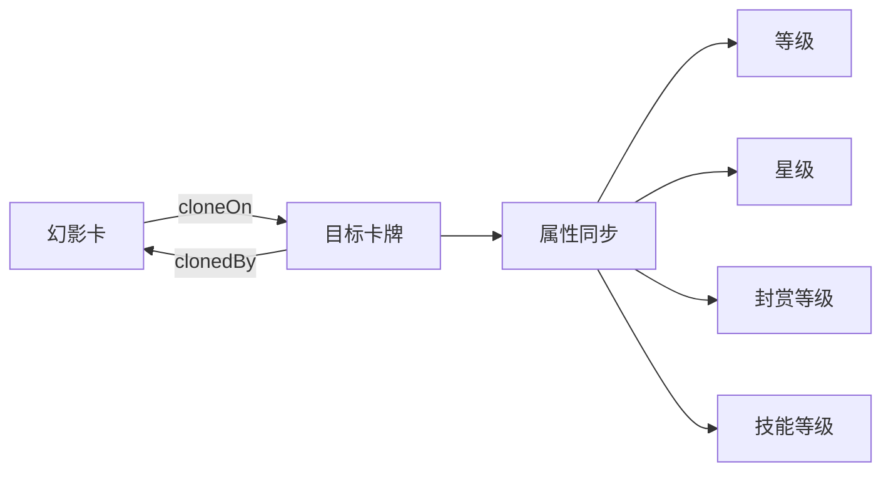

# 幻影卡系统

## 系统概述

幻影卡是一种特殊的卡牌类型，能够复制其他已拥有卡牌的属性。幻影卡不能独立升级，其等级、星级、封赏等级完全跟随复制目标同步。系统支持切换复制目标、处理占用冲突，并可设置过期时间。

## 核心机制

### 复制机制



### 数据结构

```csharp
// PlayerCard.cs
public class PlayerCard
{
    // 幻影卡相关字段
    public bool isPhantom = false;     // 是否为幻影卡
    public string cloneOn = "";        // 幻影卡复制的目标卡牌ID
    public string clonedBy = "";       // 被哪张幻影卡复制
    public long expireTime = 0;        // 过期时间戳（毫秒），0表示永不过期
    
    // 其他属性（会从复制目标同步）
    public int level = 1;              // 等级
    public int star = 0;               // 星级
    public int giftLv = 0;             // 封赏等级
    public int giftExp = 0;            // 封赏经验
}
```

## 属性同步逻辑

### 1. 同步规则

```csharp
// PlayerCardBankMgr.cs
void SyncPhantomsForCard(string originalCardId)
{
    var originalCard = PlayerCardBank.I.Get(originalCardId);
    if (originalCard == null) return;
    
    // 找出所有复制此卡的幻影卡
    var phantoms = new List<PlayerCard>();
    foreach (var card in PlayerCardBank.I.cards)
    {
        if (card.isPhantom && card.cloneOn == originalCardId)
        {
            phantoms.Add(card);
        }
    }
    
    // 同步等级、星级、封赏等级
    foreach (var phantom in phantoms)
    {
        phantom.level = originalCard.level;
        phantom.star = originalCard.star;
        phantom.giftLv = originalCard.giftLv;
        phantom.giftExp = originalCard.giftExp;
        
        NotifyUpdated(phantom.id);
    }
}
```

### 2. 限制条件

```csharp
// 幻影卡不能独立升级
if (pc.isPhantom)
{
    Debug.LogWarning($"Cannot upgrade phantom card {id}");
    return;
}

// 幻影卡不能独立升星
if (pc.isPhantom)
{
    Debug.LogWarning($"Cannot star up phantom card {id}");
    return;
}

// 幻影卡不能接受封赏
if (pc.isPhantom)
{
    Debug.LogWarning($"Cannot add gift exp to phantom card {id}");
    return;
}

// 幻影卡不能装备道具
if (pc.isPhantom)
{
    Debug.LogWarning($"Cannot equip on phantom card {id}");
    return;
}
```

## PhantomClonePanel UI实现

### UI结构

```
PhantomClonePanel/
├── BlackPanel                    # 主面板
│   ├── TitleLabel               # 标题："选择XX要复制的武将"
│   ├── CurrentCloneLabel        # 当前复制状态
│   ├── CardListScroll           # 卡牌列表（ScrollViewPro）
│   │   ├── ResetCard           # 重置卡片（取消复制）
│   │   └── CardOption[]        # 可复制的卡牌列表
│   ├── CancelCloneBtn          # 取消复制按钮
│   ├── CloseBtn                # 关闭按钮
│   └── LoadingOverlay          # 加载遮罩
└── BlackSpace                   # 点击关闭区域
```

### PhantomClonePanel 控制器

```csharp
public class PhantomClonePanel : MonoBehaviour, IUIPanelController
{
    // UI元素
    private ScrollViewPro cardListScroll;
    private Button closeBtn;
    private Button cancelCloneBtn;
    private Label titleLabel;
    private Label currentCloneLabel;
    private VisualElement loadingOverlay;
    
    // 卡片模板
    [SerializeField] private VisualTreeAsset cardTemplate;
    
    // 运行时状态
    private Dictionary<string, VisualElement> cardContainers = new();
    private string currentSelectedId = null;
    private bool isCardListBuilt = false;
    private bool isProcessing = false;
    
    // 数据
    private CardInfoStatic currentStatic;  // 幻影卡的静态信息
    private PlayerCard phantomCard;        // 幻影卡动态数据
    private Action<string> onCloneSelected;
}
```

### 卡牌列表构建

```csharp
void BuildCardList()
{
    cardGrid.Clear();
    cardContainers.Clear();
    
    // 1. 添加"重置"卡片（取消复制）
    var resetCard = CreateResetCard();
    cardGrid.Add(resetCard);
    cardContainers["reset"] = resetCard;
    
    // 2. 获取所有可复制的卡片（非幻影卡）
    var allCards = PlayerCardBank.I.All;
    var validTargets = new List<PlayerCard>();
    
    foreach (var card in allCards)
    {
        // 跳过幻影卡、主公卡
        if (card.isPhantom || card.id == "LORD") continue;
        validTargets.Add(card);
    }
    
    // 3. 排序：未被占用的优先
    validTargets.Sort((a, b) => 
    {
        bool aOccupied = !string.IsNullOrEmpty(a.clonedBy) && a.clonedBy != phantomCard.id;
        bool bOccupied = !string.IsNullOrEmpty(b.clonedBy) && b.clonedBy != phantomCard.id;
        
        if (aOccupied && !bOccupied) return 1;
        if (!aOccupied && bOccupied) return -1;
        return string.Compare(a.id, b.id);
    });
    
    // 4. 创建卡片UI
    foreach (var card in validTargets)
    {
        var cardItem = CreateCardWithTemplate(card);
        cardGrid.Add(cardItem);
        cardContainers[card.id] = cardItem;
    }
    
    // 5. 更新选中状态
    if (!string.IsNullOrEmpty(phantomCard.cloneOn))
    {
        UpdateSelectionState();
    }
}
```

## 复制目标切换

### 1. 简单切换（目标未被占用）

```csharp
void SelectCloneTarget(string targetId)
{
    if (string.IsNullOrEmpty(targetId)) return;
    
    // 发送请求
    var req = new PhantomCloneReq
    {
        phantom_card = phantomCard.id,
        unclone = 0,  // 0=设置复制，1=取消复制
        clone_on = targetId
    };
    
    MessageHub.I.Request("card/phantom_clone", req, OnPhantomCloneResp, 10f);
    ShowLoading(true);
}
```

### 2. 占用冲突处理

```csharp
void HandleOccupiedTarget(PlayerCard targetCard)
{
    string occupyingPhantomId = targetCard.clonedBy;
    
    // 获取显示名称
    var targetStatic = CardDatabaseStatic.Instance.Get(targetCard.id);
    var occupyingStatic = CardDatabaseStatic.Instance.Get(occupyingPhantomId);
    
    string message = $"{targetName} 已被 {occupyingName} 占用\n\n" +
                    $"确认将 {currentPhantomName} 复制目标切换为 {targetName}？";
    
    PopupManager.ShowConfirm(
        message,
        onYes: () => {
            PerformSwitch(targetCard.id, occupyingPhantomId);
        },
        onNo: null,
        yesText: "确认切换",
        noText: "取消"
    );
}
```

### 3. 两步切换流程

```csharp
IEnumerator PerformSwitchCoroutine(string targetCardId, string occupyingPhantomId)
{
    ShowLoading(true);
    
    // 步骤1：解除占用（让占用的幻影卡取消复制）
    bool step1Success = false;
    var uncloneReq = new PhantomCloneReq
    {
        phantom_card = occupyingPhantomId,
        unclone = 1,
        clone_on = null
    };
    
    MessageHub.I.Request("card/phantom_clone", uncloneReq, (resp) => {
        if (resp != null && resp.code == 0)
        {
            step1Success = true;
            
            // 立即更新本地数据
            var occupyingPhantom = PlayerCardBank.I.Get(occupyingPhantomId);
            if (occupyingPhantom != null)
            {
                occupyingPhantom.cloneOn = "";
                occupyingPhantom.level = 1;
                occupyingPhantom.star = 1;
                occupyingPhantom.giftLv = 0;
                occupyingPhantom.giftExp = 0;
            }
            
            var targetCard = PlayerCardBank.I.Get(targetCardId);
            if (targetCard != null)
            {
                targetCard.clonedBy = "";
            }
        }
    }, 10f);
    
    // 等待步骤1完成
    float timeout = 10f;
    while (!step1Success && timeout > 0)
    {
        yield return new WaitForSeconds(0.1f);
        timeout -= 0.1f;
    }
    
    if (!step1Success)
    {
        ShowLoading(false);
        PopupManager.Show("错误", "解除复制失败，请重试");
        yield break;
    }
    
    yield return new WaitForSeconds(0.5f);  // 确保服务器处理完成
    
    // 步骤2：绑定到当前幻影卡
    bool step2Success = false;
    var cloneReq = new PhantomCloneReq
    {
        phantom_card = phantomCard.id,
        unclone = 0,
        clone_on = targetCardId
    };
    
    MessageHub.I.Request("card/phantom_clone", cloneReq, (resp) => {
        if (resp != null && resp.code == 0)
        {
            step2Success = true;
            var data = JsonUtility.FromJson<PhantomCloneResp>(resp.dataJson);
            UpdateLocalData(data);
        }
    }, 10f);
    
    // 等待步骤2完成
    timeout = 10f;
    while (!step2Success && timeout > 0)
    {
        yield return new WaitForSeconds(0.1f);
        timeout -= 0.1f;
    }
    
    ShowLoading(false);
    
    if (step2Success)
    {
        PopupManager.Show("成功", "切换成功！");
        UpdateCurrentCloneLabel();
        BuildCardList();  // 重建列表以更新占用状态
        onCloneSelected?.Invoke(phantomCard.cloneOn);
    }
}
```

## 网络协议

### 请求结构

```csharp
[Serializable]
public class PhantomCloneReq
{
    public string phantom_card;    // 幻影卡ID
    public int unclone;           // 0=设置复制，1=取消复制
    public string clone_on;       // 目标卡牌ID（取消时为null）
}
```

### 响应结构

```csharp
[Serializable]
public class PhantomCloneResp
{
    public string now_clone_on;    // 当前复制的目标ID
    public string uncloned_off;    // 取消复制的目标ID
    public NewStat new_stat;       // 新的属性值
    public List<AutoUnequippedGear> auto_unequipped_gears;  // 自动卸下的装备
}

[Serializable]
public class NewStat
{
    public int level;             // 新等级
    public int star;              // 新星级
    public int gift_level;        // 新封赏等级
    public int gift_progress;     // 新封赏进度
}
```

## 过期时间处理

### 过期检查

```csharp
public void RemoveExpiredPhantoms()
{
    long currentTime = DateTimeOffset.UtcNow.ToUnixTimeMilliseconds();
    var toRemove = new List<string>();
    
    foreach (var card in PlayerCardBank.I.cards)
    {
        if (card.isPhantom && card.expireTime > 0 && card.expireTime < currentTime)
        {
            toRemove.Add(card.id);
        }
    }
    
    foreach (var id in toRemove)
    {
        RemoveCard(id);
        Debug.Log($"[PlayerCardBankMgr] Removed expired phantom card: {id}");
    }
}
```

### 剩余时间显示

```csharp
string GetRemainingTimeText(long expireTime)
{
    if (expireTime <= 0) return "永久";
    
    long currentTime = DateTimeOffset.UtcNow.ToUnixTimeMilliseconds();
    long remainingMs = expireTime - currentTime;
    
    if (remainingMs <= 0) return "已过期";
    
    TimeSpan timeSpan = TimeSpan.FromMilliseconds(remainingMs);
    
    if (timeSpan.TotalDays >= 1)
        return $"{(int)timeSpan.TotalDays}天";
    else if (timeSpan.TotalHours >= 1)
        return $"{(int)timeSpan.TotalHours}小时";
    else
        return $"{(int)timeSpan.TotalMinutes}分钟";
}
```

## UI样式

### 选中高亮

```csharp
void AddSelectedHighlight(VisualElement container)
{
    var cardRoot = container.Q<Button>("CardRoot");
    if (cardRoot != null)
    {
        cardRoot.style.borderTopColor = Color.white;
        cardRoot.style.borderRightColor = Color.white;
        cardRoot.style.borderBottomColor = Color.white;
        cardRoot.style.borderLeftColor = Color.white;
        cardRoot.style.borderTopWidth = 8;
        cardRoot.style.borderRightWidth = 8;
        cardRoot.style.borderBottomWidth = 8;
        cardRoot.style.borderLeftWidth = 8;
    }
    
    // 添加文字提示
    var selectedText = new Label("当前目标");
    selectedText.style.position = Position.Absolute;
    selectedText.style.bottom = 10;
    selectedText.style.fontSize = 26;
    selectedText.style.color = Color.white;
    selectedText.style.unityFontStyleAndWeight = FontStyle.Bold;
    container.Add(selectedText);
}
```

### 被占用样式

```csharp
// 被其他幻影卡占用时显示半透明
if (!string.IsNullOrEmpty(card.clonedBy) && card.clonedBy != phantomCard.id)
{
    cardRoot.style.unityBackgroundImageTintColor = new Color(0.5f, 0.5f, 0.5f, 0.5f);
    
    // 添加占用标记
    var occupiedLabel = new Label("已占用");
    occupiedLabel.style.position = Position.Absolute;
    occupiedLabel.style.top = Length.Percent(50);
    occupiedLabel.style.fontSize = 32;
    occupiedLabel.style.color = new Color(1f, 0.3f, 0.3f, 1f);
    container.Add(occupiedLabel);
}
```

## 事件通知

### 更新通知链

```csharp
void UpdateLocalData(PhantomCloneResp data)
{
    // 1. 更新幻影卡数据
    if (data.new_stat != null)
    {
        phantomCard.level = data.new_stat.level;
        phantomCard.star = data.new_stat.star;
        phantomCard.giftLv = data.new_stat.gift_level;
        phantomCard.giftExp = data.new_stat.gift_progress;
        
        // 更新装备槽解锁状态
        phantomCard.equip.weaponUnlocked = data.new_stat.gift_level >= 1;
        phantomCard.equip.armorUnlocked = data.new_stat.gift_level >= 2;
        phantomCard.equip.mountUnlocked = data.new_stat.gift_level >= 3;
    }
    
    // 2. 更新复制关系
    if (!string.IsNullOrEmpty(data.uncloned_off))
    {
        var oldTarget = PlayerCardBank.I.Get(data.uncloned_off);
        if (oldTarget != null)
        {
            oldTarget.clonedBy = "";
            PlayerCardBankMgr.I?.RaiseCardUpdated(oldTarget.id);
        }
        phantomCard.cloneOn = "";
    }
    
    if (!string.IsNullOrEmpty(data.now_clone_on))
    {
        phantomCard.cloneOn = data.now_clone_on;
        var newTarget = PlayerCardBank.I.Get(data.now_clone_on);
        if (newTarget != null)
        {
            newTarget.clonedBy = phantomCard.id;
            PlayerCardBankMgr.I?.RaiseCardUpdated(newTarget.id);
        }
    }
    
    // 3. 触发幻影卡自身的更新事件
    PlayerCardBankMgr.I?.RaiseCardUpdated(phantomCard.id);
    
    // 4. 强制刷新UI组件
    var cardGrid = FindObjectOfType<CardGridController>();
    cardGrid?.ForceRefreshCard(phantomCard.id);
    
    var cardDetails = FindObjectOfType<CardDetailsController>();
    cardDetails?.RefreshIfCurrent(phantomCard.id);
}
```

## 特殊规则

### 1. 主公卡不能被复制

```csharp
// 跳过主公卡
if (card.id == "LORD") continue;
```

### 2. 幻影卡不能复制幻影卡

```csharp
// 跳过其他幻影卡
if (card.isPhantom) continue;
```

### 3. 一对一占用关系

- 一张普通卡同时只能被一张幻影卡复制
- 切换目标时需要先解除原有占用

### 4. 数据同步时机

- 复制目标升级时，自动同步幻影卡
- 复制目标升星时，自动同步幻影卡
- 复制目标封赏升级时，自动同步幻影卡

## 注意事项

1. **属性同步**
   - 幻影卡的所有属性都来自复制目标
   - 不保存独立的升级数据

2. **占用管理**
   - 使用clonedBy字段跟踪占用关系
   - 切换时需要正确清理占用状态

3. **UI刷新**
   - 切换复制目标后需要刷新多个UI组件
   - 使用事件通知机制确保同步

4. **网络请求**
   - 占用冲突时需要两步操作
   - 需要处理请求失败和超时

5. **过期处理**
   - 定期检查过期时间
   - 过期后自动删除幻影卡

## 相关文档

- [卡牌系统概述](./card-overview.md)
- [卡牌数据模型](./card-data-model.md)
- [升级系统](./card-upgrade-system.md)
- [升星系统](./card-star-system.md)
- [封赏系统](./card-gift-system.md)