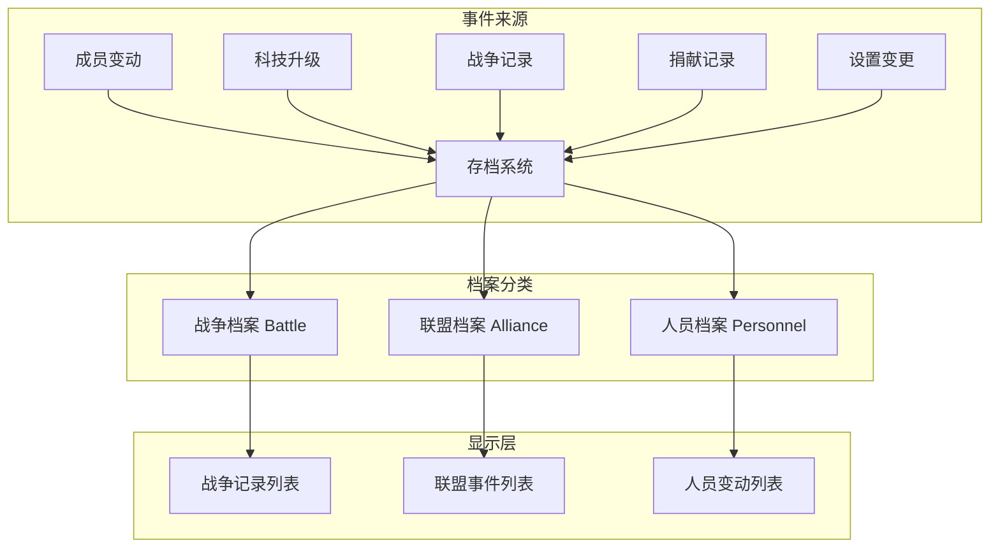

# 工会存档系统

## 功能概述

工会存档系统（档案阁）是工会历史记录的管理中心，记录了工会所有重要事件和活动。系统将事件分为三大类：战争档案、联盟档案、人员档案，为工会成员提供完整的历史查询功能。

## 系统架构



## 核心概念

### 1. 档案分类

```csharp
// 文件：Assets/Scripts/UI/Clan/ClanArchiveController.cs
public enum ArchiveCategory
{
    Battle,     // 战争
    Alliance,   // 联盟（对应event）
    Personnel   // 人员
}
```

### 2. 档案记录结构

```csharp
// 文件：Assets/Scripts/UI/Clan/ClanArchiveController.cs
[System.Serializable]
public class ArchiveRecord
{
    public string eventType;           // 事件类型
    public DateTime timestamp;         // 时间戳
    public string displayText;         // 显示文本
    public ArchiveCategory category;   // 分类
    public Dictionary<string, object> extraData; // 额外数据（如坐标）
    
    public ArchiveRecord(string eventType, DateTime timestamp, string displayText, ArchiveCategory category)
    {
        this.eventType = eventType;
        this.timestamp = timestamp;
        this.displayText = displayText;
        this.category = category;
        this.extraData = new Dictionary<string, object>();
    }
}
```

## 事件类型

### 1. 人员事件（Personnel）

| 事件类型 | 格式 | 说明 |
|----------|------|------|
| **member_join** | `member_join::time::nickname` | 成员加入 |
| **member_left** | `member_left::time::nickname` | 成员离开 |
| **member_kick** | `member_kick::time::nickname::kicker` | 成员被踢 |
| **member_position_change** | `member_position_change::time::nickname::old::new` | 职位变更 |

### 2. 联盟事件（Alliance）

| 事件类型 | 格式 | 说明 |
|----------|------|------|
| **donation** | `donation::time::nickname::amount::type` | 资源捐献 |
| **techtree_upgrade** | `techtree_upgrade::time::nickname::category` | 科技升级 |
| **techtree_refresh** | `techtree_refresh::time::nickname::category` | 概率刷新 |
| **setting** | `setting::time::nickname` | 设置修改 |
| **union_level** | `union_level::time::level` | 工会升级 |
| **buff** | `buff::time::nickname::length` | 使用增益 |

### 3. 战争事件（Battle）

| 事件类型 | 格式 | 说明 |
|----------|------|------|
| **rally** | `rally::time::nickname::target` | 发起集结 |
| **defend** | `defend::time::nickname::location` | 防守行动 |
| **occupy** | `occupy::time::nickname::coordinates` | 占领领土 |
| **abandon** | `abandon::time::nickname::coordinates` | 废弃主城 |

## 功能实现

### 1. 初始化档案系统

```csharp
// 文件：Assets/Scripts/UI/Clan/ClanArchiveController.cs
public void InitializeArchivePage(VisualElement pageRoot)
{
    root = pageRoot;
    
    // 初始化数据结构
    InitializeDataStructures();
    
    // 获取UI元素引用
    GetUIElements();
    
    // 绑定事件
    BindEvents();
    
    // 加载初始数据
    LoadInitialData();
}

private void InitializeDataStructures()
{
    recordsByCategory.Clear();
    loadedCounts.Clear();
    isLoadingMore.Clear();
    hasMoreData.Clear();
    
    foreach (ArchiveCategory cat in Enum.GetValues(typeof(ArchiveCategory)))
    {
        recordsByCategory[cat] = new List<ArchiveRecord>();
        loadedCounts[cat] = 0;
        isLoadingMore[cat] = false;
        hasMoreData[cat] = true;
    }
}
```

### 2. 解析日志条目

```csharp
// 文件：Assets/Scripts/UI/Clan/ClanArchiveController.cs
private ArchiveRecord ParseLogEntry(string logEntry, ArchiveCategory category)
{
    try
    {
        var parts = logEntry.Split(new[] { "::" }, StringSplitOptions.None);
        if (parts.Length < 2) return null;
        
        var eventType = parts[0];
        var timestamp = DateTimeOffset.FromUnixTimeSeconds(long.Parse(parts[1])).DateTime;
        
        ArchiveRecord record = null;
        
        switch (eventType)
        {
            case "member_join":
                // member_join::time::nickname
                if (parts.Length >= 3)
                {
                    var nickname = parts[2];
                    record = new ArchiveRecord(eventType, timestamp,
                        $"{nickname} 加入了联盟",
                        ArchiveCategory.Personnel);
                }
                break;
                
            case "member_left":
                // member_left::time::nickname
                if (parts.Length >= 3)
                {
                    var nickname = parts[2];
                    record = new ArchiveRecord(eventType, timestamp,
                        $"{nickname} 离开了联盟",
                        ArchiveCategory.Personnel);
                }
                break;
                
            case "member_position_change":
                // member_position_change::time::nickname::old_position::new_position
                if (parts.Length >= 5)
                {
                    var nickname = parts[2];
                    var oldPos = GetPositionDisplayName(parts[3]);
                    var newPos = GetPositionDisplayName(parts[4]);
                    
                    record = new ArchiveRecord(eventType, timestamp,
                        $"{nickname} 的职位从 {oldPos} 变更为 {newPos}",
                        ArchiveCategory.Personnel);
                }
                break;
                
            case "donation":
                // donation::time::nickname::amount::type
                if (parts.Length >= 5)
                {
                    var nickname = parts[2];
                    var amount = parts[3];
                    var donationType = parts[4];
                    
                    string typeText = donationType switch
                    {
                        "wood" => "木材",
                        "stone" => "石材",
                        "iron" => "铁矿",
                        "tech" => "科技点",
                        _ => donationType
                    };
                    
                    record = new ArchiveRecord(eventType, timestamp,
                        $"{nickname} 捐献了 {amount} {typeText}",
                        ArchiveCategory.Alliance);
                }
                break;
                
            case "techtree_upgrade":
                // techtree_upgrade::time::nickname::category
                if (parts.Length >= 4)
                {
                    var nickname = parts[2];
                    var techCategory = parts[3];
                    
                    string categoryText = techCategory switch
                    {
                        "battle" => "战斗科技",
                        "policy" => "政策科技",
                        "develop" => "发展科技",
                        "efficiency" => "效率科技",
                        _ => techCategory
                    };
                    
                    record = new ArchiveRecord(eventType, timestamp,
                        $"{nickname} 升级了{categoryText}",
                        ArchiveCategory.Alliance);
                }
                break;
        }
        
        return record;
    }
    catch (Exception e)
    {
        Debug.LogError($"[ClanArchiveController] 解析日志失败: {e.Message}");
        return null;
    }
}
```

### 3. 加载档案数据

```csharp
// 文件：Assets/Scripts/UI/Clan/ClanArchiveController.cs
private void LoadInitialData()
{
    // 请求所有三个分类的初始数据
    var categories = new List<string> { "battle", "event", "member" };
    
    RequestArchiveData(categories, 0, INITIAL_LOAD_COUNT, true);
}

private void RequestArchiveData(
    List<string> categories, 
    int startIndex, 
    int limit, 
    bool isInitialLoad)
{
    // 设置加载状态
    foreach (var cat in categories)
    {
        var category = GetCategoryFromString(cat);
        isLoadingMore[category] = true;
    }
    
    // 发送请求
    UnionService.I.GetUnionArchive(
        categories: categories,
        startIndex: startIndex,
        limit: limit,
        onSuccess: (archiveData) =>
        {
            // 处理返回的数据
            foreach (var kvp in archiveData)
            {
                var category = GetCategoryFromString(kvp.Key);
                
                if (isInitialLoad)
                {
                    recordsByCategory[category].Clear();
                }
                
                ProcessArchiveLogs(kvp.Value.logs, category);
                hasMoreData[category] = kvp.Value.logs.Count >= limit;
            }
            
            // 更新加载状态
            foreach (var cat in categories)
            {
                var category = GetCategoryFromString(cat);
                isLoadingMore[category] = false;
            }
            
            // 刷新当前分类的UI
            RefreshCurrentCategoryUI();
        },
        onError: (error) =>
        {
            Debug.LogError($"[ClanArchiveController] 加载档案数据失败: {error}");
            
            // 重置加载状态
            foreach (var cat in categories)
            {
                var category = GetCategoryFromString(cat);
                isLoadingMore[category] = false;
            }
        }
    );
}
```

### 4. 分页加载

```csharp
// 文件：Assets/Scripts/UI/Clan/ClanArchiveController.cs
private void LoadMoreData(ArchiveCategory category)
{
    if (isLoadingMore[category] || !hasMoreData[category]) return;
    
    isLoadingMore[category] = true;
    
    var categoryStr = GetStringFromCategory(category);
    var startIndex = loadedCounts[category];
    
    RequestArchiveData(
        new List<string> { categoryStr }, 
        startIndex, 
        LOAD_MORE_COUNT, 
        false
    );
    
    loadedCounts[category] += LOAD_MORE_COUNT;
}
```

### 5. UI显示

```csharp
// 文件：Assets/Scripts/UI/Clan/ClanArchiveController.cs
private void RefreshCurrentCategoryUI()
{
    // 清空当前容器
    var container = GetContainerForCategory(currentCategory);
    container.Clear();
    
    // 显示记录
    var records = recordsByCategory[currentCategory];
    foreach (var record in records)
    {
        CreateRecordItem(record, container);
    }
    
    // 如果没有记录，显示空状态
    if (records.Count == 0)
    {
        ShowEmptyState(container);
    }
}

private void CreateRecordItem(ArchiveRecord record, VisualElement container)
{
    var item = new VisualElement();
    item.AddToClassList("archive-item");
    
    // 时间标签
    var timeLabel = new Label(FormatTimestamp(record.timestamp));
    timeLabel.AddToClassList("time-label");
    item.Add(timeLabel);
    
    // 事件文本
    var textLabel = new Label(record.displayText);
    textLabel.AddToClassList("event-label");
    item.Add(textLabel);
    
    // 如果有额外数据（如坐标），添加额外信息
    if (record.extraData != null && record.extraData.ContainsKey("coordinates"))
    {
        var coordLabel = new Label($"[{record.extraData["coordinates"]}]");
        coordLabel.AddToClassList("coord-label");
        item.Add(coordLabel);
    }
    
    container.Add(item);
}
```

## 分类切换

### 1. Tab按钮处理

```csharp
// 文件：Assets/Scripts/UI/Clan/ClanArchiveController.cs
private void BindEvents()
{
    // Tab按钮点击事件
    battleTabBtn?.RegisterCallback<ClickEvent>(evt => SwitchCategory(ArchiveCategory.Battle));
    allianceTabBtn?.RegisterCallback<ClickEvent>(evt => SwitchCategory(ArchiveCategory.Alliance));
    personnelTabBtn?.RegisterCallback<ClickEvent>(evt => SwitchCategory(ArchiveCategory.Personnel));
    
    // 滚动加载更多
    battleScrollView?.RegisterCallback<GeometryChangedEvent>(evt => OnScrollChanged(ArchiveCategory.Battle));
    allianceScrollView?.RegisterCallback<GeometryChangedEvent>(evt => OnScrollChanged(ArchiveCategory.Alliance));
    personnelScrollView?.RegisterCallback<GeometryChangedEvent>(evt => OnScrollChanged(ArchiveCategory.Personnel));
}

private void SwitchCategory(ArchiveCategory category)
{
    if (currentCategory == category) return;
    
    currentCategory = category;
    
    // 更新Tab样式
    UpdateTabStyles();
    
    // 切换内容显示
    ShowCategoryContent(category);
    
    // 如果该分类还没有数据，加载数据
    if (recordsByCategory[category].Count == 0)
    {
        LoadInitialDataForCategory(category);
    }
}
```

### 2. 内容切换

```csharp
// 文件：Assets/Scripts/UI/Clan/ClanArchiveController.cs
private void ShowCategoryContent(ArchiveCategory category)
{
    // 隐藏所有内容
    battleContent?.AddToClassList("hidden");
    allianceContent?.AddToClassList("hidden");
    personnelContent?.AddToClassList("hidden");
    
    // 显示当前分类
    switch (category)
    {
        case ArchiveCategory.Battle:
            battleContent?.RemoveFromClassList("hidden");
            break;
        case ArchiveCategory.Alliance:
            allianceContent?.RemoveFromClassList("hidden");
            break;
        case ArchiveCategory.Personnel:
            personnelContent?.RemoveFromClassList("hidden");
            break;
    }
}
```

## 缓存管理

### 1. 缓存存储

```csharp
// 文件：Assets/Scripts/Network/Core/Service/UnionService.cs
public class UnionCacheManager
{
    private const string ARCHIVE_DATA_KEY = "UnionService_Archive_";
    
    public void SaveArchiveData(Dictionary<string, UnionService.UnionArchiveData> archiveDict)
    {
        try
        {
            var json = JsonConvert.SerializeObject(archiveDict);
            if (json.Length > 100000)
            {
                SaveToFile(ARCHIVE_DATA_KEY, json);
            }
            else
            {
                PlayerPrefs.SetString(ARCHIVE_DATA_KEY, json);
                PlayerPrefs.Save();
            }
        }
        catch (Exception e)
        {
            Debug.LogError($"[UnionCacheManager] Save archive data failed: {e.Message}");
        }
    }
    
    public Dictionary<string, UnionService.UnionArchiveData> LoadArchiveData()
    {
        try
        {
            var json = LoadFromFile(ARCHIVE_DATA_KEY);
            if (string.IsNullOrEmpty(json))
            {
                json = PlayerPrefs.GetString(ARCHIVE_DATA_KEY, "");
            }
            
            if (!string.IsNullOrEmpty(json))
            {
                return JsonConvert.DeserializeObject<Dictionary<string, UnionService.UnionArchiveData>>(json)
                    ?? new Dictionary<string, UnionService.UnionArchiveData>();
            }
        }
        catch (Exception e)
        {
            Debug.LogError($"[UnionCacheManager] Load archive data failed: {e.Message}");
        }
        
        return new Dictionary<string, UnionService.UnionArchiveData>();
    }
}
```

## 时间格式化

### 1. 时间戳格式化

```csharp
// 文件：Assets/Scripts/UI/Clan/ClanArchiveController.cs
private string FormatTimestamp(DateTime timestamp)
{
    var now = DateTime.Now;
    var timeSpan = now - timestamp;
    
    if (timeSpan.TotalMinutes < 1)
        return "刚刚";
    else if (timeSpan.TotalMinutes < 60)
        return $"{(int)timeSpan.TotalMinutes}分钟前";
    else if (timeSpan.TotalHours < 24)
        return $"{(int)timeSpan.TotalHours}小时前";
    else if (timeSpan.TotalDays < 7)
        return $"{(int)timeSpan.TotalDays}天前";
    else
        return timestamp.ToString("yyyy-MM-dd");
}
```

### 2. 职位名称转换

```csharp
// 文件：Assets/Scripts/UI/Clan/ClanArchiveController.cs
private string GetPositionDisplayName(string position)
{
    switch (position?.ToLower())
    {
        case "r6":
        case "leader": return "盟主";
        case "r5":
        case "coleader": return "副盟主";
        case "r4": return "内阁精英";
        case "r3": return "内阁成员";
        case "r2": return "将军";
        case "r1": return "士兵";
        default: return position ?? "成员";
    }
}
```

## API接口

### 获取档案数据

**路径**: `union/get_union_archive`  
**方法**: POST

#### 请求
```json
{
    "categories": ["battle", "event", "member"],
    "start_index": 0,
    "limit": 20
}
```

#### 响应
```json
{
    "battle": {
        "logs": [
            "rally::1703145600::张三::enemy_city_123",
            "occupy::1703142000::李四::100,200"
        ]
    },
    "event": {
        "logs": [
            "techtree_upgrade::1703145000::王五::battle",
            "donation::1703144000::赵六::1000::tech"
        ]
    },
    "member": {
        "logs": [
            "member_join::1703143500::新成员",
            "member_position_change::1703143000::老成员::r1::r2"
        ]
    }
}
```

## 性能优化

### 1. 分页加载
- 初始加载20条记录
- 滚动到底部加载更多
- 每次加载20条

### 2. 缓存策略
- 本地缓存已加载数据
- 避免重复请求
- 按分类独立缓存

### 3. UI优化
- 虚拟滚动列表
- 延迟渲染可见项
- 批量更新DOM

## 注意事项

### 1. 数据去重
- 检查时间戳和事件类型
- 避免重复显示相同事件
- 合并增量更新

### 2. 错误处理
- 解析失败跳过该条记录
- 网络错误显示提示
- 保持已有数据显示

### 3. 时间处理
- 使用服务器时间戳
- 本地时间仅用于显示
- 统一时区处理

### 4. 用户体验
- 空状态提示
- 加载状态显示
- 平滑切换分类

## 相关文档

- [工会系统概述](union-overview.md)
- [成员系统与权限](member-system.md)
- [工会科技树系统](union-tech.md)
- [工会广播系统](union-broadcast.md)