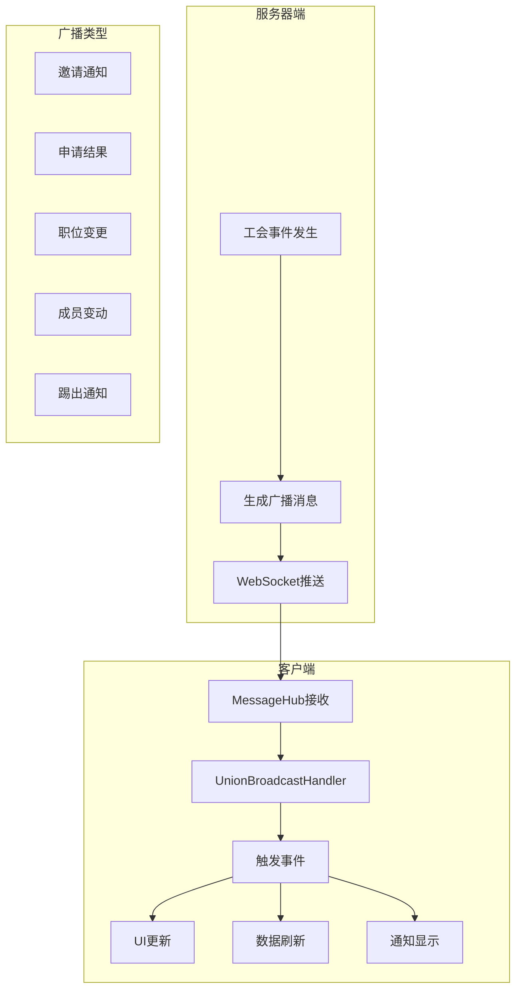
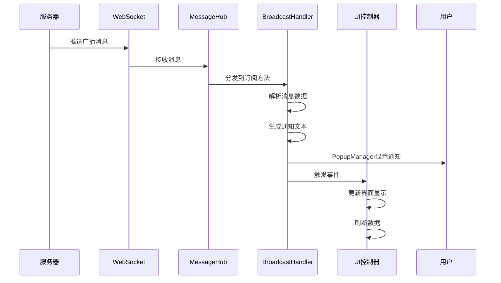

# 工会广播系统

## 功能概述

工会广播系统是实时通知机制的核心，负责处理所有工会相关的服务器推送消息。系统通过WebSocket接收服务器广播，实时通知客户端各种工会事件，如成员加入、职位变更、申请结果等，确保所有在线成员能及时获取工会状态变化。

## 系统架构



## 核心概念

### 1. 广播类型

| 广播类型 | 常量标识 | 说明 | 触发时机 |
|----------|----------|------|----------|
| **邀请通知** | `union/invited_by_union` | 收到工会邀请 | 其他工会向玩家发送邀请 |
| **申请拒绝** | `union/application_declined` | 申请被拒绝 | 工会管理员拒绝申请 |
| **申请接受** | `union/application_accepted` | 申请被接受 | 工会管理员接受申请 |
| **职位变更** | `union/position_changed` | 职位发生变化 | 管理员调整成员职位 |
| **踢出工会** | `union/kicked_from_union` | 被踢出工会 | 管理员移除成员 |
| **成员加入** | `union/member_joined` | 新成员加入 | 有新成员加入工会 |
| **成员离开** | `union/member_left` | 成员离开 | 成员退出或被踢出 |

### 2. 事件定义

```csharp
// 文件：Assets/Scripts/Network/Core/Service/UnionBroadcastHandler.cs
public class UnionBroadcastHandler : MonoBehaviour
{
    // 事件定义
    public event Action<string> OnUnionInvited;                    // 收到联盟邀请
    public event Action<string, bool> OnApplicationResult;         // 申请结果(unionId, accepted)
    public event Action<string, string> OnPositionChanged;         // 职位变更(oldPos, newPos)
    public event Action<string, string> OnKickedFromUnion;         // 被踢出联盟(unionId, kickedBy)
    public event Action<string, string> OnMemberJoined;            // 成员加入(cid, nickname)
    public event Action<string> OnMemberLeft;                      // 成员离开(cid)
}
```

## 数据结构

### 1. 广播消息格式

```json
// 邀请通知
{
    "union_id": "union_123"
}

// 申请结果
{
    "union_id": "union_123"
}

// 职位变更
{
    "old_position": "r2",
    "new_position": "r4"
}

// 踢出通知
{
    "union_id": "union_123",
    "kicked_by": "leader_name"
}

// 成员加入
{
    "cid": "player_123",
    "nickname": "玩家昵称"
}

// 成员离开
{
    "cid": "player_123"
}
```

## 功能实现

### 1. 初始化与订阅

```csharp
// 文件：Assets/Scripts/Network/Core/Service/UnionBroadcastHandler.cs
public void Initialize()
{
    if (MessageHub.I == null)
    {
        Debug.LogError("[UnionBroadcastHandler] MessageHub not initialized!");
        return;
    }
    
    // 订阅所有联盟相关广播
    MessageHub.I.Subscribe(BROADCAST_INVITED, OnInvitedByUnion);
    MessageHub.I.Subscribe(BROADCAST_APP_DECLINED, OnApplicationDeclined);
    MessageHub.I.Subscribe(BROADCAST_APP_ACCEPTED, OnApplicationAccepted);
    MessageHub.I.Subscribe(BROADCAST_POSITION_CHANGED, OnPositionChangedBroadcast);
    MessageHub.I.Subscribe(BROADCAST_KICKED, OnKickedFromUnionBroadcast);
    MessageHub.I.Subscribe(BROADCAST_MEMBER_JOINED, OnMemberJoinedBroadcast);
    MessageHub.I.Subscribe(BROADCAST_MEMBER_LEFT, OnMemberLeftBroadcast);
    
    Debug.Log("[UnionBroadcastHandler] Initialized and subscribed to broadcasts");
}
```

### 2. 邀请通知处理

```csharp
// 文件：Assets/Scripts/Network/Core/Service/UnionBroadcastHandler.cs
private void OnInvitedByUnion(string dataJson)
{
    try
    {
        var data = JsonConvert.DeserializeObject<Dictionary<string, object>>(dataJson);
        if (data != null && data.ContainsKey("union_id"))
        {
            string unionId = data["union_id"].ToString();
            Debug.Log($"[UnionBroadcastHandler] Received union invitation from: {unionId}");
            
            // 显示通知
            PopupManager.Show("联盟邀请", "您收到了一个新的联盟邀请！");
            
            // 触发事件
            OnUnionInvited?.Invoke(unionId);
            
            // TODO: 更新UI显示邀请标记
        }
    }
    catch (Exception e)
    {
        Debug.LogError($"[UnionBroadcastHandler] Failed to parse invitation broadcast: {e.Message}");
    }
}
```

### 3. 职位变更处理

```csharp
// 文件：Assets/Scripts/Network/Core/Service/UnionBroadcastHandler.cs
private void OnPositionChangedBroadcast(string dataJson)
{
    try
    {
        var data = JsonConvert.DeserializeObject<Dictionary<string, object>>(dataJson);
        if (data != null)
        {
            string oldPos = data.ContainsKey("old_position") ? data["old_position"].ToString() : "";
            string newPos = data.ContainsKey("new_position") ? data["new_position"].ToString() : "";
            
            Debug.Log($"[UnionBroadcastHandler] 职位变更: {oldPos} -> {newPos}");
            
            // 先刷新玩家信息
            PlayerInfoService.I.RefreshMyInfo(() =>
            {
                // 显示通知
                string message = GetPositionChangeMessage(oldPos, newPos);
                PopupManager.Show("职位变更", message);
                
                // 触发事件（这会调用 ClanMemberController.OnPositionChanged）
                OnPositionChanged?.Invoke(oldPos, newPos);
                
                // 刷新成员列表
                ForceRefreshMemberList();
                
                // 更新所有权限相关UI
                RefreshAllPermissionUI();
            });
        }
    }
    catch (Exception e)
    {
        Debug.LogError($"[UnionBroadcastHandler] 解析职位变更广播失败: {e.Message}");
    }
}
```

### 4. 成员变动处理

```csharp
// 文件：Assets/Scripts/Network/Core/Service/UnionBroadcastHandler.cs
private void OnMemberJoinedBroadcast(string dataJson)
{
    try
    {
        var data = JsonConvert.DeserializeObject<Dictionary<string, object>>(dataJson);
        if (data != null && data.ContainsKey("cid"))
        {
            string cid = data["cid"].ToString();
            string nickname = data.ContainsKey("nickname") ? data["nickname"].ToString() : "未知玩家";
            
            Debug.Log($"[UnionBroadcastHandler] Member joined: {nickname} ({cid})");
            
            // 显示通知
            PopupManager.Show("新成员加入", $"{nickname} 加入了联盟");
            
            // 触发事件
            OnMemberJoined?.Invoke(cid, nickname);
            
            // 强制刷新成员列表
            ForceRefreshMemberList();
        }
    }
    catch (Exception e)
    {
        Debug.LogError($"[UnionBroadcastHandler] Failed to parse member joined broadcast: {e.Message}");
    }
}

private void OnMemberLeftBroadcast(string dataJson)
{
    try
    {
        var data = JsonConvert.DeserializeObject<Dictionary<string, object>>(dataJson);
        if (data != null && data.ContainsKey("cid"))
        {
            string cid = data["cid"].ToString();
            
            Debug.Log($"[UnionBroadcastHandler] Member left: {cid}");
            
            // 触发事件
            OnMemberLeft?.Invoke(cid);
            
            // 强制刷新成员列表
            ForceRefreshMemberList();
        }
    }
    catch (Exception e)
    {
        Debug.LogError($"[UnionBroadcastHandler] Failed to parse member left broadcast: {e.Message}");
    }
}
```

### 5. 踢出工会处理

```csharp
// 文件：Assets/Scripts/Network/Core/Service/UnionBroadcastHandler.cs
private void OnKickedFromUnionBroadcast(string dataJson)
{
    try
    {
        var data = JsonConvert.DeserializeObject<Dictionary<string, object>>(dataJson);
        if (data != null && data.ContainsKey("union_id"))
        {
            string unionId = data["union_id"].ToString();
            string kickedBy = data.ContainsKey("kicked_by") ? 
                data["kicked_by"].ToString() : "管理员";
            Debug.Log($"[UnionBroadcastHandler] Kicked from union {unionId} by {kickedBy}");
            
            // 显示通知
            PopupManager.Show("移出联盟", $"您已被 {kickedBy} 移出联盟");
            
            // 触发事件
            OnKickedFromUnion?.Invoke(unionId, kickedBy);
            
            // 清理联盟缓存
            UnionService.I.ClearCache();
            
            // 刷新玩家信息
            RefreshPlayerInfo();
            
            // 返回到无联盟界面
            ReturnToNoUnionView();
        }
    }
    catch (Exception e)
    {
        Debug.LogError($"[UnionBroadcastHandler] Failed to parse kick broadcast: {e.Message}");
    }
}
```

## 事件订阅与取消

### 1. UI控制器订阅

```csharp
// 文件：Assets/Scripts/UI/Clan/ClanMemberController.cs
void Awake()
{
    // 订阅广播事件
    if (UnionBroadcastHandler.I != null)
    {
        UnionBroadcastHandler.I.OnPositionChanged += OnPositionChanged;
        UnionBroadcastHandler.I.OnMemberJoined += OnMemberJoined;
        UnionBroadcastHandler.I.OnMemberLeft += OnMemberLeft;
    }
}

void OnDestroy()
{
    // 最终清理
    if (UnionBroadcastHandler.I != null)
    {
        UnionBroadcastHandler.I.OnPositionChanged -= OnPositionChanged;
        UnionBroadcastHandler.I.OnMemberJoined -= OnMemberJoined;
        UnionBroadcastHandler.I.OnMemberLeft -= OnMemberLeft;
    }
}
```

### 2. 主控制器订阅

```csharp
// 文件：Assets/Scripts/UI/Clan/UnionMainController.cs
void Awake()
{
    if (UnionBroadcastHandler.I != null)
    {
        UnionBroadcastHandler.I.OnKickedFromUnion += OnKickedFromUnion;
    }
}

void OnDestroy()
{
    // 取消订阅
    if (UnionBroadcastHandler.I != null)
    {
        UnionBroadcastHandler.I.OnKickedFromUnion -= OnKickedFromUnion;
    }
}
```

### 3. 申请结果订阅

```csharp
// 文件：Assets/Scripts/UI/Clan/JoinUnionController.cs
void Awake()
{
    if (UnionBroadcastHandler.I != null)
    {
        UnionBroadcastHandler.I.OnApplicationResult += OnApplicationResult;
    }
}

void OnDestroy()
{
    // 取消订阅
    if (UnionBroadcastHandler.I != null)
    {
        UnionBroadcastHandler.I.OnApplicationResult -= OnApplicationResult;
    }
}
```

## 辅助方法

### 1. 权限刷新

```csharp
// 文件：Assets/Scripts/Network/Core/Service/UnionBroadcastHandler.cs
private void RefreshAllPermissionUI()
{
    // 关闭可能打开的管理弹窗（如果失去权限）
    var myInfo = PlayerInfoService.I?.GetMyInfo();
    if (myInfo != null && !myInfo.IsUnionOfficer)
    {
        // 关闭玩家详情弹窗的管理功能
        var playerDetailPopup = FindObjectOfType<PlayerDetailPopupController>();
        if (playerDetailPopup != null)
        {
            playerDetailPopup.OnPermissionLost();
        }
    }
}
```

### 2. 界面切换

```csharp
// 文件：Assets/Scripts/Network/Core/Service/UnionBroadcastHandler.cs
private void RefreshAfterJoinUnion()
{
    // 刷新玩家信息
    PlayerInfoService.I.RefreshMyInfo(() =>
    {
        // 清理联盟缓存
        UnionService.I.ClearCache();
        
        // 通知主界面切换到联盟页面
        var mainController = FindObjectOfType<UnionMainController>();
        if (mainController != null)
        {
            mainController.OnJoinUnionSuccess();
        }
    });
}

private void ReturnToNoUnionView()
{
    var mainController = FindObjectOfType<UnionMainController>();
    if (mainController != null)
    {
        mainController.OnLeaveUnionSuccess();
    }
}
```

### 3. 成员列表刷新

```csharp
// 文件：Assets/Scripts/Network/Core/Service/UnionBroadcastHandler.cs
private void ForceRefreshMemberList()
{
    var memberController = FindObjectOfType<ClanMemberController>();
    if (memberController != null)
    {
        memberController.ForceRefreshMemberList();
    }
}
```

## 通知消息生成

### 1. 职位变更消息

```csharp
// 文件：Assets/Scripts/Network/Core/Service/UnionBroadcastHandler.cs
private string GetPositionChangeMessage(string oldPos, string newPos)
{
    int oldLevel = GetPositionLevel(oldPos);
    int newLevel = GetPositionLevel(newPos);
    
    string newPosName = GetPositionDisplayName(newPos);
    
    if (newLevel > oldLevel)
    {
        return $"恭喜！您已被提升为{newPosName}";
    }
    else if (newLevel < oldLevel)
    {
        return $"您的职位已调整为{newPosName}";
    }
    else
    {
        return $"您的职位已变更为{newPosName}";
    }
}
```

### 2. 职位等级判断

```csharp
// 文件：Assets/Scripts/Network/Core/Service/UnionBroadcastHandler.cs
private int GetPositionLevel(string position)
{
    switch (position?.ToLower())
    {
        case "r6":
        case "leader": return 6;
        case "r5":
        case "coleader": return 5;
        case "r4": return 4;
        case "r3": return 3;
        case "r2": return 2;
        case "r1": return 1;
        default: return 0;
    }
}
```

### 3. 职位显示名称

```csharp
// 文件：Assets/Scripts/Network/Core/Service/UnionBroadcastHandler.cs
private string GetPositionDisplayName(string position)
{
    switch (position)
    {
        case "leader": return "盟主";
        case "coleader": return "副盟主";
        case "r4": return "R4";
        case "r3": return "R3";
        case "r2": return "R2";
        case "r1": return "R1";
        default: return position;
    }
}
```

## 单例模式

```csharp
// 文件：Assets/Scripts/Network/Core/Service/UnionBroadcastHandler.cs
public class UnionBroadcastHandler : MonoBehaviour
{
    // 单例
    public static UnionBroadcastHandler I { get; private set; }
    
    void Awake()
    {
        if (I != null && I != this)
        {
            Destroy(gameObject);
            return;
        }
        I = this;
        DontDestroyOnLoad(gameObject);
    }
    
    void OnDestroy()
    {
        // 清理单例
        if (I == this)
        {
            I = null;
        }
    }
}
```

## 广播流程



## 性能优化

### 1. 事件管理
- 使用弱引用避免内存泄漏
- 及时取消订阅避免重复处理
- 批量更新减少UI刷新

### 2. 数据处理
- 异常捕获保证稳定性
- JSON解析使用try-catch
- 避免频繁的FindObjectOfType

### 3. UI更新
- 合并相似的刷新操作
- 使用标记避免重复刷新
- 延迟非关键UI更新

## 注意事项

### 1. 订阅管理
- 在Awake中订阅事件
- 在OnDestroy中取消订阅
- 避免重复订阅

### 2. 错误处理
- 所有广播处理都要try-catch
- 解析失败不影响其他功能
- 记录错误日志便于调试

### 3. 状态同步
- 职位变更先刷新玩家信息
- 成员变动立即刷新列表
- 踢出工会清理所有缓存

### 4. 用户体验
- 及时显示通知弹窗
- 权限变化立即生效
- 界面自动切换流畅

## 相关文档

- [工会系统概述](union-overview.md)
- [成员系统与权限](member-system.md)
- [工会邀请系统](union-invitation.md)
- [工会管理功能](union-management.md)