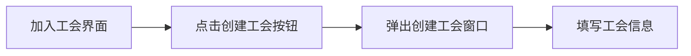
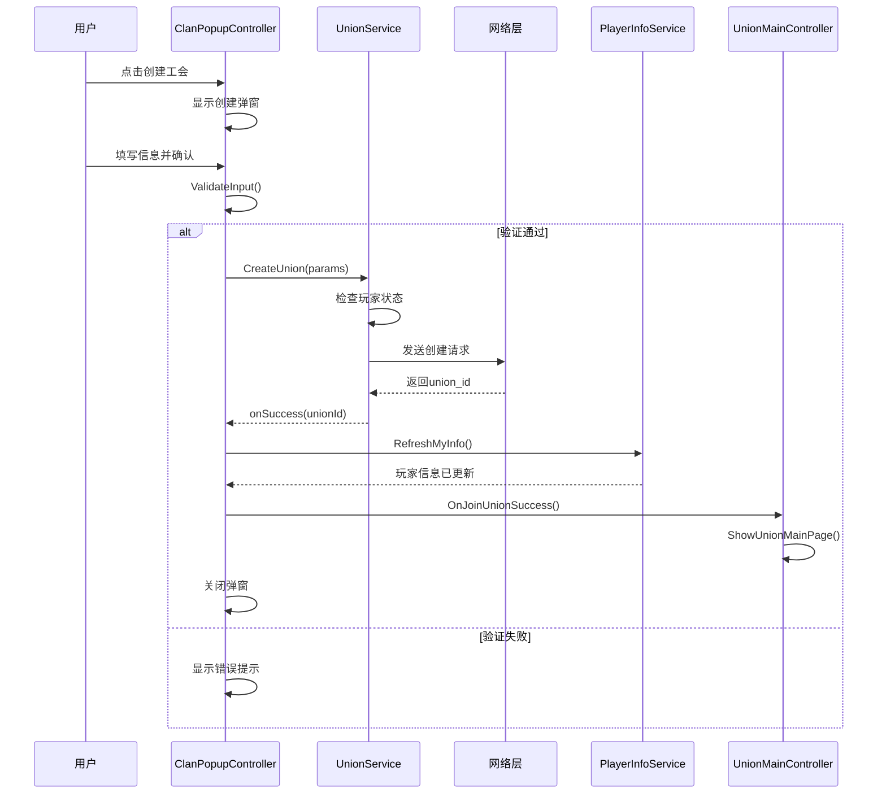

# 创建工会流程

## 功能概述

创建工会功能允许未加入任何工会的玩家创建自己的工会。创建者自动成为工会盟主（Leader），拥有最高管理权限。

## 创建条件

### 前置条件

| 条件 | 说明 |
|------|------|
| **工会状态** | 玩家必须未加入任何工会 |
| **网络连接** | 需要稳定的网络连接 |
| **消耗资源** | 创建工会可能需要消耗钻石（具体数值由服务器配置） |

### 输入限制

| 字段 | 限制 | 说明 |
|------|------|------|
| **简称** | 2-4个字符 | 字母或数字，显示在旗帜上 |
| **全称** | 小于18字节 | 工会完整名称 |
| **简介** | 最多100字符 | 工会介绍说明 |
| **语言** | 8种可选 | all/zh-CN/en/ja/es/fr/ko/de |
| **图标** | 数字1-10 | 旗帜上的图案 |
| **颜色** | 预设颜色 | 背景色和图标色 |

## 界面流程

### 1. 打开创建界面



### 2. 创建工会弹窗结构

```
创建工会弹窗
├── 基本信息区
│   ├── 简称输入框 (GuildShortName)
│   ├── 全称输入框 (GuildFullName)
│   └── 简介输入框 (GuildDescription)
├── 语言选择区
│   └── 8个语言按钮
├── 旗帜设计区
│   ├── 图标选择 (10个图标)
│   ├── 颜色选择 (8种预设色)
│   └── 预览显示
└── 操作按钮区
    ├── 确认创建按钮
    └── 关闭按钮
```

## 默认设置说明

### 加入类型（Join Type）

工会创建时可设置三种加入类型：

| 类型 | 值 | 说明 | 默认 |
|------|-----|------|------|
| **申请加入** | `apply` | 玩家需要提交申请，等待盟主/副盟主审批 | ✓ |
| **公开加入** | `open` | 玩家满足战力要求可直接加入 | |
| **仅邀请** | `invite` | 只能通过邀请加入，不接受申请 | |

### 战力要求设置

| 设置项 | 默认值 | 说明 |
|--------|--------|------|
| **最低战力要求** | `0` | 加入工会的最低战力门槛，0表示无要求 |
| **自动通过战力** | `-1` | 达到此战力的申请自动通过，-1表示关闭自动通过 |

#### 战力要求逻辑：
1. **minPower = 0**：任何人都可以申请/加入
2. **minPower > 0**：只有战力达到要求的玩家才能申请/加入
3. **autoPower = -1**：所有申请都需要手动审批
4. **autoPower > 0**：战力达到此值的申请自动通过，低于此值需要审批

### 默认配置示例

```json
{
    // 视觉配置
    "symbol": "1",              // 第1个图标
    "symbol_color": "ffffff",   // 白色图标
    "bg_color": "ef5350",       // 红色背景（实际创建时的默认色）
    
    // 基本设置
    "language": "all",          // 接受所有语言的玩家
    "intro": "",                // 空简介
    
    // 加入设置
    "join_type": "apply",       // 需要申请
    "min_power": 0,             // 无战力要求
    "auto_power": -1            // 不自动通过
}
```

## 代码实现

### UI控制器 - ClanPopupController

```csharp
public class ClanPopupController : MonoBehaviour
{
    // 选中的配置
    private string selectedLanguage = "all";
    private int selectedIconIndex = 1;
    private Color selectedIconColor = Color.white;
    private Color selectedBgColor = new Color(239f/255f, 83f/255f, 80f/255f);
    
    void OnCreateGuildConfirm()
    {
        // 1. 获取输入值
        var shortName = currentPopup.Q<TextField>("GuildShortName")?.value?.Trim();
        var fullName = currentPopup.Q<TextField>("GuildFullName")?.value?.Trim();
        var description = currentPopup.Q<TextField>("GuildDescription")?.value?.Trim();
        
        // 2. 验证输入
        if (!ValidateInput(shortName, fullName, description))
            return;
        
    void CreateGuild(string shortName, string fullName, string description)
    {
        // 获取选中的配置
        string language = selectedLanguage;
        string symbol = selectedIconIndex.ToString();
        string symbolColor = ColorUtility.ToHtmlStringRGB(selectedIconColor);
        string bgColor = ColorUtility.ToHtmlStringRGB(selectedBgColor);
        
        Debug.Log($"[ClanPopupController] Creating guild - Abbr: {shortName}, Name: {fullName}");
        
        // 调用服务创建联盟
        UnionService.I.CreateUnion(
            abbr: shortName,
            name: fullName,
            symbol: symbol,
            symbolColor: symbolColor,
            bgColor: bgColor,
            intro: description ?? "",
            language: language,
            joinType: "apply",  // 默认申请加入
            minPower: 0,        // 默认无战力要求
            autoPower: -1,      // 默认不自动通过
            onSuccess: (unionId) =>
            {
                PopupManager.Show("成功", "联盟创建成功！");
                ClosePopup();
                
                // 通知后续处理
                var joinController = FindObjectOfType<JoinUnionController>();
                if (joinController != null)
                {
                    joinController.OnCreateUnionSuccess(unionId);
                }
            },
            onError: (error) =>
            {
                PopupManager.Show("创建失败", GetFriendlyErrorMessage(error));
            }
        );
    }
    }
    
    bool ValidateInput(string shortName, string fullName, string description)
    {
        // 必填项检查
        if (string.IsNullOrEmpty(shortName))
        {
            PopupManager.Show("提示", "请输入联盟简称");
            return false;
        }
        
        if (string.IsNullOrEmpty(fullName))
        {
            PopupManager.Show("提示", "请输入联盟全称");
            return false;
        }
        
        // 长度检查
        if (shortName.Length < 2 || shortName.Length > 4)
        {
            PopupManager.Show("提示", "联盟简称需要2-4个字符");
            return false;
        }
        
        if (System.Text.Encoding.UTF8.GetByteCount(fullName) >= 18)
        {
            PopupManager.Show("提示", "联盟全称过长");
            return false;
        }
        
        if (!string.IsNullOrEmpty(description) && description.Length > 100)
        {
            PopupManager.Show("提示", "联盟简介最多100个字符");
            return false;
        }
        
        return true;
    }
}
```

### 网络服务 - UnionService

```csharp
public void CreateUnion(
    string abbr,                // 简称
    string name,                // 全称
    string symbol = "1",         // 图标ID（默认：1）
    string symbolColor = "ffffff", // 图标颜色（默认：白色）
    string bgColor = "000000",   // 背景颜色（默认：黑色）
    string intro = "",           // 简介（默认：空）
    string language = "all",     // 语言（默认：全部）
    string joinType = "apply",   // 加入类型（默认：申请加入）
    int minPower = 0,           // 最低战力要求（默认：0，无要求）
    int autoPower = -1,         // 自动通过战力（默认：-1，关闭自动通过）
    Action<string> onSuccess = null,
    Action<string> onError = null)
{
    // 1. 前置检查
    var myInfo = PlayerInfoService.I?.GetMyInfo();
    if (myInfo != null && myInfo.HasUnion)
    {
        onError?.Invoke("已经在工会中，无法创建新工会");
        return;
    }
    
    // 2. 构建请求
    var request = new CreateUnionRequest
    {
        abbr = abbr,
        name = name,
        symbol = symbol,
        symbol_color = symbolColor,
        bg_color = bgColor,
        intro = intro,
        language = language,
        join_type = joinType,
        min_power = minPower,
        auto_power = autoPower
    };
    
    // 3. 发送请求
    MessageHub.I.Request("union/create_union", request, OnCreateResponse, 10f);
}
```

## 数据流程

### 创建工会完整流程



## 请求与响应

### 请求格式

```json
{
    "abbr": "TEST",              // 简称
    "name": "Test Guild",        // 全称
    "symbol": "1",               // 图标ID（默认：1）
    "symbol_color": "ffffff",    // 图标颜色(hex)（默认：白色）
    "bg_color": "ef5350",        // 背景颜色(hex)（默认：红色）
    "intro": "Welcome!",         // 简介（默认：空）
    "language": "zh-CN",         // 语言（默认：all）
    "join_type": "apply",        // 加入类型（默认：apply）
    "min_power": 0,              // 最低战力要求（默认：0）
    "auto_power": -1             // 自动通过战力（默认：-1，关闭）
}
```

### 响应格式

#### 成功响应

```json
{
    "code": 200,
    "data": {
        "union_id": "U123456789"  // 新创建的工会ID
    }
}
```

#### 失败响应

```json
{
    "code": 400,
    "msg": "error_type"
}
```

### 错误码说明

| 错误码 | 说明 | 用户提示 |
|--------|------|----------|
| `already in union` | 已在工会中 | 您已经在其他工会中 |
| `invalid abbr format` | 简称格式错误 | 工会简称格式错误（2-4位字母或数字） |
| `name too long` | 名称过长 | 工会名称过长 |
| `intro too long` | 简介过长 | 工会简介过长（最多100个字符） |
| `duplicate name` | 名称重复 | 该工会名称已被使用 |
| `insufficient resources` | 资源不足 | 创建工会所需资源不足 |

## 颜色配置

### 预设颜色方案

```csharp
// 8种预设背景色
private readonly Color[] PRESET_COLORS = new Color[]
{
    new Color(239f/255f, 83f/255f, 80f/255f),   // 红色
    new Color(255f/255f, 193f/255f, 7f/255f),   // 黄色
    new Color(76f/255f, 175f/255f, 80f/255f),   // 绿色
    new Color(33f/255f, 150f/255f, 243f/255f),  // 蓝色
    new Color(156f/255f, 39f/255f, 176f/255f),  // 紫色
    new Color(255f/255f, 152f/255f, 0f/255f),   // 橙色
    new Color(96f/255f, 125f/255f, 139f/255f),  // 灰色
    new Color(121f/255f, 85f/255f, 72f/255f)    // 棕色
};
```

### 旗帜预览更新

```csharp
void UpdateBannerPreview()
{
    var preview = currentPopup.Q<VisualElement>("BannerPreview");
    if (preview == null) return;
    
    // 设置背景色
    preview.style.backgroundColor = selectedBgColor;
    
    // 设置图标
    var icon = preview.Q<Label>("BannerIcon");
    if (icon != null)
    {
        icon.text = GetIconSymbol(selectedIconIndex);
        icon.style.color = selectedIconColor;
    }
}
```

## 创建后处理

### 1. 刷新玩家信息

```csharp
// 创建成功后，刷新玩家信息
PlayerInfoService.I.RefreshMyInfo(() =>
{
    var myInfo = PlayerInfoService.I.GetMyInfo();
    Debug.Log($"Player union updated: {myInfo.union}");
});
```

### 2. 切换到工会主界面

```csharp
public void OnCreateUnionSuccess(string unionId)
{
    // 1. 关闭创建弹窗
    ClosePopup();
    
    // 2. 刷新玩家信息
    PlayerInfoService.I.RefreshMyInfo(() =>
    {
        // 3. 获取工会详情
        UnionService.I.GetUnionInfo(unionId, null,
            onSuccess: (unionInfo) =>
            {
                // 4. 切换到工会主界面
                UnionMainController.I.ShowUnionMainPage();
            },
            onError: (error) =>
            {
                Debug.LogError($"获取工会信息失败: {error}");
            }
        );
    });
}
```

## 最佳实践

### 1. 输入验证

- **前端验证**：立即反馈，提升用户体验
- **后端验证**：确保数据安全性和一致性
- **双重验证**：前后端都要验证，防止恶意请求

### 2. 错误处理

```csharp
// 友好的错误提示
private string GetFriendlyErrorMessage(string serverError)
{
    switch (serverError)
    {
        case "already in union":
            return "您已经在其他工会中";
        case "duplicate name":
            return "该工会名称已被使用，请换一个";
        case "insufficient resources":
            return "创建工会所需的钻石不足";
        default:
            return $"创建失败：{serverError}";
    }
}
```

### 3. 加载状态

```csharp
// 创建过程中显示加载状态
void ShowCreatingState(bool isCreating)
{
    var confirmBtn = currentPopup.Q<Button>("ConfirmBtn");
    if (confirmBtn != null)
    {
        confirmBtn.SetEnabled(!isCreating);
        confirmBtn.text = isCreating ? "创建中..." : "创建工会";
    }
    
    // 禁用输入框
    SetInputFieldsEnabled(!isCreating);
}
```

## 性能优化

### 1. 缓存清理

```csharp
// 创建成功后清理工会列表缓存
public void OnUnionCreated()
{
    // 清空工会列表缓存，下次获取时会重新加载
    cachedUnionList.Clear();
    
    // 清空搜索结果
    searchResults.Clear();
}
```

### 2. 防重复提交

```csharp
private bool isCreating = false;

void OnCreateGuildConfirm()
{
    if (isCreating) return;  // 防止重复点击
    
    isCreating = true;
    ShowCreatingState(true);
    
    UnionService.I.CreateUnion(
        // ... parameters
        onSuccess: (unionId) =>
        {
            isCreating = false;
            // ... success handling
        },
        onError: (error) =>
        {
            isCreating = false;
            ShowCreatingState(false);
            // ... error handling
        }
    );
}
```

## 常见问题

### Q: 创建工会需要什么条件？

**A:** 玩家必须未加入任何工会，可能需要消耗一定数量的钻石（具体由服务器配置决定）。

### Q: 工会名称可以重复吗？

**A:** 工会全称不能重复，但简称可以重复。系统会自动检查名称是否已被使用。

### Q: 创建后可以修改工会信息吗？

**A:** 盟主可以通过工会设置功能修改部分信息，如简介、加入条件等。但名称通常不能修改。

### Q: 创建失败后资源会返还吗？

**A:** 只有创建成功才会扣除资源。如果因为网络或其他原因创建失败，资源不会被扣除。

### Q: 语言选择有什么作用？

**A:** 语言设置主要用于：
- 工会列表中的筛选
- 帮助相同语言的玩家找到合适的工会
- 不影响工会内的实际交流

## 相关文档

- [工会系统概述](./union-overview.md)
- [加入工会流程](./union-joining.md)
- [工会管理功能](./union-management.md)
- [成员系统与权限](./member-system.md)
- [API接口文档](./union-api.md)