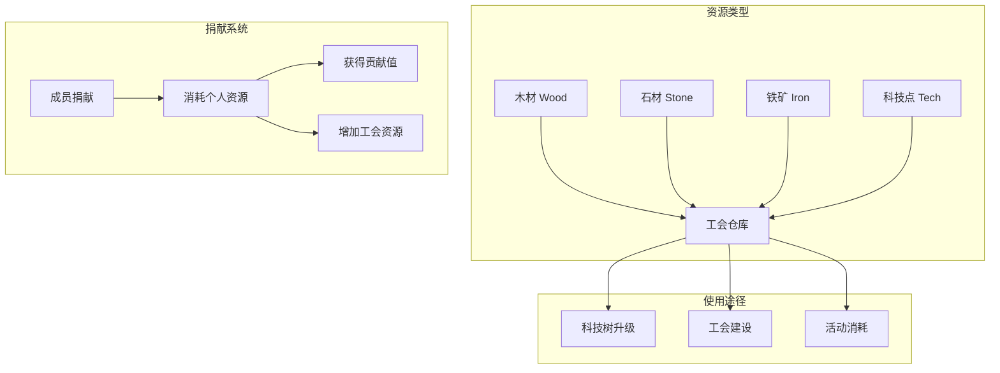
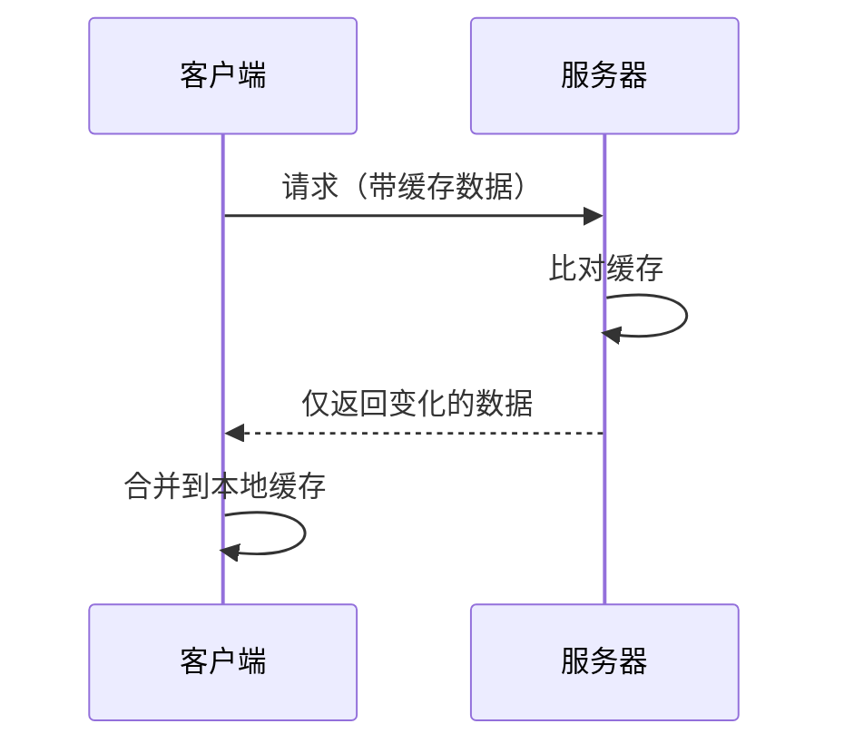

# 工会仓库系统

## 功能概述

工会仓库系统是工会资源管理的核心，负责存储和管理工会的公共资源。系统支持四种基础资源（木材、石材、铁矿、科技点）的存储，成员可以通过捐献获得贡献值，科技点用于升级工会科技树。

## 系统架构



## 核心概念

### 1. 资源类型

| 资源 | 标识 | 用途 | 捐献物品 |
|------|------|------|----------|
| **木材** | `wood` | 基础建设 | 铜币 Copper |
| **石材** | `stone` | 防御建设 | 银币 Silver |
| **铁矿** | `iron` | 军事建设 | 金币 Gold |
| **科技点** | `tech` | 科技升级 | 联盟功勋 UnionMerit |

### 2. 捐献配置

| 资源 | 贡献值/次 | 消耗物品 | 消耗数量 | 兑换比例 |
|------|----------|----------|----------|----------|
| **木材** | 2 | Copper | 1000 | 1:1 |
| **石材** | 3 | Silver | 100 | 1:1 |
| **铁矿** | 4 | Gold | 10 | 1:1 |
| **科技点** | 5 | UnionMerit | 5 | 10:1 |

### 3. 捐献限制

```csharp
// 文件：Assets/Resources/UnionConfigData.asset
donation_config:
  cap: 30                          // 每日捐献次数上限
  recovery_interval_ms: 900000     // 恢复间隔（15分钟）
```

## 数据结构

### UnionInventoryInfo - 仓库信息

```csharp
// 文件：Assets/Scripts/Network/Core/Service/UnionService.cs
[Serializable]
public class UnionInventoryInfo
{
    public Dictionary<string, long> union_inventory;      // 工会库存
    public JObject union_contribution_info;               // 贡献信息
    public Dictionary<string, object> my_donation;        // 我的捐献记录
}
```

### DonationConfig - 捐献配置

```csharp
// 文件：Assets/Scripts/UI/Clan/UnionConfigData.cs
[Serializable]
public class DonationConfig
{
    public int cap = 30;                              // 捐献次数上限
    public int recovery_interval_ms = 900000;         // 恢复间隔（毫秒）
    
    // 木材捐献
    public int wood_contribution_per_donate = 2;      // 每次贡献值
    public string wood_donate_item_id = "Copper";     // 消耗物品
    public int wood_donate_ratio = 1;                 // 兑换比例
    public int wood_donate_cost = 1000;               // 消耗数量
    
    // 石材捐献
    public int stone_contribution_per_donate = 3;
    public string stone_donate_item_id = "Silver";
    public int stone_donate_ratio = 1;
    public int stone_donate_cost = 100;
    
    // 铁矿捐献
    public int iron_contribution_per_donate = 4;
    public string iron_donate_item_id = "Gold";
    public int iron_donate_ratio = 1;
    public int iron_donate_cost = 10;
    
    // 科技点捐献
    public int tech_contribution_per_donate = 5;
    public string tech_donate_item_id = "UnionMerit";
    public int tech_donate_ratio = 10;
    public int tech_donate_cost = 5;
}
```

## 功能实现

### 1. 获取仓库信息

```csharp
// 文件：Assets/Scripts/Network/Core/Service/UnionService.cs
public void GetUnionInventoryInfo(
    Dictionary<string, object> myData = null,
    Action<UnionInventoryInfo> onSuccess = null,
    Action<string> onError = null)
{
    var myInfo = PlayerInfoService.I?.GetMyInfo();
    if (myInfo == null || !myInfo.HasUnion)
    {
        onError?.Invoke("您不在任何联盟中");
        return;
    }
    
    // 构建请求数据
    var request = new GetUnionInventoryInfoRequest
    {
        my_data = new UnionInventoryMyData()
    };
    
    // 填充客户端缓存数据
    if (myData.ContainsKey("union_inventory") && myData["union_inventory"] is Dictionary<string, long> inventory)
    {
        request.my_data.union_inventory = inventory;
    }
    
    // 由于这是发展署调用，不需要贡献信息和捐赠信息，但要符合接口要求
    request.my_data.union_contribution_info = new Dictionary<string, UnionContributionInfo>();
    request.my_data.my_donation = new Dictionary<string, object>();
    
    Debug.Log($"[UnionService] Getting union inventory info");
    
    // 使用 RequestRawData 避免 JsonUtility 的问题
    string rawDataJson = JsonConvert.SerializeObject(request.my_data);
    string fullRequest = $"{{\"my_data\":{rawDataJson}}}";
    
    MessageHub.I.RequestRawData(METHOD_GET_INVENTORY_INFO, fullRequest, response =>
    {
        if (response.code == 0)
        {
            // 手动解析响应
            var responseData = JObject.Parse(response.dataJson);
            var inventoryInfo = new UnionInventoryInfo();
            
            // 解析库存
            if (responseData["union_inventory_info"]?["union_inventory"] != null)
            {
                inventoryInfo.union_inventory = responseData["union_inventory_info"]["union_inventory"]
                    .ToObject<Dictionary<string, long>>();
            }
            
            onSuccess?.Invoke(inventoryInfo);
        }
    });
}
```

### 2. 获取科技点

```csharp
// 文件：Assets/Scripts/Network/Core/Service/UnionService.cs
public void GetUnionTechPoints(Action<long> onSuccess = null, Action<string> onError = null)
{
    var myData = new Dictionary<string, object>
    {
        ["union_inventory"] = new Dictionary<string, long>(), // 空缓存，获取全量数据
        ["union_contribution_info"] = new Dictionary<string, object>(),
        ["my_donation"] = new Dictionary<string, object>()
    };
    
    GetUnionInventoryInfo(myData,
        onSuccess: (info) =>
        {
            long techPoints = 0;
            if (info?.union_inventory != null && info.union_inventory.ContainsKey("tech"))
            {
                techPoints = info.union_inventory["tech"];
            }
            
            Debug.Log($"[UnionService] Current tech points: {techPoints}");
            onSuccess?.Invoke(techPoints);
        },
        onError: onError
    );
}
```

### 3. 计算捐献次数

```csharp
// 文件：Assets/Scripts/UI/Clan/UnionConfigData.cs
public (long nowMs, int currentLeft) GetContributionCurrentLeft(int lastLeft, long lastTimeMs)
{
    int cap = donation_config.cap;
    int interval = donation_config.recovery_interval_ms;
    long nowMs = DateTimeOffset.Now.ToUnixTimeMilliseconds();
    
    int recovered = (int)((nowMs - lastTimeMs) / interval);
    int currentLeft = Mathf.Min(cap, recovered + lastLeft);
    
    return (nowMs, currentLeft);
}
```

### 4. 获取捐献信息

```csharp
// 文件：Assets/Scripts/UI/Clan/UnionConfigData.cs
public DonateInfo GetDonateInfo(string material)
{
    if (material != "wood" && material != "stone" && material != "iron" && material != "tech")
        return null;
    
    return new DonateInfo
    {
        contribution = (int)typeof(DonationConfig)
            .GetField($"{material}_contribution_per_donate")
            .GetValue(donation_config),
        costItemId = (string)typeof(DonationConfig)
            .GetField($"{material}_donate_item_id")
            .GetValue(donation_config),
        donateRatio = (int)typeof(DonationConfig)
            .GetField($"{material}_donate_ratio")
            .GetValue(donation_config),
        donateCost = (int)typeof(DonationConfig)
            .GetField($"{material}_donate_cost")
            .GetValue(donation_config)
    };
}
```

## UI实现

### 1. 发展署界面

```csharp
// 文件：Assets/Scripts/UI/Clan/ClanInventController.cs
void UpdateUnionInventoryInfo()
{
    // 使用缓存数据进行增量更新
    var myData = new Dictionary<string, object>
    {
        ["union_inventory"] = cachedUnionInventory,
        ["union_contribution_info"] = new Dictionary<string, object>(),
        ["my_donation"] = new Dictionary<string, object>()
    };
    
    UnionService.I.GetUnionInventoryInfo(myData, 
        onSuccess: (info) =>
        {
            if (info?.union_inventory != null)
            {
                // 更新缓存
                cachedUnionInventory = info.union_inventory;
                
                // 更新UI显示
                UpdateResourceDisplay();
                
                // 特别关注科技点
                long techPoints = cachedUnionInventory.GetValueOrDefault("tech", 0L);
                UpdateTechPointsDisplay(techPoints);
            }
        },
        onError: (error) =>
        {
            Debug.LogError($"[ClanInventController] 获取仓库信息失败: {error}");
        }
    );
}
```

### 2. 资源显示

```csharp
// 文件：Assets/Scripts/UI/Clan/ClanInventController.cs
void UpdateResourceDisplay()
{
    // 更新科技点显示
    if (techPointsLabel != null)
    {
        long techPoints = cachedUnionInventory.GetValueOrDefault("tech", 0L);
        techPointsLabel.text = $"科技点: {techPoints}";
    }
    
    // 更新其他资源显示（如果需要）
    long wood = cachedUnionInventory.GetValueOrDefault("wood", 0L);
    long stone = cachedUnionInventory.GetValueOrDefault("stone", 0L);
    long iron = cachedUnionInventory.GetValueOrDefault("iron", 0L);
    
    Debug.Log($"[ClanInventController] 资源状态 - 木材:{wood} 石材:{stone} 铁矿:{iron} 科技:{techPoints}");
}
```

### 3. 定时更新

```csharp
// 文件：Assets/Scripts/UI/Clan/ClanInventController.cs
IEnumerator AutoUpdateInventory()
{
    while (true)
    {
        yield return new WaitForSeconds(30f); // 每30秒更新一次
        
        // 更新库存信息
        UpdateUnionInventoryInfo();
    }
}

void OnEnable()
{
    // 启动定时更新
    if (updateCoroutine != null)
    {
        StopCoroutine(updateCoroutine);
    }
    updateCoroutine = StartCoroutine(AutoUpdateInventory());
}

void OnDestroy()
{
    // 停止定时更新
    if (updateCoroutine != null)
    {
        StopCoroutine(updateCoroutine);
        updateCoroutine = null;
    }
}
```

## API接口

### 1. 获取仓库信息

**路径**: `union/get_union_inventory_info`  
**方法**: POST

#### 请求
```json
{
    "my_data": {
        "union_inventory": {
            "wood": 1000,
            "stone": 2000,
            "iron": 3000,
            "tech": 5000
        },
        "union_contribution_info": {},
        "my_donation": {}
    }
}
```

#### 响应
```json
{
    "union_inventory_info": {
        "union_inventory": {
            "wood": 1500,
            "stone": 2500,
            "iron": 3500,
            "tech": 5500
        },
        "union_contribution_info": {
            // 贡献信息
        },
        "my_donation": {
            // 捐献记录
        }
    }
}
```

### 2. 捐献资源

**路径**: `union/donate`  
**方法**: POST

#### 请求
```json
{
    "material": "tech",   // wood/stone/iron/tech
    "amount": 10         // 捐献次数
}
```

#### 响应
```json
{
    "code": 0,
    "data": {
        "contribution_gained": 50,
        "resource_added": 100,
        "remaining_donation": 20
    }
}
```

## 配置数据

### 捐献配置表

```json
// 文件：Assets/Scripts/UI/Clan/union.json
"donation_config": {
    "cap": 30,
    "recovery_interval_ms": 900000,
    
    "wood_contribution_per_donate": 2,
    "wood_donate_item_id": "Copper",
    "wood_donate_ratio": 1,
    "wood_donate_cost": 1000,
    
    "stone_contribution_per_donate": 3,
    "stone_donate_item_id": "Silver",
    "stone_donate_ratio": 1,
    "stone_donate_cost": 100,
    
    "iron_contribution_per_donate": 4,
    "iron_donate_item_id": "Gold",
    "iron_donate_ratio": 1,
    "iron_donate_cost": 10,
    
    "tech_contribution_per_donate": 5,
    "tech_donate_item_id": "UnionMerit",
    "tech_donate_ratio": 10,
    "tech_donate_cost": 5
}
```

## 增量更新机制

### 1. 工作原理



### 2. 缓存处理

```csharp
// 文件：Assets/Scripts/UI/Clan/ClanInventController.cs
private Dictionary<string, long> cachedUnionInventory = new Dictionary<string, long>();

void ProcessInventoryUpdate(UnionInventoryInfo newInfo)
{
    if (newInfo?.union_inventory != null)
    {
        // 合并新数据到缓存
        foreach (var kvp in newInfo.union_inventory)
        {
            cachedUnionInventory[kvp.Key] = kvp.Value;
        }
        
        // 更新显示
        UpdateResourceDisplay();
    }
}
```

## 科技点使用

### 1. 科技升级消耗

```csharp
// 文件：Assets/Scripts/UI/Clan/ClanInventController.cs
void OnResearchClicked()
{
    var categoryData = techtreeData[currentCategory];
    int upgradeCost = UnionService.I.GetTechtreeUpgradeRequirement(categoryData.current);
    
    // 检查科技点是否足够
    long currentTechPoints = cachedUnionInventory.GetValueOrDefault("tech", 0L);
    if (currentTechPoints < upgradeCost)
    {
        PopupManager.Show("科技点不足", $"需要 {upgradeCost} 科技点，当前只有 {currentTechPoints}");
        return;
    }
    
    // 执行升级...
}
```

### 2. 消耗后更新

```csharp
// 文件：Assets/Scripts/UI/Clan/ClanInventController.cs
void OnTechtreeUpgraded(string category, UnionService.TechtreeUpgradeResult result)
{
    if (result != null && result.tech_remaining >= 0)
    {
        // 更新本地缓存的科技点
        cachedUnionInventory["tech"] = result.tech_remaining;
        
        // 更新显示
        UpdateTechPointsDisplay(result.tech_remaining);
    }
}
```

## 错误处理

### 服务器错误码

| 错误码 | 消息 | 中文提示 |
|--------|------|---------|
| 400 | Invalid request | 请求参数错误 |
| 401 | Unauthorized | 未认证 |
| 403 | Not in union | 您不在任何联盟中 |
| 500 | Server error | 服务器错误 |

## 性能优化

### 1. 缓存策略
- 本地缓存库存数据
- 增量更新减少传输
- 定时刷新保持同步

### 2. 网络优化
- 批量请求资源信息
- 使用缓存避免频繁请求
- 错误重试机制

### 3. UI优化
- 延迟更新非关键显示
- 批量更新UI元素
- 使用对象池管理列表项

## 注意事项

### 1. 数据同步
- 定时更新库存信息
- 操作后立即刷新
- 使用增量更新机制

### 2. 权限控制
- 所有成员可查看库存
- 捐献权限根据设置
- 使用权限需要官员以上

### 3. 资源管理
- 科技点优先用于升级
- 其他资源用于建设
- 合理规划资源使用

### 4. 用户体验
- 实时显示资源变化
- 清晰的消耗提示
- 友好的不足提醒

## 相关文档

- [工会系统概述](union-overview.md)
- [工会科技树系统](union-tech.md)
- [工会宝库系统](union-treasury.md)
- [成员系统与权限](member-system.md)