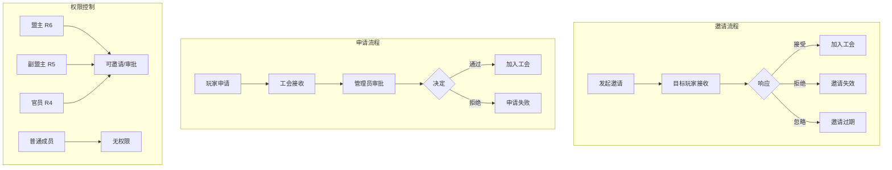
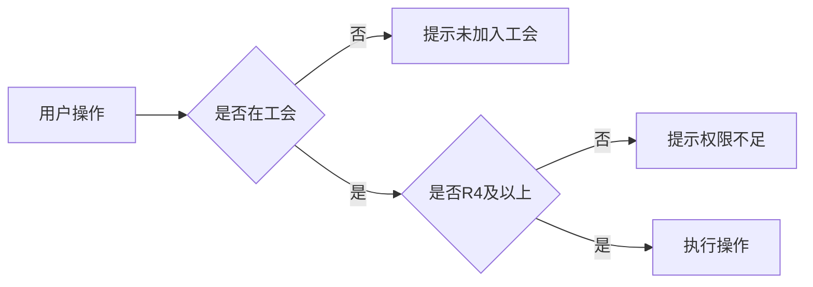

# 工会邀请系统

## 功能概述

工会邀请系统提供了完整的成员招募机制，包括主动邀请玩家、处理加入申请、邀请通知等功能。系统支持权限控制，只有特定职位的成员才能发送邀请和处理申请。

## 系统架构



## 核心概念

### 1. 加入方式对比

| 方式 | 发起方 | 接收方 | 权限要求 | 适用场景 |
|------|--------|--------|----------|----------|
| **主动邀请** | 工会管理员 | 目标玩家 | R4及以上发起 | 招募特定玩家 |
| **申请加入** | 玩家 | 工会管理员 | R4及以上审批 | 玩家主动加入 |
| **直接加入** | 玩家 | 系统自动 | 无需审批 | 开放型工会 |

### 2. 邀请状态

| 状态 | 说明 | 处理方式 |
|------|------|----------|
| **待处理** | 邀请已发送，等待响应 | 显示在邀请列表 |
| **已接受** | 玩家接受邀请 | 自动加入工会 |
| **已拒绝** | 玩家拒绝邀请 | 从列表移除 |
| **已过期** | 超时未响应 | 自动失效 |

## 数据结构

### SendUnionInvitationRequest - 发送邀请请求

```csharp
// 文件：Assets/Scripts/Network/Core/Service/UnionService.cs
[Serializable]
public class SendUnionInvitationRequest
{
    public string target;  // 目标玩家CID
}
```

### AcceptApplicationRequest - 处理申请请求

```csharp
// 文件：Assets/Scripts/Network/Core/Service/UnionService.cs
[Serializable]
public class AcceptApplicationRequest
{
    public string type;    // "accept" 或 "decline"
    public string cid;     // 申请者CID
}
```

## 功能实现

### 1. 发送邀请

```csharp
// 文件：Assets/Scripts/Network/Core/Service/UnionService.cs
public void InviteToUnion(
    string targetCid,
    Action onSuccess = null,
    Action<string> onError = null)
{
    // 检查基本条件
    var myInfo = PlayerInfoService.I?.GetMyInfo();
    if (myInfo == null || !myInfo.HasUnion)
    {
        onError?.Invoke("您不在任何联盟中");
        return;
    }
    
    // 创建请求对象
    var request = new SendUnionInvitationRequest
    {
        target = targetCid  // 正确的字段名
    };
    
    Debug.Log($"[UnionService] SendUnionInvitation - Target: {targetCid}");
    
    const string METHOD_SEND_INVITATION = "union/send_union_invitation";
    
    MessageHub.I.Request(METHOD_SEND_INVITATION, request, response =>
    {
        if (response.code == 0)
        {
            Debug.Log($"[UnionService] Successfully sent invitation to player: {targetCid}");
            onSuccess?.Invoke();
        }
        else
        {
            // 处理错误
            string errorMsg = response.msg;
            switch (response.code)
            {
                case 400:
                    if (response.msg.Contains("target_cid is required"))
                        errorMsg = "目标玩家ID无效";
                    else if (response.msg.Contains("already in a union"))
                        errorMsg = "该玩家已经在其他联盟中";
                    break;
                case 403:
                    if (response.msg.Contains("not in any union"))
                        errorMsg = "您不在任何联盟中";
                    else if (response.msg.Contains("Only union managers"))
                        errorMsg = "权限不足，只有盟主、副盟主或R4才能发送邀请";
                    else if (response.msg.Contains("Union is full"))
                        errorMsg = "联盟人数已满";
                    break;
            }
            
            onError?.Invoke(errorMsg);
        }
    });
}
```

### 2. 接受申请

```csharp
// 文件：Assets/Scripts/Network/Core/Service/UnionService.cs
public void AcceptApplication(
    string applicantCid,
    Action onSuccess = null,
    Action<string> onError = null)
{
    // 检查权限
    var myInfo = PlayerInfoService.I?.GetMyInfo();
    if (myInfo == null || !myInfo.HasUnion)
    {
        onError?.Invoke("您不在任何联盟中");
        return;
    }
    
    // 创建请求对象
    var request = new AcceptApplicationRequest
    {
        type = "accept",
        cid = applicantCid
    };
    
    Debug.Log($"[UnionService] Accepting application from: {applicantCid}");
    
    MessageHub.I.Request(METHOD_ACCEPT_APPLICATION, request, response =>
    {
        if (response.code == 0)
        {
            Debug.Log($"[UnionService] Successfully accepted application from: {applicantCid}");
            onSuccess?.Invoke();
        }
        else
        {
            // 错误处理
            HandleApplicationError(response.code, response.msg, onError);
        }
    });
}
```

### 3. 拒绝申请

```csharp
// 文件：Assets/Scripts/Network/Core/Service/UnionService.cs
public void RejectApplication(
    string applicantCid,
    Action onSuccess = null,
    Action<string> onError = null)
{
    // 检查权限
    var myInfo = PlayerInfoService.I?.GetMyInfo();
    if (myInfo == null || !myInfo.HasUnion)
    {
        onError?.Invoke("您不在任何联盟中");
        return;
    }
    
    // 创建请求对象 - 注意这里是 "decline" 不是 "reject"
    var request = new AcceptApplicationRequest
    {
        type = "decline",
        cid = applicantCid
    };
    
    Debug.Log($"[UnionService] Rejecting application from: {applicantCid}");
    
    MessageHub.I.Request(METHOD_ACCEPT_APPLICATION, request, response =>
    {
        if (response.code == 0)
        {
            Debug.Log($"[UnionService] Successfully rejected application from: {applicantCid}");
            onSuccess?.Invoke();
        }
        else
        {
            HandleApplicationError(response.code, response.msg, onError);
        }
    });
}
```

## 广播处理

### 1. 邀请广播接收

```csharp
// 文件：Assets/Scripts/Network/Core/Service/UnionBroadcastHandler.cs
private void OnInvitedByUnion(string dataJson)
{
    try
    {
        var data = JsonConvert.DeserializeObject<Dictionary<string, object>>(dataJson);
        if (data != null && data.ContainsKey("union_id"))
        {
            string unionId = data["union_id"].ToString();
            Debug.Log($"[UnionBroadcastHandler] Received union invitation from: {unionId}");
            
            // 显示通知
            PopupManager.Show("联盟邀请", "您收到了一个新的联盟邀请！");
            
            // 触发事件
            OnUnionInvited?.Invoke(unionId);
            
            // TODO: 更新UI显示邀请标记
        }
    }
    catch (Exception e)
    {
        Debug.LogError($"[UnionBroadcastHandler] Failed to parse invitation broadcast: {e.Message}");
    }
}
```

### 2. 申请结果广播

```csharp
// 文件：Assets/Scripts/Network/Core/Service/UnionBroadcastHandler.cs
// 申请被接受
private void OnApplicationAccepted(string dataJson)
{
    try
    {
        var data = JsonConvert.DeserializeObject<Dictionary<string, object>>(dataJson);
        if (data != null && data.ContainsKey("union_id"))
        {
            string unionId = data["union_id"].ToString();
            Debug.Log($"[UnionBroadcastHandler] Application accepted by union: {unionId}");
            
            // 显示通知
            PopupManager.Show("申请成功", "恭喜！您已成功加入联盟！");
            
            // 触发事件
            OnApplicationResult?.Invoke(unionId, true);
            
            // 刷新玩家信息和联盟缓存
            RefreshAfterJoinUnion();
        }
    }
    catch (Exception e)
    {
        Debug.LogError($"[UnionBroadcastHandler] Failed to parse accept broadcast: {e.Message}");
    }
}

// 申请被拒绝
private void OnApplicationDeclined(string dataJson)
{
    try
    {
        var data = JsonConvert.DeserializeObject<Dictionary<string, object>>(dataJson);
        if (data != null && data.ContainsKey("union_id"))
        {
            string unionId = data["union_id"].ToString();
            Debug.Log($"[UnionBroadcastHandler] Application declined by union: {unionId}");
            
            // 显示通知
            PopupManager.Show("申请结果", "很遗憾，您的联盟申请被拒绝了。");
            
            // 触发事件
            OnApplicationResult?.Invoke(unionId, false);
            
            // 清除已申请标记
            UnionService.I.MarkUnionAsApplied(unionId);
        }
    }
    catch (Exception e)
    {
        Debug.LogError($"[UnionBroadcastHandler] Failed to parse decline broadcast: {e.Message}");
    }
}
```

## UI实现

### 1. 邀请界面

```csharp
// 文件：Assets/Scripts/UI/Clan/ClanApplyListController.cs
void OnInvitePlayer(PlayerData player)
{
    Debug.Log($"[ClanInviteApply] 邀请玩家: {player.playerName}");
    
    // 权限检查
    var myInfo = PlayerInfoService.I?.GetMyInfo();
    if (myInfo == null || !myInfo.IsUnionOfficer)
    {
        PopupManager.Show("权限不足", "只有R4及以上职位才能发送邀请");
        return;
    }
    
    // 发送邀请请求
    UnionService.I.InviteToUnion(player.playerId,
        onSuccess: () =>
        {
            // 标记为已邀请
            player.isInvited = true;
            
            // 更新UI
            RefreshList();
            
            PopupManager.Show("邀请成功", $"已向 {player.playerName} 发送联盟邀请");
        },
        onError: (error) =>
        {
            Debug.LogError($"[ClanInviteApply] 邀请失败: {error}");
            PopupManager.Show("邀请失败", error);
        }
    );
}
```

### 2. 申请处理界面

```csharp
// 文件：Assets/Scripts/UI/Clan/ClanApplyListController.cs
void OnAcceptApplicant(PlayerData player)
{
    Debug.Log($"[ClanInviteApply] 接受申请: {player.playerName}");
    
    // 发送接受请求
    UnionService.I.AcceptApplication(player.playerId,
        onSuccess: () =>
        {
            // 从列表中移除
            players.Remove(player);
            RefreshList();
            UpdateApplyCount();
            RefreshMemberListAfterAccept();
            
            PopupManager.Show("已接受", $"{player.playerName} 已加入联盟");
            
            // 刷新成员列表页面
            RefreshMemberListPage();
            
            // 如果没有申请了，关闭弹窗
            if (players.Count == 0)
            {
                ClosePopup();
            }
        },
        onError: (error) =>
        {
            PopupManager.Show("操作失败", error);
        }
    );
}
```

## API接口

### 1. 发送邀请

**路径**: `union/send_union_invitation`  
**方法**: POST

#### 请求
```json
{
    "target": "player_cid_123"
}
```

#### 响应
```json
{
    "code": 0,
    "msg": "Success"
}
```

### 2. 接受/拒绝申请

**路径**: `union/accept_union_application`  
**方法**: POST

#### 请求
```json
{
    "type": "accept",  // 或 "decline"
    "cid": "applicant_cid_123"
}
```

#### 响应
```json
{
    "code": 0,
    "msg": "Success"
}
```

### 3. 获取申请列表

**路径**: `union/get_union_application`  
**方法**: POST

#### 请求
```json
{
    "get_my_applications": false,      // 获取我发出的申请
    "get_union_applications": true     // 获取工会收到的申请
}
```

#### 响应
```json
{
    "my_sent": [],           // 我发出的申请（CID列表）
    "union_received": [      // 工会收到的申请（CID列表）
        "player_cid_1",
        "player_cid_2"
    ]
}
```

## 权限控制

### 1. 邀请权限

```csharp
// 文件：Assets/Scripts/Network/Core/Service/PlayerInfoService.cs
public bool IsUnionOfficer => 
    union_position == "r4" || 
    union_position == "r5" || 
    union_position == "r6" || 
    union_position == "leader" || 
    union_position == "coleader";
```

### 2. 权限判断流程



## 错误处理

### 服务器错误码

| 错误码 | 消息 | 中文提示 |
|--------|------|---------|
| 400 | target_cid is required | 目标玩家ID无效 |
| 400 | already in a union | 该玩家已经在其他联盟中 |
| 401 | Unauthorized | 未认证，请重新登录 |
| 403 | not in any union | 您不在任何联盟中 |
| 403 | Only union managers | 权限不足，只有R4及以上才能操作 |
| 403 | Union is full | 联盟人数已满 |
| 500 | Server error | 服务器错误，请稍后重试 |

### 错误处理示例

```csharp
// 文件：Assets/Scripts/Network/Core/Service/UnionService.cs
switch (response.code)
{
    case 400:
        if (response.msg.Contains("type must be"))
            errorMsg = "操作类型错误";
        else if (response.msg.Contains("cid is required"))
            errorMsg = "申请者ID无效";
        break;
    case 403:
        if (response.msg.Contains("not in any union"))
            errorMsg = "您不在任何联盟中";
        else if (response.msg.Contains("only union managers"))
            errorMsg = "权限不足，只有盟主、副盟主或R4才能处理申请";
        break;
}
```

## 广播事件

### 1. 广播类型

```csharp
// 文件：Assets/Scripts/Network/Core/Service/UnionBroadcastHandler.cs
private const string BROADCAST_INVITED = "union/invited_by_union";
private const string BROADCAST_APP_DECLINED = "union/application_declined";
private const string BROADCAST_APP_ACCEPTED = "union/application_accepted";
```

### 2. 事件订阅

```csharp
// 文件：Assets/Scripts/Network/Core/Service/UnionBroadcastHandler.cs
public void Initialize()
{
    // 订阅所有联盟相关广播
    MessageHub.I.Subscribe(BROADCAST_INVITED, OnInvitedByUnion);
    MessageHub.I.Subscribe(BROADCAST_APP_DECLINED, OnApplicationDeclined);
    MessageHub.I.Subscribe(BROADCAST_APP_ACCEPTED, OnApplicationAccepted);
    
    Debug.Log("[UnionBroadcastHandler] Initialized and subscribed to broadcasts");
}
```

## 界面更新

### 1. 申请数量角标

```csharp
// 文件：Assets/Scripts/UI/Clan/ClanMemberController.cs
private void UpdateApplyCount(int count)
{
    if (applyCountBadge != null)
    {
        applyCountBadge.style.display = count > 0 ? 
            DisplayStyle.Flex : DisplayStyle.None;
        
        if (applyCountLabel != null)
        {
            applyCountLabel.text = count > 99 ? "99+" : count.ToString();
        }
    }
    
    Debug.Log($"[ClanMemberController] 申请数量更新为: {count}");
}
```

### 2. 实时刷新

```csharp
// 文件：Assets/Scripts/UI/Clan/ClanMemberController.cs
void OnEnable()
{
    // 订阅事件
    if (UnionBroadcastHandler.I != null)
    {
        UnionBroadcastHandler.I.OnMemberJoined += OnMemberJoined;
        UnionBroadcastHandler.I.OnMemberLeft += OnMemberLeft;
    }
}

void OnDisable()
{
    // 取消订阅
    if (UnionBroadcastHandler.I != null)
    {
        UnionBroadcastHandler.I.OnMemberJoined -= OnMemberJoined;
        UnionBroadcastHandler.I.OnMemberLeft -= OnMemberLeft;
    }
}
```

## 性能优化

### 1. 批量处理
- 可以一次获取多个申请
- 批量更新UI状态
- 使用缓存减少请求

### 2. 状态管理
- 本地缓存申请状态
- 标记已邀请玩家避免重复
- 智能刷新机制

### 3. 网络优化
- 合并请求减少网络开销
- 使用WebSocket接收实时通知
- 错误重试机制

## 注意事项

### 1. 权限验证
- 前后端双重权限验证
- R4及以上才能发送邀请
- 操作前检查最新权限

### 2. 状态同步
- 邀请状态实时更新
- 广播通知所有在线成员
- 申请列表定期刷新

### 3. 用户体验
- 清晰的权限提示
- 实时的操作反馈
- 友好的错误提示

### 4. 数据一致性
- 操作成功后立即刷新
- 使用广播保证实时性
- 缓存更新避免显示错误

## 相关文档

- [工会系统概述](union-overview.md)
- [加入工会流程](union-joining.md)
- [成员系统与权限](member-system.md)
- [工会管理功能](union-management.md)