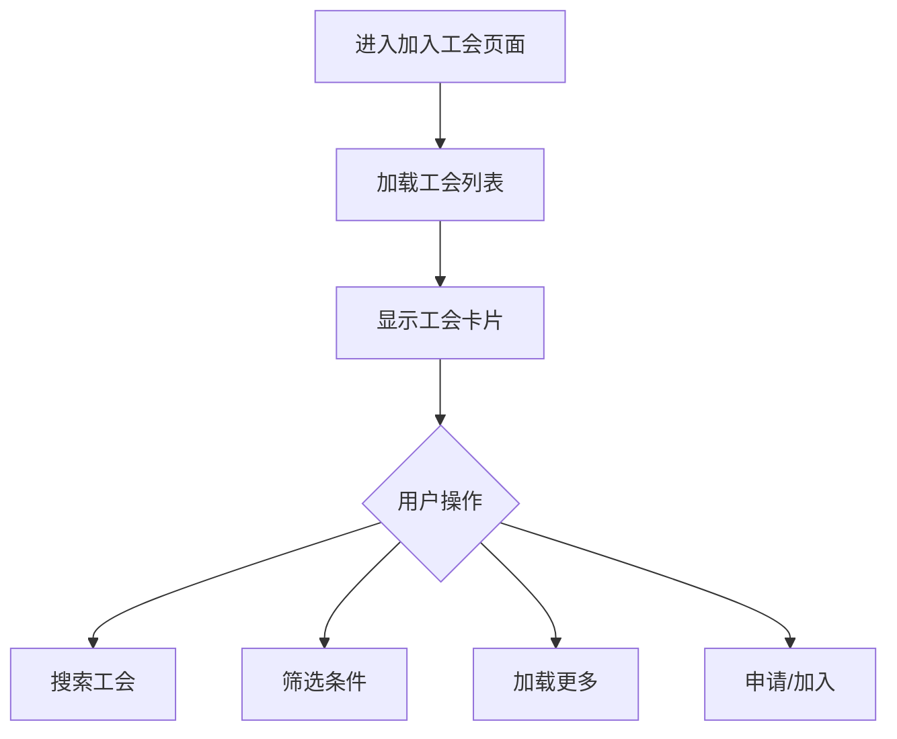
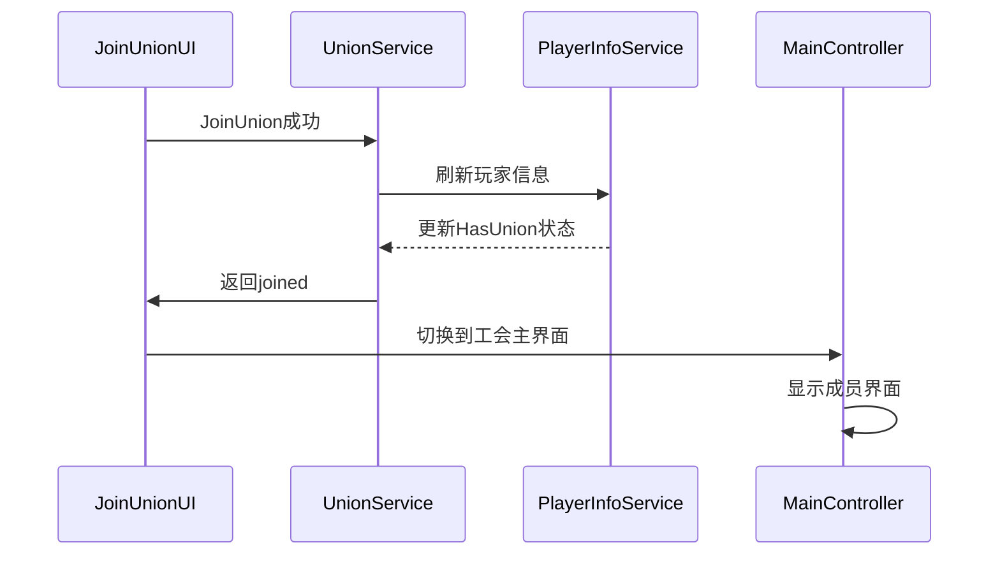

# 加入工会流程

## 功能概述

加入工会系统提供了工会列表浏览、搜索筛选、申请加入等功能。根据工会的不同设置，玩家可以直接加入、申请加入或需要邀请才能加入。

## 前置条件

### 玩家状态检查
```csharp
// 检查是否可以加入工会
var myInfo = PlayerInfoService.I?.GetMyInfo();
if (myInfo != null && myInfo.HasUnion)
{
    // 已在工会中，无法加入其他工会
    return false;
}
```

### 战力要求检查
```csharp
// 检查战力是否满足要求
if (long.TryParse(unionData.min_power_requirement, out long minPower))
{
    if (myInfo.total_power < minPower)
    {
        // 战力不足，无法加入
        return false;
    }
}
```

## 加入方式

### 1. 加入类型说明

| 类型 | 说明 | 玩家操作 | 结果 |
|------|------|---------|------|
| **open** | 开放加入 | 点击"加入"按钮 | 立即成为成员 |
| **apply** | 申请加入 | 点击"申请"按钮 | 等待审批 |
| **invite** | 仅邀请 | 无法主动加入 | 需收到邀请 |

### 2. 自动通过机制

当工会设置了 `auto_accept_power` 时：
- 战力 ≥ `auto_accept_power`：申请自动通过
- 战力 < `auto_accept_power`：需要审批

## UI流程

### 1. 工会列表界面



### 2. 工会列表项结构

```yaml
UnionListItem:
  Banner:
    - BannerBg         # 旗帜背景
    - BannerSymbol     # 旗帜图案
  
  Info:
    - UnionAbbr        # [简称]
    - UnionName        # 全称
    - LanguageTag      # 语言标签
    - LevelLabel       # Lv.等级
  
  Stats:
    - TotalPower       # 总战力
    - MemberCount      # 成员数/上限
    - TerritoryScore   # 领土分数
  
  Actions:
    - JoinBtn          # 加入按钮（open类型）
    - ApplyBtn         # 申请按钮（apply类型）
    - AppliedBtn       # 已申请按钮（禁用状态）
    - LockedBtn        # 仅邀请按钮（invite类型）
```

### 3. 按钮状态逻辑

```csharp
// 根据工会类型和申请状态显示不同按钮
if (unionData.hasApplied)
{
    // 已申请 - 显示禁用的"已申请"按钮
    ShowButton(appliedBtn);
}
else if (unionData.join_type == "open")
{
    // 开放加入 - 显示"加入"按钮
    ShowButton(joinBtn);
}
else if (unionData.join_type == "apply")
{
    // 申请加入 - 显示"申请"按钮
    ShowButton(applyBtn);
}
else if (unionData.join_type == "invite")
{
    // 仅邀请 - 显示锁定图标
    ShowButton(lockedBtn);
}
```

## 功能实现

### 1. 工会列表加载

```csharp
// JoinUnionController.cs
private void LoadUnionList(int startIndex = 0)
{
    UnionService.I.GetUnionList(
        startIndex: startIndex,
        forceRefresh: false,
        onSuccess: (unions) =>
        {
            foreach (var union in unions)
            {
                CreateUnionListItem(union);
            }
        },
        onError: (error) =>
        {
            PopupManager.Show("加载失败", error);
        }
    );
}
```

### 2. 搜索筛选功能

```csharp
// 搜索实现
private void OnSearchValueChanged(ChangeEvent<string> evt)
{
    string keyword = evt.newValue.ToLower();
    
    if (string.IsNullOrEmpty(keyword))
    {
        // 显示所有
        ShowAllUnions();
    }
    else
    {
        // 筛选显示
        FilterUnions(keyword);
    }
}

// 筛选逻辑
private void FilterUnions(string keyword)
{
    var filtered = cachedUnions.Where(u =>
        u.abbr.ToLower().Contains(keyword) ||
        u.union_name.ToLower().Contains(keyword)
    );
    
    UpdateDisplayList(filtered);
}
```

### 3. 分页加载

```csharp
private void OnScrollReachEnd()
{
    if (!isLoading && hasMoreData)
    {
        LoadMoreUnions();
    }
}

private void LoadMoreUnions()
{
    isLoading = true;
    int nextIndex = currentLoadedCount;
    
    UnionService.I.GetUnionList(
        startIndex: nextIndex,
        onSuccess: (unions) =>
        {
            if (unions.Count < PAGE_SIZE)
            {
                hasMoreData = false;
            }
            currentLoadedCount += unions.Count;
            isLoading = false;
        }
    );
}
```

### 4. 加入/申请处理

```csharp
// 处理加入请求
private void DoJoinUnion(UnionListItem unionData)
{
    // 禁用所有按钮，防止重复操作
    SetAllButtonsEnabled(false);
    
    UnionService.I.JoinUnion(
        unionId: unionData.union_id,
        onSuccess: (joinType) =>
        {
            SetAllButtonsEnabled(true);
            
            if (joinType == "joined")
            {
                // 直接加入成功
                PopupManager.Show("加入成功", 
                    $"恭喜您成功加入 {unionData.union_name}！");
                RefreshAndSwitchToUnionPage();
            }
            else if (joinType == "applied")
            {
                // 申请提交成功
                unionData.hasApplied = true;
                UpdateListItemUI(unionData);
                PopupManager.Show("申请成功", 
                    "您的申请已提交，请等待审批。");
            }
        },
        onError: (error) =>
        {
            SetAllButtonsEnabled(true);
            PopupManager.Show("加入失败", error);
        }
    );
}
```

## API接口

### 1. 获取工会列表

**路径**: `union/get_union_list`  
**方法**: POST

#### 请求
```json
{
    "start_index": 0,
    "count": 10
}
```

#### 响应
```json
{
    "unions": {
        "union_123": {
            "union_id": "union_123",
            "abbr": "TEST",
            "union_name": "测试工会",
            "total_power": "1000000",
            "member_count": "10",
            "max_member": "30",
            "level": "5",
            "language": "zh",
            "join_type": "apply",
            "min_power_requirement": "10000"
        }
    }
}
```

### 2. 加入工会

**路径**: `union/join_union`  
**方法**: POST

#### 请求
```json
{
    "union_id": "union_123"
}
```

#### 响应

##### 直接加入（open类型或满足auto_accept）
```json
{
    "code": 200,
    "data": {
        "union_id": "union_123",
        "type": "joined"
    }
}
```

##### 提交申请（需要审批）
```json
{
    "code": 200,
    "data": {
        "union_id": "union_123",
        "type": "applied"
    }
}
```

### 3. 错误处理

服务器返回的错误消息会在 `UnionService.cs` 中转换为中文提示：

| 错误消息 | 中文提示 |
|----------|---------|
| union_id is required | 未提供联盟ID |
| already in union | 您已经在其他联盟中 |
| power requirement not met | 您的战力未达到联盟最低要求 |
| union is full | 联盟人数已满 |
| union not found | 联盟不存在 |
| internal error | 服务器错误，请稍后重试 |

## 申请状态管理

### 1. 本地缓存

```csharp
// 缓存已申请的工会ID列表
private HashSet<string> appliedUnions = new HashSet<string>();

// 标记为已申请
public void MarkUnionAsApplied(string unionId)
{
    appliedUnions.Add(unionId);
    SaveToLocalCache();
}
```

### 2. 申请结果处理

```csharp
// 监听广播事件
UnionBroadcastHandler.I.OnApplicationResult += (unionId, accepted) =>
{
    if (accepted)
    {
        // 申请通过 - 切换到工会主界面
        RefreshAndSwitchToUnionPage();
    }
    else
    {
        // 申请被拒 - 重置申请状态
        appliedUnions.Remove(unionId);
        UpdateUnionListItem(unionId);
    }
};
```

### 3. 申请查询

```csharp
// 获取我的申请列表
UnionService.I.GetUnionApplications(
    getMyApplications: true,
    getUnionApplications: false,
    onSuccess: (mySent, unionReceived) =>
    {
        // mySent: 我发出的申请CID列表
        foreach (var cid in mySent)
        {
            appliedUnions.Add(cid);
        }
        RefreshAllListItems();
    }
);
```

## 加入后流程

### 1. 成功加入后的处理



### 2. 数据更新

```csharp
private void RefreshAndSwitchToUnionPage()
{
    // 刷新玩家信息
    PlayerInfoService.I.RefreshMyInfo(() =>
    {
        // 通知主控制器切换界面
        if (unionMainController != null)
        {
            unionMainController.OnJoinUnionSuccess();
        }
    });
}
```

## 用户体验优化

### 1. 加载状态

```csharp
// 显示加载指示器
private void ShowLoadingIndicator(bool show)
{
    loadingSpinner.style.display = show ? 
        DisplayStyle.Flex : DisplayStyle.None;
    
    if (show)
    {
        // 禁用交互
        SetInteractable(false);
    }
}
```

### 2. 防重复操作

```csharp
// 操作期间禁用所有按钮
private void SetAllButtonsEnabled(bool enabled)
{
    foreach (var button in allJoinButtons)
    {
        button.SetEnabled(enabled);
    }
}
```

### 3. 实际的错误显示

```csharp
// JoinUnionController.cs - 战力检查
if (myInfo.total_power < minPower)
{
    PopupManager.Show("战力不足", 
        $"该联盟要求最低战力 {FormatPower(minPower)}，您当前战力为 {FormatPower(myInfo.total_power)}");
    return;
}

// 加入失败时显示错误
onError: (error) =>
{
    SetAllButtonsEnabled(true);
    PopupManager.Show("加入失败", error);
}
```

### 4. 错误处理

```csharp
// UnionService.cs 中的错误处理
switch (response.msg)
{
    case "union_id is required":
        errorMsg = "未提供联盟ID";
        break;
    case "already in union":
        errorMsg = "您已经在其他联盟中";
        break;
    case "power requirement not met":
        errorMsg = "您的战力未达到联盟最低要求";
        break;
    case "union is full":
        errorMsg = "联盟人数已满";
        break;
    case "union not found":
        errorMsg = "联盟不存在";
        break;
    case "internal error":
    case "failed to join union":
        errorMsg = "服务器错误，请稍后重试";
        break;
}

// JoinUnionController.cs 中显示错误
onError: (error) =>
{
    SetAllButtonsEnabled(true);
    PopupManager.Show("加入失败", error);
}
```

## 注意事项

### 1. 性能优化
- 虚拟滚动列表（ScrollViewPro）
- 分页加载（每页10个）
- 图片懒加载
- 缓存工会数据

### 2. 状态同步
- 监听广播事件更新申请状态
- 加入成功后刷新玩家信息
- 切换界面前确保数据已更新

### 3. 错误处理
- 网络超时重试
- 友好的错误提示
- 保持UI状态一致性

### 4. 权限检查
- 战力要求实时检查
- 已有工会状态检查
- 申请冷却时间限制

## 相关文档

- [创建工会流程](union-creation.md)
- [工会管理功能](union-management.md)
- [成员系统与权限](member-system.md)
- [工会邀请系统](union-invitation.md)