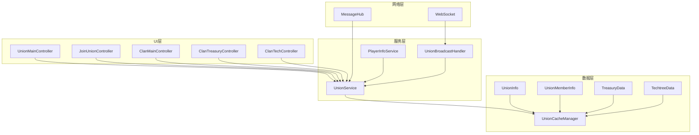
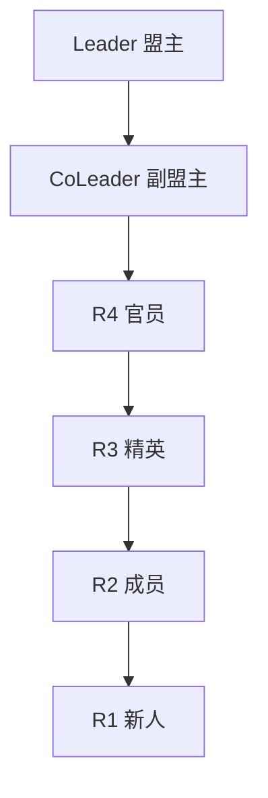
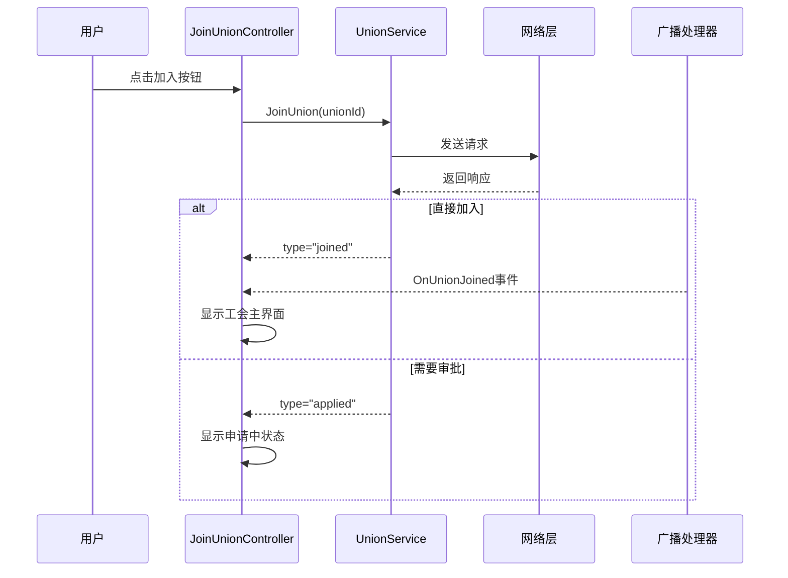
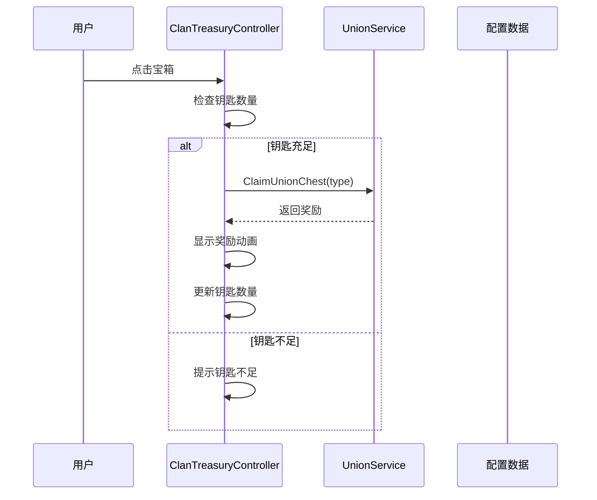

# 工会系统概述

## 系统简介

工会系统是游戏的社交协作核心，提供完整的工会管理、成员互动、资源共享体系。系统包含工会创建、成员管理、宝库分红、科技树、仓库等功能，支持多层级职位权限管理，以及盟友礼物、宝箱等深度玩法。

## 系统架构



## 核心概念

### 1. 工会状态

| 状态 | 说明 | UI显示 |
|------|------|--------|
| **无工会** | 玩家未加入任何工会 | 显示加入工会界面 |
| **已加入** | 玩家是工会成员 | 显示工会主界面 |
| **申请中** | 正在等待审批 | 显示申请状态 |

### 2. 职位体系



| 职位 | 权限等级 | 权限说明 |
|------|---------|---------|
| **Leader** | 最高 | 所有权限（解散、转让、设置） |
| **CoLeader** | 高 | 管理权限（踢人、审批、设置） |
| **R4** | 中高 | 部分管理（审批申请） |
| **R3** | 中 | 精英成员 |
| **R2** | 低 | 普通成员 |
| **R1** | 最低 | 新加入成员 |

### 3. 功能模块

#### 联盟（Alliance）
- 工会基本信息展示
- 工会公告编辑
- 工会设置管理

#### 成员（Members）
- 成员列表查看
- 职位调整
- 踢出成员
- 邀请新成员

#### 宝库（Treasury）
- 宝箱系统（钻石/武将/士兵）
- 钥匙系统（碎片合成）
- 盟友礼物（购买分红）

#### 科技（Tech）
- 军事科技 (military)
- 发展科技 (develop)
- 效率科技 (efficiency)
- 随机升级机制

#### 仓库（Inventory）
- 工会物资存储
- 成员贡献记录
- 资源分配

## 数据模型

### UnionInfo - 工会信息

```csharp
[Serializable]
public class UnionInfo
{
    // 基础信息
    public string union_id;              // 工会ID
    public string abbr;                  // 简称
    public string union_name;            // 全称
    public string introduction;          // 简介
    public string language;              // 语言
    
    // 旗帜配置
    public string banner_symbol;         // 旗帜图案
    public string banner_symbol_color;   // 图案颜色
    public string banner_bg_color;       // 背景颜色
    
    // 统计数据
    public int level;                    // 工会等级
    public long total_influence;         // 总影响力
    public long total_power;             // 总战力
    public int member_count;             // 当前成员数
    public int max_member;               // 最大成员数
    public int territory_score;          // 领土分数
    
    // 设置
    public string join_type;             // 加入类型 (open/apply/invite)
    public int min_power_requirement;    // 最低战力要求
    public int auto_accept_power;        // 自动接受战力
    
    // 成员信息
    public string leader;                // 盟主CID
    public string coleader;              // 副盟主CID
}
```

### TreasuryData - 宝库数据

```csharp
[Serializable]
public class TreasuryData
{
    public int available_keys;              // 可用钥匙数
    public int union_key_fragment;          // 钥匙碎片数
    public long your_last_claim_time;       // 上次领取时间
    public Dictionary<string, long> new_ally_gifts;  // 新礼物
    public long this_request_timestamp;     // 请求时间戳
}
```

### TechtreeCategory - 科技树类别

```csharp
[Serializable]
public class TechtreeCategory
{
    public int current;              // 大类总等级
    public float[] probability;      // 概率分布 [0.25, 0.25, 0.25, 0.25]
    public int[] items;              // 各小项等级 [0, 0, 0, 0]
}
```

## 核心服务

### UnionService - 工会服务

```csharp
public class UnionService : MonoBehaviour
{
    // 单例访问
    public static UnionService I { get; private set; }
    
    // 状态
    public bool IsInited { get; private set; }
    public bool HasUnion => PlayerInfoService.I?.GetMyInfo()?.HasUnion;
    
    // 事件
    public event Action OnUnionDataReady;
    public event Action<List<UnionListItem>> OnUnionListUpdated;
    
    // 工会管理
    public void CreateUnion(CreateUnionRequest request, Action<string> onSuccess, Action<string> onError);
    public void JoinUnion(string unionId, Action<JoinUnionResponse> onSuccess, Action<string> onError);
    public void QuitUnion(Action onSuccess, Action<string> onError);
    
    // 成员管理
    public void GetUnionMemberInfo(string unionId, Action<UnionMemberInfo> onSuccess, Action<string> onError);
    public void ChangeMemberPosition(string targetCid, string newPosition, Action onSuccess, Action<string> onError);
    
    // 宝库系统
    public void GetUnionTreasury(Action<TreasuryData> onSuccess, Action<string> onError);
    public void ClaimUnionChest(string chestType, Action<ClaimUnionChestResponse> onSuccess, Action<string> onError);
    
    // 科技树
    public void GetUnionTechtree(string unionId, Action<Dictionary<string, TechtreeCategory>> onSuccess, Action<string> onError);
    public void UpgradeTechtree(string category, Action<TechtreeUpgradeResult> onSuccess, Action<string> onError);
}
```

### UnionBroadcastHandler - 广播处理器

```csharp
public class UnionBroadcastHandler : MonoBehaviour
{
    // 单例访问
    public static UnionBroadcastHandler I { get; private set; }
    
    // 事件
    public event Action<string> OnUnionCreated;
    public event Action<string> OnUnionJoined;
    public event Action<string> OnUnionLeft;
    public event Action<string, string> OnMemberKicked;
    public event Action<string, string, string> OnPositionChanged;
    public event Action<bool> OnApplicationResult;
    
    // 处理广播消息
    public void HandleBroadcast(string eventType, JObject data);
}
```

## API接口

### 工会管理接口

| 方法 | 路径 | 说明 |
|------|------|------|
| **GetUnionList** | `union/get_union_list` | 获取工会列表 |
| **GetUnionInfo** | `union/get_union_info` | 获取工会详情 |
| **CreateUnion** | `union/create_union` | 创建工会 |
| **JoinUnion** | `union/join_union` | 加入工会 |
| **QuitUnion** | `union/quit_union` | 退出工会 |

### 成员管理接口

| 方法 | 路径 | 说明 |
|------|------|------|
| **GetMemberInfo** | `union/get_union_member_info` | 获取成员信息 |
| **ChangeMemberPosition** | `union/change_member_position` | 修改成员职位 |
| **AcceptApplication** | `union/accept_union_application` | 接受申请 |
| **GetApplication** | `union/get_union_application` | 获取申请列表 |

### 宝库系统接口

| 方法 | 路径 | 说明 |
|------|------|------|
| **GetTreasury** | `union/get_union_treasury` | 获取宝库数据 |
| **ClaimChest** | `union/claim_union_chest` | 领取宝箱 |
| **ClaimAllyGift** | `union/claim_ally_gift` | 领取盟友礼物 |

### 科技树接口

| 方法 | 路径 | 说明 |
|------|------|------|
| **GetTechtree** | `union/get_union_techtree` | 获取科技树 |
| **UpgradeTechtree** | `union/upgrade_techtree` | 升级科技 |
| **RefreshProbability** | `union/refresh_techtree_probability` | 刷新概率 |

## 数据流

### 1. 加入工会流程



### 2. 宝箱领取流程



## 配置数据

### UnionConfigData配置

```csharp
// 科技配置示例
"military": {
    "0": ["rally_army_cap_bonus", 500],      // 集结上限
    "1": ["rally_cap_bonus", 4000],          // 集结容量
    "2": ["rally_speed_bonus", 0.001],       // 集结速度
    "3": ["camp_garrison_cap", 5000]         // 驻防上限
}

// 礼物配置
"ally_gift": {
    "ally_gift_1": { "key_fragment": 10, "Gold": 10 },
    "ally_gift_2": { "key_fragment": 20, "Gold": 20 },
    "ally_gift_3": { "key_fragment": 30, "Gold": 30 }
}

// 钥匙碎片需求
"key_fragment_requirement": {
    "0": 1000,  // 1级需要1000碎片
    "1": 2000,  // 2级需要2000碎片
    // ...
    "10": 12000 // 11级需要12000碎片
}
```

## 缓存机制

### 缓存策略

```csharp
public class UnionCacheManager
{
    // 缓存键
    private const string UNION_LIST_KEY = "UnionService_List";
    private const string UNION_INFO_KEY = "UnionService_Info_";
    private const string MEMBER_INFO_KEY = "UnionService_MemberInfo_";
    
    // 保存方式
    public void SaveCache()
    {
        // 小数据：PlayerPrefs
        if (data.Length < 100000)
            PlayerPrefs.SetString(key, json);
        
        // 大数据：文件系统
        else
            File.WriteAllText(path, json);
    }
}
```

## 快速开始

### 1. 初始化工会系统

```csharp
// 初始化服务
if (!UnionService.I.IsInited)
{
    UnionService.I.Init();
}

// 等待初始化完成
UnionService.I.OnUnionDataReady += OnServiceReady;
```

### 2. 获取工会信息

```csharp
// 获取我的工会
UnionService.I.GetMyUnionDetails(
    onSuccess: (unionInfo) => {
        Debug.Log($"工会名称: {unionInfo.union_name}");
        Debug.Log($"工会等级: {unionInfo.level}");
    },
    onError: (error) => {
        Debug.LogError($"获取失败: {error}");
    }
);
```

### 3. 监听广播事件

```csharp
void OnEnable()
{
    UnionBroadcastHandler.I.OnUnionJoined += OnSomeoneJoined;
    UnionBroadcastHandler.I.OnMemberKicked += OnSomeoneKicked;
}

void OnDisable()
{
    UnionBroadcastHandler.I.OnUnionJoined -= OnSomeoneJoined;
    UnionBroadcastHandler.I.OnMemberKicked -= OnSomeoneKicked;
}
```

## 性能优化建议

### 1. 数据缓存
- 使用Dictionary缓存工会信息
- 成员列表增量更新
- 避免重复请求相同数据

### 2. UI优化
- 使用ScrollViewPro处理长列表
- 异步加载工会旗帜图片
- 分页加载工会列表

### 3. 网络优化
- 批量请求工会信息
- 使用WebSocket接收实时更新
- 本地缓存减少请求频率

## 常见问题

### Q: 如何判断玩家是否有工会？

**A:** 
```csharp
var hasUnion = PlayerInfoService.I.GetMyInfo()?.HasUnion ?? false;
// 或
var hasUnion = UnionService.I.HasUnion;
```

### Q: 职位权限如何判断？

**A:** 
```csharp
// 判断是否是盟主
bool isLeader = myInfo.cid == unionInfo.leader;

// 判断是否是副盟主
bool isCoLeader = myInfo.cid == unionInfo.coleader;

// 判断是否有管理权限
bool canManage = isLeader || isCoLeader;
```

### Q: 宝库数据多久更新一次？

**A:** 
- 增量更新：每次请求带上last_request_timestamp
- 服务器只返回该时间戳之后的新数据
- 客户端合并新旧数据

### Q: 科技树升级是什么机制？

**A:** 
- 每个大类有4个小项
- 升级时根据概率随机选择一个小项升级
- 可以刷新概率分布（消耗资源）

