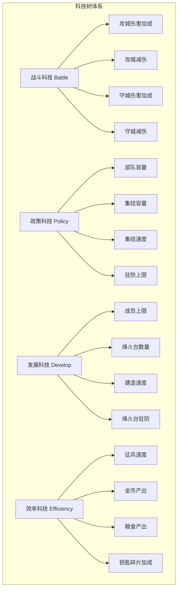

# 工会科技树系统

## 功能概述

工会科技树系统是提升工会整体实力的核心机制。系统分为四大科技分支，每个分支包含4项具体科技，通过消耗科技点进行升级。升级时采用概率机制，可以通过刷新来调整各项科技的升级概率。

## 系统架构



## 核心概念

### 1. 科技分类

| 分类 | 标识 | 重点方向 | 适用场景 |
|------|------|----------|----------|
| **战斗** | `battle` | 战斗加成 | PVP对战、攻城战 |
| **政策** | `policy` | 军事容量 | 大规模集结、驻防 |
| **发展** | `develop` | 工会发展 | 基础设施建设 |
| **效率** | `efficiency` | 资源产出 | 经济发展、资源积累 |

### 2. 升级机制


### 3. 概率分配

- 每个分类的4个小项都有独立的升级概率
- 初始概率均为25%
- 可以消耗资源刷新概率分布
- 概率总和始终为100%

## 数据结构

### TechtreeCategory - 科技树分类

```csharp
// 文件：Assets/Scripts/Network/Core/Service/UnionService.cs
[Serializable]
public class TechtreeCategory
{
    public int current;              // 该分类的总等级
    public float[] probability;      // 4个小项的升级概率 [0.25, 0.25, 0.25, 0.25]
    public int[] items;              // 4个小项的当前等级 [10, 15, 8, 12]
}
```

### TechtreeUpgradeResult - 升级结果

```csharp
// 文件：Assets/Scripts/Network/Core/Service/UnionService.cs
[Serializable]
public class TechtreeUpgradeResult
{
    public string category;          // 升级的分类
    public int term;                 // 升级的小项索引 (0-3)
    public int new_level;            // 新等级
    public string bonus_type;        // 加成类型
    public int remaining_tech;       // 剩余科技点
}
```

## 科技详情

### 1. 战斗科技 (Battle)

```csharp
// 文件：Assets/Scripts/UI/Clan/UnionConfigData.cs
"battle": {
    "0": ["attack_clan_building_damage_bonus", 0.002],     // 攻城伤害加成 +0.2%/级
    "1": ["attack_clan_building_damage_reduction", 0.002], // 攻城减伤 +0.2%/级
    "2": ["defend_clan_building_damage_bonus", 0.002],     // 守城伤害加成 +0.2%/级
    "3": ["defend_clan_building_damage_reduction", 0.002]  // 守城减伤 +0.2%/级
}
```

### 2. 政策科技 (Policy)

```csharp
// 文件：Assets/Scripts/UI/Clan/union.json
"policy": {
    "0": ["army_cap_bonus", 500],           // 部队容量 +500/级
    "1": ["rally_cap_bonus", 4000],         // 集结容量 +4000/级
    "2": ["rally_speed_bonus", 0.001],      // 集结速度 +0.1%/级
    "3": ["camp_garrison_from_clam_cap_bonus", 5000]  // 驻防上限 +5000/级
}
```

### 3. 发展科技 (Develop)

```csharp
// 文件：Assets/Scripts/UI/Clan/union.json
"develop": {
    "0": ["member_cap", 1],                 // 成员上限 +1/级
    "1": ["beacon_tower_cap", 1],           // 烽火台数量 +1/级
    "2": ["build_speed", 0.005],            // 建造速度 +0.5%/级
    "3": ["beacon_tower_garrison_cap", 10000]  // 烽火台驻防 +10000/级
}
```

### 4. 效率科技 (Efficiency)

```csharp
// 文件：Assets/Scripts/UI/Clan/union.json
"efficiency": {
    "0": ["union_city_recruit_speed", 0.01],   // 征兵速度 +1%/级
    "1": ["union_city_money_speed", 0.01],     // 金币产出 +1%/级
    "2": ["union_city_food_speed", 0.01],      // 粮食产出 +1%/级
    "3": ["union_gift_key_bonus", 0.005]       // 钥匙碎片加成 +0.5%/级
}
```

## 功能实现

### 1. 获取科技树数据

```csharp
// 文件：Assets/Scripts/Network/Core/Service/UnionService.cs
public void GetUnionTechtree(
    Action<Dictionary<string, TechtreeCategory>> onSuccess = null,
    Action<string> onError = null)
{
    // 构建缓存数据（增量更新）
    var cacheData = BuildTechtreeCacheData();
    
    var request = new Dictionary<string, object>();
    if (cacheData != null && cacheData.Count > 0)
    {
        request["my_data"] = cacheData;
    }
    
    MessageHub.I.Request(METHOD_GET_TECHTREE, request, response =>
    {
        if (response.code == 0)
        {
            // 解析并合并数据
            var responseObj = JObject.Parse(response.dataJson);
            
            // 更新缓存
            UpdateTechtreeFromResponse(cachedData, responseObj);
            
            // 返回完整数据
            onSuccess?.Invoke(cachedData.categories);
        }
    });
}
```

### 2. 升级科技

```csharp
// 文件：Assets/Scripts/UI/Clan/ClanInventController.cs
void OnResearchClicked()
{
    Debug.Log("[ClanInventController] 点击研究按钮");
    
    // 权限检查
    var myInfo = PlayerInfoService.I?.GetMyInfo();
    if (myInfo == null || !myInfo.IsUnionOfficer)
    {
        Debug.LogWarning("[ClanInventController] 非officer尝试点击研究按钮");
        return;
    }
    
    var categoryData = techtreeData[currentCategory];
    int upgradeCost = UnionService.I.GetTechtreeUpgradeRequirement(categoryData.current);
    
    // 检查科技点
    long currentTechPoints = cachedUnionInventory.GetValueOrDefault("tech", 0L);
    if (currentTechPoints < upgradeCost)
    {
        PopupManager.Show("科技点不足", $"需要 {upgradeCost} 科技点，当前只有 {currentTechPoints}");
        return;
    }
    
    // 显示确认弹窗
    string probabilityText = GetCurrentProbabilityText(categoryData);
    string message = $"确定要消耗 {upgradeCost} 科技点进行研究吗？\n\n当前升级概率：\n{probabilityText}";
    
    PopupManager.ShowConfirm(message,
        onYes: () =>
        {
            // 发送研究请求
            UnionService.I.UpgradeTechtree(currentCategory,
                onSuccess: (result) =>
                {
                    string techName = GetTechName(result.bonus_type);
                    PopupManager.Show("研究成功", $"成功升级了 {techName}！\n等级提升至 Lv.{result.new_level}");
                },
                onError: (error) =>
                {
                    PopupManager.Show("研究失败", error);
                }
            );
        }
    );
}
```

### 3. 刷新概率

```csharp
// 文件：Assets/Scripts/Network/Core/Service/UnionService.cs
public void RefreshTechtreeProbability(
    string category, 
    Action onSuccess = null, 
    Action<string> onError = null)
{
    // 权限检查
    var myInfo = PlayerInfoService.I?.GetMyInfo();
    if (!myInfo.IsUnionOfficer)
    {
        onError?.Invoke("只有R4及以上职位才能刷新概率");
        return;
    }
    
    // 验证分类
    var validCategories = new[] { "battle", "policy", "develop", "efficiency" };
    if (!validCategories.Contains(category))
    {
        onError?.Invoke("无效的科技树类别");
        return;
    }
    
    var request = new Dictionary<string, object>
    {
        ["category"] = category
    };
    
    MessageHub.I.RequestRawData(METHOD_REFRESH_PROBABILITY, requestJson, response =>
    {
        if (response.code == 0)
        {
            Debug.Log($"[UnionService] Techtree probability refreshed successfully");
            
            // 立即刷新科技树数据
            GetUnionTechtree(
                onSuccess: (data) =>
                {
                    OnTechtreeProbabilityRefreshed?.Invoke(category);
                    onSuccess?.Invoke();
                },
                onError: onError
            );
        }
    });
}
```

### 4. 升级消耗计算

```csharp
// 文件：Assets/Scripts/Network/Core/Service/UnionService.cs
public int GetTechtreeUpgradeRequirement(int categoryTotal)
{
    // 使用公式：500 + max(0, category_total-80)^2
    int baseCost = 500;
    int extraCost = 0;
    
    if (categoryTotal > 80)
    {
        int diff = categoryTotal - 80;
        extraCost = diff * diff; // (category_total - 80) 的平方
    }
    
    return baseCost + extraCost;
}
```

## UI界面

### 1. 科技树界面结构

```yaml
DevelopmentRoot:
  HeaderSection:
    - TechPointsLabel: "科技点: 12345"
    
  CategoryTabs:
    - CombatBtn: "战斗"
    - MilitaryBtn: "军事"  
    - DevelopmentBtn: "发展"
    - EfficiencyBtn: "效率"
    
  TechContainer:
    TechItem_0:
      - Icon: 科技图标
      - Name: 科技名称
      - Level: "Lv.15"
      - Progress: 升级概率条
      - Percentage: "25%"
    
    TechItem_1:
      - Icon: 科技图标
      - Name: 科技名称
      - Level: "Lv.10"
      - Progress: 升级概率条
      - Percentage: "25%"
    
    # ... TechItem_2, TechItem_3
    
  ActionButtons:
    - ResearchBtn: "研究 (消耗 500)"
    - RefreshBtn: "刷新概率"
```

### 2. 概率显示

```csharp
// 文件：Assets/Scripts/UI/Clan/ClanInventController.cs
string GetCurrentProbabilityText(UnionService.TechtreeCategory categoryData)
{
    var sb = new System.Text.StringBuilder();
    var categoryConfig = configData.union_techtree.FirstOrDefault(c => c.categoryName == currentCategory);
    
    if (categoryConfig != null)
    {
        for (int i = 0; i < 4; i++)
        {
            string techName = GetTechName(categoryConfig.items[i].bonusType);
            float probability = categoryData.probability[i] * 100f;
            sb.AppendLine($"{techName}: {probability:F0}%");
        }
    }
    
    return sb.ToString().TrimEnd();
}
```

## API接口

### 1. 获取科技树

**路径**: `union/get_union_techtree`  
**方法**: POST

#### 请求
```json
{
    "my_data": {
        "battle": {
            "current": 45,
            "probability": [0.25, 0.25, 0.25, 0.25],
            "0": 10, "1": 15, "2": 8, "3": 12
        }
        // ... 其他分类的缓存数据
    }
}
```

#### 响应
```json
{
    "battle": {
        "current": 45,
        "probability": [0.3, 0.2, 0.2, 0.3],
        "0": 10, "1": 15, "2": 8, "3": 12
    },
    "policy": {
        "current": 38,
        "probability": [0.25, 0.25, 0.25, 0.25],
        "0": 8, "1": 10, "2": 10, "3": 10
    }
    // ... 其他分类
}
```

### 2. 升级科技

**路径**: `union/upgrade_techtree`  
**方法**: POST

#### 请求
```json
{
    "category": "battle"
}
```

#### 响应
```json
{
    "category": "battle",
    "term": 2,                              // 升级了第3项（索引2）
    "new_level": 9,                         // 新等级
    "bonus_type": "defend_clan_building_damage_bonus",
    "remaining_tech": 8500                  // 剩余科技点
}
```

### 3. 刷新概率

**路径**: `union/refresh_techtree_probability`  
**方法**: POST

#### 请求
```json
{
    "category": "battle"
}
```

#### 响应
```json
{
    "code": 0,
    "msg": "Success"
}
```

## 权限控制

### 1. 操作权限

| 操作 | 所需权限 | 说明 |
|------|----------|------|
| **查看科技树** | 工会成员 | 所有成员可查看 |
| **升级科技** | R4及以上 | 需要Officer权限 |
| **刷新概率** | R4及以上 | 需要Officer权限 |

### 2. 权限判断

```csharp
// 文件：Assets/Scripts/UI/Clan/ClanInventController.cs
void UpdateButtonPermissions()
{
    var myInfo = PlayerInfoService.I?.GetMyInfo();
    bool isOfficer = myInfo?.IsUnionOfficer ?? false;
    
    // R4及以上才能点击研究和刷新按钮
    if (researchBtn != null)
    {
        researchBtn.SetEnabled(isOfficer);
        if (!isOfficer)
        {
            researchBtn.style.backgroundColor = new Color(0.5f, 0.5f, 0.5f, 0.5f);
        }
    }
    
    if (refreshBtn != null)
    {
        refreshBtn.SetEnabled(isOfficer);
        if (!isOfficer)
        {
            refreshBtn.style.backgroundColor = new Color(0.5f, 0.5f, 0.5f, 0.5f);
        }
    }
}
```

## 消耗配置

### 1. 升级消耗公式

```python
# 基础消耗 + 超过80级后的额外消耗
cost = 500 + max(0, category_total - 80) ** 2

# 示例：
# 总等级 0-80: 消耗 500
# 总等级 90: 消耗 500 + 10^2 = 600
# 总等级 100: 消耗 500 + 20^2 = 900
# 总等级 120: 消耗 500 + 40^2 = 2100
```

### 2. 刷新消耗

```csharp
// 文件：Assets/Scripts/UI/Clan/UnionConfigData.cs
techtree_refresh_cost_item: "iron"       // 消耗物品：铁矿
techtree_refresh_cost_amount: 1000       // 消耗数量：1000
```

## 缓存机制

### 1. 增量更新

```csharp
// 文件：Assets/Scripts/Network/Core/Service/UnionService.cs
private Dictionary<string, object> BuildTechtreeCacheData()
{
    var myInfo = PlayerInfoService.I?.GetMyInfo();
    if (myInfo == null || !myInfo.HasUnion) return new Dictionary<string, object>();
    
    var unionId = myInfo.union;
    if (!techtreeCache.ContainsKey(unionId))
    {
        return new Dictionary<string, object>();
    }
    
    var cached = techtreeCache[unionId];
    var result = new Dictionary<string, object>();
    
    foreach (var kvp in cached.categories)
    {
        var categoryData = new Dictionary<string, object>
        {
            ["current"] = kvp.Value.current,
            ["probability"] = kvp.Value.probability,
            ["0"] = kvp.Value.items[0],
            ["1"] = kvp.Value.items[1],
            ["2"] = kvp.Value.items[2],
            ["3"] = kvp.Value.items[3]
        };
        result[kvp.Key] = categoryData;
    }
    
    return result;
}
```

### 2. 本地缓存更新

```csharp
// 文件：Assets/Scripts/Network/Core/Service/UnionService.cs
private void UpdateLocalTechtreeCache(TechtreeUpgradeResult result)
{
    var myInfo = PlayerInfoService.I?.GetMyInfo();
    if (myInfo == null || !myInfo.HasUnion) return;
    
    var unionId = myInfo.union;
    if (!techtreeCache.ContainsKey(unionId))
    {
        techtreeCache[unionId] = new TechtreeData();
    }
    
    var cache = techtreeCache[unionId];
    if (!cache.categories.ContainsKey(result.category))
    {
        cache.categories[result.category] = new TechtreeCategory();
    }
    
    var category = cache.categories[result.category];
    
    // 更新小项等级
    if (result.term >= 0 && result.term < 4)
    {
        category.items[result.term] = result.new_level;
    }
    
    // 更新总等级
    category.current = category.items.Sum();
    
    // 保存缓存
    SaveCache();
}
```

## 错误处理

### 服务器错误码

| 错误码 | 消息 | 中文提示 |
|--------|------|---------|
| 400 | Invalid category | 无效的科技树类别 |
| 400 | All items maxed | 该类别所有科技都已满级 |
| 401 | Unauthorized | 未认证，请重新登录 |
| 402 | Insufficient tech | 科技点不足 |
| 403 | Insufficient permission | 权限不足，需要R4或以上职位 |
| 403 | Not in union | 您不在任何联盟中 |
| 500 | Server error | 服务器错误，请稍后重试 |

### 错误处理示例

```csharp
// 文件：Assets/Scripts/Network/Core/Service/UnionService.cs
private void HandleTechtreeError(int code, string msg, Action<string> onError)
{
    string errorMsg = msg;
    
    switch (code)
    {
        case 402:
            if (msg.Contains("insufficient tech points"))
            {
                // 尝试解析具体数值
                var match = System.Text.RegularExpressions.Regex.Match(msg, @"Need (\d+), have (\d+)");
                if (match.Success)
                {
                    errorMsg = $"科技点不足，需要 {match.Groups[1].Value}，当前只有 {match.Groups[2].Value}";
                }
                else
                {
                    errorMsg = "科技点不足";
                }
            }
            break;
        // ... 其他错误处理
    }
    
    onError?.Invoke(errorMsg);
}
```

## 事件通知

### 1. 科技升级事件

```csharp
// 文件：Assets/Scripts/UI/Clan/ClanArchiveController.cs
case "techtree_upgrade":
    // techtree_upgrade::time::nickname::category
    if (parts.Length >= 4)
    {
        var nickname = parts[2];
        var techCategory = parts[3];
        
        string categoryText = techCategory switch
        {
            "battle" => "战斗科技",
            "policy" => "政策科技",
            "develop" => "发展科技",
            "efficiency" => "效率科技",
            _ => techCategory
        };
        
        record = new ArchiveRecord(eventType, timestamp,
            $"{nickname} 升级了{categoryText}",
            ArchiveCategory.Alliance);
    }
    break;
```

### 2. 概率刷新事件

```csharp
// 文件：Assets/Scripts/UI/Clan/ClanArchiveController.cs
case "techtree_refresh":
    // techtree_refresh::time::nickname::category
    if (parts.Length >= 4)
    {
        var nickname = parts[2];
        var techCategory = parts[3];
        
        string categoryText = techCategory switch
        {
            "battle" => "战斗科技",
            "policy" => "政策科技",
            "develop" => "发展科技",
            "efficiency" => "效率科技",
            _ => techCategory
        };
        
        record = new ArchiveRecord(eventType, timestamp,
            $"{nickname} 刷新了{categoryText}",
            ArchiveCategory.Alliance);
    }
    break;
```

## 性能优化

### 1. 数据缓存
- 使用本地缓存减少请求
- 增量更新避免重复传输
- 智能合并新旧数据

### 2. UI优化
- 延迟加载科技图标
- 批量更新概率显示
- 使用对象池管理UI元素

### 3. 网络优化
- 合并请求（获取所有分类）
- 使用缓存数据进行增量更新
- 升级后立即更新本地缓存

## 注意事项

### 1. 权限控制
- 只有R4及以上可以升级和刷新
- 所有成员可以查看科技树
- 操作前后端双重验证

### 2. 数据同步
- 升级后立即更新本地缓存
- 刷新概率后重新获取数据
- 定期同步避免数据过期

### 3. 概率机制
- 概率总和始终为100%
- 刷新会重新分配概率
- 概率影响升级的小项选择

### 4. 消耗计算
- 消耗随总等级增长
- 80级后消耗急剧增加
- 刷新消耗固定资源

## 相关文档

- [工会系统概述](union-overview.md)
- [工会宝库系统](union-treasury.md)
- [工会仓库系统](union-inventory.md)
- [成员系统与权限](member-system.md)