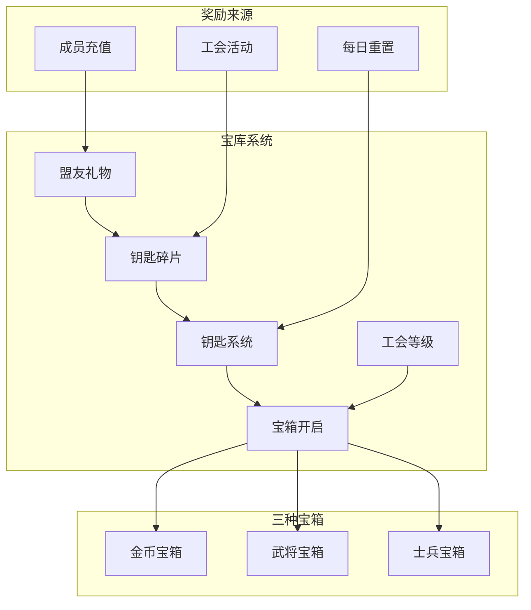
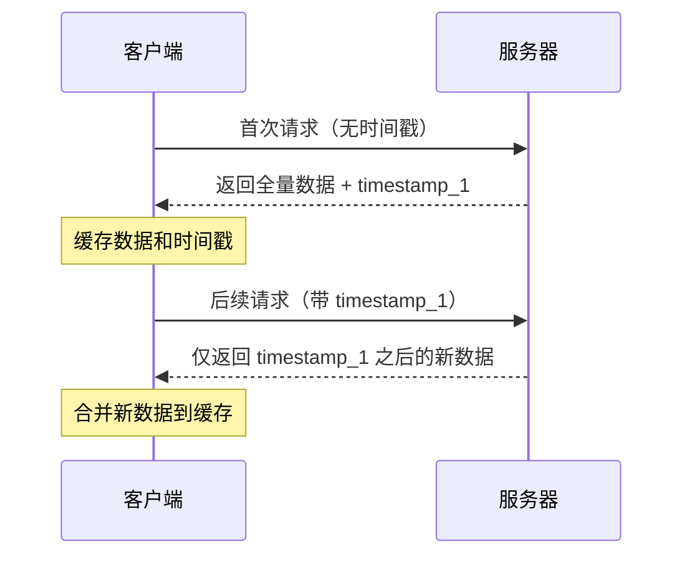

# 工会宝库系统

## 功能概述

工会宝库系统是工会成员共享福利的核心机制，包含三大功能模块：宝箱系统、钥匙系统和盟友礼物。成员可以消耗钥匙开启宝箱获得奖励，通过钥匙碎片合成新钥匙，以及领取其他成员购买礼包时的分红。

## 系统架构



## 核心概念

### 1. 钥匙系统

| 概念 | 说明 |
|------|------|
| **可用钥匙** | 用于开启宝箱的消耗品，每个宝箱消耗1把钥匙 |
| **钥匙碎片** | 用于合成钥匙的材料，达到指定数量可合成1把钥匙 |
| **碎片需求** | 随工会等级提升，合成所需碎片数量增加 |

### 2. 宝箱类型

| 宝箱 | 类型标识 | 主要奖励 | 说明 |
|------|----------|----------|------|
| **金币宝箱** | `gold` | 大量金币 | 资源型奖励 |
| **武将宝箱** | `card` | 武将卡牌、英雄徽章 | 发展型奖励 |
| **士兵宝箱** | `soldier` | 士兵令、部队资源 | 军事型奖励 |

### 3. 盟友礼物

| 礼物类型 | 标识 | 碎片奖励 | 金币奖励 |
|----------|------|----------|----------|
| **普通馈赠** | `ally_gift_1` | 10 | 10 |
| **精致馈赠** | `ally_gift_2` | 20 | 20 |
| **豪华馈赠** | `ally_gift_3` | 30 | 30 |

## 数据结构

### TreasuryData - 宝库数据

```csharp
// 文件：Assets/Scripts/Network/Core/Service/UnionService.cs
[Serializable]
public class TreasuryData
{
    public int available_keys;              // 可用钥匙数量
    public int union_key_fragment;          // 工会钥匙碎片总数
    public long your_last_claim_time;       // 上次领取盟友礼物时间
    public Dictionary<string, long> new_ally_gifts;  // 新的盟友礼物（增量）
    public long this_request_timestamp;     // 本次请求时间戳
}
```

### ClaimUnionChestResponse - 宝箱开启响应

```csharp
// 文件：Assets/Scripts/Network/Core/Service/UnionService.cs
[Serializable]
public class ClaimUnionChestResponse
{
    public Dictionary<string, int> claimed;          // 获得的奖励
    public Dictionary<string, object> current_balance;  // 当前余额
}
```

### ClaimAllyGiftResponse - 盟友礼物响应

```csharp
// 文件：Assets/Scripts/Network/Core/Service/UnionService.cs
[Serializable]
public class ClaimAllyGiftResponse
{
    public Dictionary<string, int> claimed;          // 领取的总奖励
    public int current_union_key_fragment;           // 当前碎片数
    public int your_current_key;                     // 当前钥匙数
    public long this_claim_time;                     // 本次领取时间
    public Dictionary<string, object> current_balance;  // 当前余额
}
```

## 功能实现

### 1. 获取宝库数据

```csharp
// 文件：Assets/Scripts/Network/Core/Service/UnionService.cs
public void GetUnionTreasury(
    Action<TreasuryData> onSuccess = null,
    Action<string> onError = null)
{
    // 增量更新机制
    var request = new Dictionary<string, object>();
    if (lastRequestTimestamp > 0)
    {
        request["last_request_timestamp"] = lastRequestTimestamp;
    }
    
    MessageHub.I.Request(METHOD_GET_UNION_TREASURY, request, response =>
    {
        if (response.code == 0)
        {
            var treasuryData = JsonConvert.DeserializeObject<TreasuryData>(response.dataJson);
            
            // 更新时间戳
            lastRequestTimestamp = treasuryData.this_request_timestamp;
            
            // 如果是增量更新，合并数据
            if (cachedTreasuryData != null && treasuryData.new_ally_gifts != null)
            {
                // 合并新礼物到缓存
                foreach (var gift in treasuryData.new_ally_gifts)
                {
                    cachedTreasuryData.new_ally_gifts[gift.Key] = gift.Value;
                }
                
                // 更新其他字段
                cachedTreasuryData.available_keys = treasuryData.available_keys;
                cachedTreasuryData.union_key_fragment = treasuryData.union_key_fragment;
                cachedTreasuryData.your_last_claim_time = treasuryData.your_last_claim_time;
            }
            else
            {
                cachedTreasuryData = treasuryData;
            }
            
            onSuccess?.Invoke(cachedTreasuryData);
        }
    });
}
```

### 2. 开启宝箱

```csharp
// 文件：Assets/Scripts/UI/Clan/ClanTreasuryController.cs
private void OnChestClicked(string chestType)
{
    Debug.Log($"[ClanTreasuryController] 点击宝箱：{chestType}");
    
    // 检查钥匙数量
    if (currentKeyCount < 1)
    {
        PopupManager.Show("钥匙不足", "需要1把钥匙才能开启宝箱");
        return;
    }
    
    // 通过UnionService开启宝箱
    UnionService.I.ClaimUnionChest(chestType,
        (rewards) =>
        {
            // 显示奖励
            ShowRewardPopup(chestType, rewards);
            
            // 刷新数据
            RefreshTreasuryData();
        },
        (error) =>
        {
            PopupManager.Show("开启失败", error);
        }
    );
}
```

### 3. 领取盟友礼物

```csharp
// 文件：Assets/Scripts/UI/Clan/ClanTreasuryController.cs
private void OnClaimAllClicked()
{
    Debug.Log("[ClanTreasuryController] 点击一键领取盟友馈赠");
    
    // 检查是否有未领取的馈赠
    if (allyGiftDisplayItems.Count == 0)
    {
        PopupManager.Show("提示", "暂无可领取的盟友馈赠");
        return;
    }
    
    // 通过 UnionService 领取所有馈赠
    UnionService.I.ClaimAllyGift(
        (rewards, newKeyFragment, newKeyCount) =>
        {
            // 显示领取成功
            ShowAllyGiftClaimSuccess(rewards);
            
            // 更新本地数据
            currentKeyFragment = newKeyFragment;
            currentKeyCount = newKeyCount;
            
            // 清理本地显示
            allyGiftDisplayItems.Clear();
            RefreshAllyGiftsGrid();
            
            // 刷新数据
            RefreshTreasuryData();
        },
        (error) =>
        {
            PopupManager.Show("领取失败", error);
        }
    );
}
```

### 4. 钥匙碎片合成

```csharp
// 文件：Assets/Scripts/UI/Clan/ClanTreasuryController.cs
private void UpdateKeyFragmentProgress()
{
    // 获取当前工会等级
    int unionLevel = currentUnionLevel;
    
    // 获取所需碎片数（根据等级）
    int requiredFragments = UnionConfigData.Instance.GetRequiredKeyFrag(unionLevel);
    
    // 更新进度条
    if (keyFragmentProgressBar != null)
    {
        float progress = (float)currentKeyFragment / requiredFragments;
        keyFragmentProgressBar.value = progress * 100;
    }
    
    // 更新文本显示
    if (keyFragmentLabel != null)
    {
        keyFragmentLabel.text = $"钥匙碎片：{currentKeyFragment}/{requiredFragments}";
    }
    
    // 检查是否可以合成
    if (currentKeyFragment >= requiredFragments)
    {
        // 自动合成钥匙（服务器处理）
        Debug.Log("[ClanTreasuryController] 碎片已满，自动合成钥匙");
    }
}
```

## UI界面

### 1. 宝库主界面结构

```yaml
TreasuryRoot:
  TitleSection:
    - Title: "宝库阁"
  
  MainChestsSection:
    DiamondChestCard:
      - DiamondChestIcon      # 钻石宝箱图标
      - DiamondWarningIcon     # 钥匙不足警告
      - DiamondChestBtn        # 开启按钮
    
    GeneralChestCard:
      - GeneralChestIcon       # 武将宝箱图标
      - GeneralWarningIcon     # 钥匙不足警告
      - GeneralChestBtn        # 开启按钮
    
    SoldierChestCard:
      - SoldierChestIcon       # 士兵宝箱图标
      - SoldierWarningIcon     # 钥匙不足警告
      - SoldierChestBtn        # 开启按钮
  
  KeyInfoSection:
    - KeyCountLabel           # 可用钥匙：X
    - KeyFragmentProgress     # 碎片进度条
    - FragmentLabel          # X/Y 碎片
  
  AllyGiftsSection:
    - SectionTitle: "盟友馈赠"
    - ClaimAllBtn            # 一键领取按钮
    - ChestGridContainer     # 礼物网格容器
```

### 2. 盟友礼物显示

```csharp
// 文件：Assets/Scripts/UI/Clan/ClanTreasuryController.cs
private void CreateAllyGiftGridItem(AllyGiftDisplayItem giftItem)
{
    // 克隆模板
    var chestElement = chestSelectTemplate.CloneTree();
    var container = chestElement.Q<VisualElement>("ChestGridItem");
    
    // 设置礼物信息
    var nameLabel = container.Q<Label>("PlayerNameLabel");
    var typeLabel = container.Q<Label>("ChestTypeLabel");
    var statusLabel = container.Q<Label>("StatusLabel");
    
    nameLabel.text = giftItem.playerName;
    typeLabel.text = GetGiftTypeName(giftItem.giftId);
    
    // 显示碎片数量
    int fragmentAmount = GetGiftFragmentAmount(giftItem.giftId);
    statusLabel.text = $"+{fragmentAmount} 碎片";
    
    // 添加到容器
    chestGridContainer.Add(chestElement);
}
```

## API接口

### 1. 获取宝库数据

**路径**: `union/get_union_treasury`  
**方法**: POST

#### 请求
```json
{
    "last_request_timestamp": 1234567890  // 可选，用于增量更新
}
```

#### 响应
```json
{
    "available_keys": 3,
    "union_key_fragment": 850,
    "your_last_claim_time": 1234567890,
    "new_ally_gifts": {
        "gift_id_1": 1234567891,
        "gift_id_2": 1234567892
    },
    "this_request_timestamp": 1234567893
}
```

### 2. 开启宝箱

**路径**: `union/claim_union_chest`  
**方法**: POST

#### 请求
```json
{
    "chest_type": "gold"  // gold/card/soldier
}
```

#### 响应
```json
{
    "claimed": {
        "Gold": 1000,
        "HeroCrest_SGeneral": 5
    },
    "current_balance": {
        "Gold": 50000,
        "HeroCrest_SGeneral": 25
    }
}
```

### 3. 领取盟友礼物

**路径**: `union/claim_ally_gift`  
**方法**: POST

#### 请求
```json
{}  // 空对象，一键领取所有
```

#### 响应
```json
{
    "claimed": {
        "key_fragment": 150,
        "Gold": 100
    },
    "current_union_key_fragment": 1000,
    "your_current_key": 4,
    "this_claim_time": 1234567894,
    "current_balance": {
        "Gold": 51000
    }
}
```

## 配置数据

### 钥匙碎片需求配置

```csharp
// 文件：Assets/Scripts/UI/Clan/UnionConfigData.cs
// 根据工会等级的碎片需求
key_fragment_requirements:
  - level: 0, requirement: 1000
  - level: 1, requirement: 2000
  - level: 2, requirement: 3000
  - level: 3, requirement: 4000
  - level: 4, requirement: 5000
  - level: 5, requirement: 6000
  - level: 6, requirement: 7000
  - level: 7, requirement: 8000
  - level: 8, requirement: 9000
  - level: 9, requirement: 10000
  - level: 10, requirement: 12000
```

### 宝箱奖励配置

```json
// 文件：Assets/Scripts/UI/Clan/union.json
"union_chest": {
    "gold": {
        "Gold": [100, 200, 300, 400, 500, 600, 700, 800, 900, 1000, 1200]
    },
    "card": {
        "Gold": [10, 20, 30, 40, 50, 60, 70, 80, 90, 100, 120],
        "HeroCrest_SGeneral": [1, 2, 3, 4, 5, 6, 7, 8, 9, 10, 12]
    },
    "soldier": {
        "Gold": [10, 20, 30, 40, 50, 60, 70, 80, 90, 100, 120],
        "TroopOrder": [1, 1, 1, 1, 1, 2, 2, 2, 2, 3, 3]
    }
}
```

## 增量更新机制

### 1. 工作原理



### 2. 实现代码

```csharp
// 文件：Assets/Scripts/UI/Clan/ClanTreasuryController.cs
private void ProcessAllyGifts(Dictionary<string, long> allGifts)
{
    // 清理已领取的礼物（时间戳小于等于最后领取时间的）
    var keysToRemove = allAllyGifts
        .Where(g => g.Value <= lastClaimTime)
        .Select(g => g.Key)
        .ToList();
    
    foreach (var key in keysToRemove)
    {
        allAllyGifts.Remove(key);
    }
    
    // 添加新礼物（时间戳大于最后领取时间的）
    foreach (var gift in allGifts)
    {
        if (gift.Value > lastClaimTime)
        {
            allAllyGifts[gift.Key] = gift.Value;
        }
    }
}
```

## 奖励计算

### 1. 根据工会等级计算奖励

```csharp
// 文件：Assets/Scripts/UI/Clan/UnionConfigData.cs
public Dictionary<string, int> GetUnionChestReward(string chest, int unionLevel)
{
    var chestData = union_chests.Find(c => c.chestType == chest);
    if (chestData == null) return new Dictionary<string, int>();
    
    var result = new Dictionary<string, int>();
    int levelIndex = unionLevel < 10 ? unionLevel : 10;  // 最高等级10
    
    foreach (var reward in chestData.rewards)
    {
        if (levelIndex < reward.rewardsByLevel.Length)
        {
            result[reward.itemId] = reward.rewardsByLevel[levelIndex];
        }
    }
    
    return result;
}
```

### 2. 科技加成计算

```csharp
// 文件：Assets/Scripts/UI/Clan/ClanTreasuryController.cs
// 效率科技中的 union_gift_key_bonus 影响钥匙碎片获取
private int CalculateKeyFragmentWithBonus(int baseAmount)
{
    // 获取科技加成
    float techBonus = GetTechTreeBonus("efficiency", 3);  // union_gift_key_bonus
    
    // 计算最终数量
    int finalAmount = Mathf.RoundToInt(baseAmount * (1 + techBonus));
    
    return finalAmount;
}
```

## 错误处理

### 服务器错误码

| 错误码 | 消息 | 中文提示 |
|--------|------|---------|
| 400 | Invalid chest_type | 无效的宝箱类型 |
| 401 | Unauthorized | 未认证，请重新登录 |
| 402 | Keys depleted | 钥匙已用完 |
| 403 | Not in union | 您未加入任何联盟 |
| 500 | Server error | 服务器错误，请稍后重试 |

### 错误处理示例

```csharp
// 文件：Assets/Scripts/Network/Core/Service/UnionService.cs
switch (response.code)
{
    case 402:
        errorMsg = "钥匙已用完，请等待联盟获得新钥匙";
        // 尝试解析更多信息
        try
        {
            var errorData = JsonConvert.DeserializeObject<Dictionary<string, object>>(response.dataJson);
            if (errorData != null && errorData.ContainsKey("next_key_time"))
            {
                long nextKeyTime = Convert.ToInt64(errorData["next_key_time"]);
                var timeSpan = DateTimeOffset.FromUnixTimeSeconds(nextKeyTime) - DateTimeOffset.Now;
                errorMsg += $"（{timeSpan.Hours}小时{timeSpan.Minutes}分钟后获得新钥匙）";
            }
        }
        catch { }
        break;
}
```

## 性能优化

### 1. 缓存策略
- 使用增量更新减少数据传输
- 本地缓存宝库数据
- 智能合并新旧数据

### 2. UI优化
- 使用对象池管理礼物项
- 延迟加载玩家头像
- 批量更新UI元素

### 3. 网络优化
- 合并请求（宝库数据一次获取）
- 使用时间戳避免重复数据
- 错误重试机制

## 注意事项

### 1. 时间同步
- 使用服务器时间戳判断礼物状态
- 客户端时间仅用于显示
- 领取时间以服务器返回为准

### 2. 数据一致性
- 开箱后立即刷新宝库数据
- 领取礼物后更新本地缓存
- 碎片合成由服务器自动处理

### 3. 权限控制
- 所有成员都可以开箱和领取礼物
- 钥匙为工会共享资源
- 个人领取记录独立维护

### 4. 用户体验
- 钥匙不足时显示警告图标
- 实时更新碎片进度
- 领取成功后立即反馈

## 相关文档

- [工会系统概述](union-overview.md)
- [工会科技树系统](union-techtree.md)
- [成员系统与权限](member-system.md)
- [工会配置数据](union-config.md)