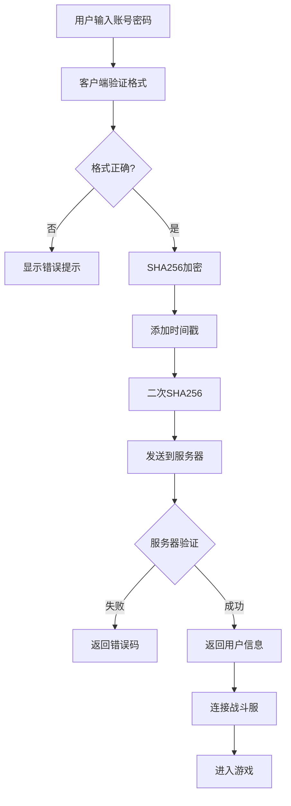

# 账号密码登录

## 功能概述

账号密码登录是游戏的传统登录方式，提供完整的账号体系，包括登录、注册、密码找回等功能。

## 技术实现

### 登录流程



### 密码加密机制

#### 双重SHA256加密

```csharp title="AccountAuthController.cs"
private void OnClickLogin()
{
    string account = loginAccField.value.Trim();
    string password = loginPwdField.value;
    
    // 输入验证
    if (!CheckAccountAndPwd(account, password)) 
        return;
    
    // 显示加载动画
    LoadingPanelManager.Instance.Show();
    
    // 发起登录请求
    api.PasswordLogin(
        account,
        password,
        ok: json => {
            // 保存会话信息
            SaveSession(json);
            
            // 连接战斗服
            BattleServerBridge.Connect(json,
                onOk: _ => {
                    SceneManager.LoadScene("LoadingScene");
                },
                onFail: err => {
                    LoadingPanelManager.Instance.Hide();
                    PopupManager.Show("连接失败", err);
                });
        },
        fail: msg => {
            LoadingPanelManager.Instance.Hide();
            PopupManager.Show("登录失败", msg);
        });
}
```

#### 加密实现细节

```csharp title="AuthAPI.cs"
public Coroutine PasswordLogin(string account, string rawPwd,
                               Action<string> ok, Action<string> fail)
{
    // 生成时间戳（毫秒级）
    long ts = DateTimeOffset.UtcNow.ToUnixTimeMilliseconds();
    string tsStr = ts.ToString();
    
    // 第一次SHA256：原始密码哈希
    string sha1 = Sha256Hex(rawPwd);
    
    // 第二次SHA256：加入时间戳防重放
    string sha2 = Sha256Hex(sha1 + tsStr);
    
    // 构建请求体
    string url = $"{host}/user/PasswordLogin";
    string body = JsonUtility.ToJson(new {
        username = account,
        password = sha2,
        timestamp = tsStr
    });
    
    return StartCoroutine(PostJson(url, body, ok, fail));
}

// SHA256实现
private string Sha256Hex(string input)
{
    using (SHA256 sha256 = SHA256.Create())
    {
        byte[] bytes = Encoding.UTF8.GetBytes(input);
        byte[] hash = sha256.ComputeHash(bytes);
        return BitConverter.ToString(hash)
            .Replace("-", "").ToLowerInvariant();
    }
}
```

### 输入验证

#### 账号验证规则

```csharp title="验证逻辑"
private bool CheckAccountAndPwd(TextField accField, TextField pwdField)
{
    string account = accField.value.Trim();
    string password = pwdField.value;
    
    // 账号长度检查：3-20字符
    if (account.Length < 3 || account.Length > 20)
    {
        ShowFieldError(hinterror, "账号长度需3-20个字符", accField);
        return false;
    }
    
    // 账号格式检查：仅允许字母数字下划线
    if (!Regex.IsMatch(account, @"^[a-zA-Z0-9_]+$"))
    {
        ShowFieldError(hinterror, "账号只能包含字母、数字和下划线", accField);
        return false;
    }
    
    // 密码长度检查：6-20字符
    if (password.Length < 6 || password.Length > 20)
    {
        ShowFieldError(hinterrorpwd, "密码长度需6-20个字符", pwdField);
        return false;
    }
    
    return true;
}
```

#### 实时验证反馈

```csharp title="错误提示系统"
// 显示字段错误
private void ShowFieldError(Label errorLabel, string msg, TextField field)
{
    errorLabel.text = msg;
    errorLabel.style.color = new Color(0.7f, 0.14f, 0.14f);  // 红色
    field.AddToClassList("error");
    
    // 3秒后自动清除
    StartCoroutine(ClearErrorAfter(3f, errorLabel, field));
}

// 显示成功提示
private void ShowFieldOk(List<Label> labels, string msg, TextField field)
{
    foreach (var label in labels)
    {
        label.text = msg;
        label.style.color = new Color(0.32f, 0.65f, 0.53f);  // 绿色
    }
    field.RemoveFromClassList("error");
}
```

## UI界面

### 登录面板布局

```xml title="LogInScreenVisualTree.uxml"
<ui:VisualElement name="AccountLoginPanel">
    <!-- 账号输入 -->
    <ui:VisualElement name="AccountPanel" class="bar">
        <ui:TextField 
            placeholder-text="输入账号" 
            name="account-input" 
            class="textinput"/>
    </ui:VisualElement>
    
    <!-- 错误提示 -->
    <ui:Label name="hinterror" class="hint"/>
    
    <!-- 密码输入 -->
    <ui:VisualElement name="PasswordPanel" class="bar">
        <ui:TextField 
            placeholder-text="输入密码" 
            password="true"
            name="pwd-input" 
            class="textinput"/>
    </ui:VisualElement>
    
    <ui:Label name="hinterrorpwd" class="hint"/>
    
    <!-- 功能按钮 -->
    <ui:VisualElement name="ButtonGroup">
        <ui:Button text="忘记密码?" name="ForgetPwdBtn"/>
        <ui:Button text="还没账号?" name="RegisterButton"/>
    </ui:VisualElement>
    
    <!-- 登录按钮 -->
    <ui:Button text="登录" name="LoginBtn" class="brownbutton"/>
    
    <!-- 协议提示 -->
    <ui:Label text="登录即表示你已同意用户协议与隐私政策"/>
</ui:VisualElement>
```

### 样式定义

```css title="LogInScreenStyle.uss"
/* 输入框样式 */
.bar {
    background-image: url("输入账号框.png");
    border-radius: 10px;
    width: 100%;
    height: 45%;
    margin-top: 10px;
}

.textinput {
    background-color: transparent;
    border-width: 0;
    font-size: 35px;
    color: rgb(251, 231, 178);
    -unity-text-align: middle-left;
    padding-left: 20px;
}

/* 错误提示样式 */
.hint {
    font-size: 25px;
    height: 30px;
    margin-top: 5px;
    -unity-text-align: middle-center;
}

/* 错误状态 */
.error {
    border-color: rgb(180, 35, 35);
    border-width: 2px;
}

/* 登录按钮 */
.brownbutton {
    background-image: url("登录按钮.png");
    background-size: 45% 100%;
    font-size: 45px;
    color: rgb(251, 231, 178);
    height: 10.5%;
    margin-top: 20px;
}
```

## 服务器交互

### API接口

#### 登录接口

```http
POST /user/PasswordLogin
Content-Type: application/json

{
    "username": "用户名",
    "password": "SHA256加密后的密码",
    "timestamp": "时间戳"
}
```

#### 响应格式

```json title="成功响应"
{
    "code": 0,
    "message": "success",
    "uid": "user_123456",
    "user_token": "token_xxxxx",
    "cid": "character_123",
    "character_token": "char_token_xxx",
    "server_id": 1,
    "server_ip_address": "192.168.1.100",
    "server_port": 8000
}
```

```json title="失败响应"
{
    "code": 201,
    "message": "密码错误"
}
```

### 错误码说明

| 错误码 | 含义 | 用户提示 |
|-------|------|---------|
| 0 | 成功 | - |
| 101 | 用户名不存在 | 账号不存在，请先注册 |
| 102 | 用户名格式错误 | 账号格式不正确 |
| 201 | 密码错误 | 密码错误，请重试 |
| 202 | 密码格式错误 | 密码格式不正确 |
| 401 | 请求格式错误 | 系统错误，请重试 |
| 501 | 服务器内部错误 | 服务器繁忙，请稍后重试 |

## 安全措施

### 1. 密码加密传输

```csharp title="AuthAPI.cs - 实际实现"
// 双重SHA256加密，确保密码安全
string sha1 = Sha256Hex(rawPwd);            // 第一次SHA-256
string sha2 = Sha256Hex(sha1 + tsStr);      // 第二次SHA-256 + 时间戳
```

### 2. 防重复点击

```csharp title="AccountAuthController.cs - 实际实现"
private void OnClickLogin()
{
    // 禁用按钮防止重复点击
    loginBtn.SetEnabled(false);
    
    api.PasswordLogin(account, password,
        ok: _ => loginBtn.SetEnabled(true),
        fail: _ => loginBtn.SetEnabled(true)
    );
}
```

### 3. 时间戳防重放

```csharp title="AuthAPI.cs - 实际实现"
// 每次请求都带时间戳
long ts = DateTimeOffset.UtcNow.ToUnixTimeMilliseconds();
string tsStr = ts.ToString();

string body = $@"{{
    ""username"": ""{account}"",
    ""password"": ""{sha2}"",
    ""timestamp"": ""{tsStr}""  // 时间戳防止重放攻击
}}";
```

## 用户体验优化

### 1. 清空输入

```csharp title="AccountAuthController.cs - 实际实现"
// 登录成功后清空所有输入
private void ClearAllInputs()
{
    loginAccField?.SetValue("");
    loginPwdField?.SetValue("");
    regAccField?.SetValue("");
    regPwdField1?.SetValue("");
    regPwdField2?.SetValue("");
    // ... 其他输入框
}
```

### 2. 防重复点击

```csharp title="实际实现"
private void OnClickLogin()
{
    // 禁用按钮防止重复点击
    loginBtn.SetEnabled(false);
    
    // 请求完成后恢复
    api.PasswordLogin(account, password,
        ok: _ => loginBtn.SetEnabled(true),
        fail: _ => loginBtn.SetEnabled(true)
    );
}
```

### 3. Loading反馈

```csharp title="LoadingPanelManager.cs - 实际代码"
// 全屏Loading（只有这两个方法）
LoadingPanelManager.Instance.Show();
LoadingPanelManager.Instance.Hide();

// 局部Loading（SpinController）
SpinController.Instance.Show();
SpinController.Instance.Hide();
```

## 测试要点

### 功能测试清单

- 正常登录流程
- 错误密码处理  
- 网络异常处理
- 并发登录测试
- 弱网环境测试

### 边界条件

- 账号长度边界（3-20字符）
- 密码长度边界（6-20字符）
- 特殊字符过滤
- 空输入处理

## 常见问题

### Q: 为什么使用双重SHA256？

**A:** 第一次SHA256确保密码不可逆，第二次加入时间戳防止重放攻击。即使网络包被截获，攻击者也无法重复使用。

### Q: 如何处理密码找回？

**A:** 通过邮箱验证码重置密码，详见[邮箱验证系统](./email-verification.md)。

### Q: 登录失败怎么办？

**A:** 检查账号密码是否正确，确认网络连接正常。系统会通过PopupManager显示具体错误信息。

