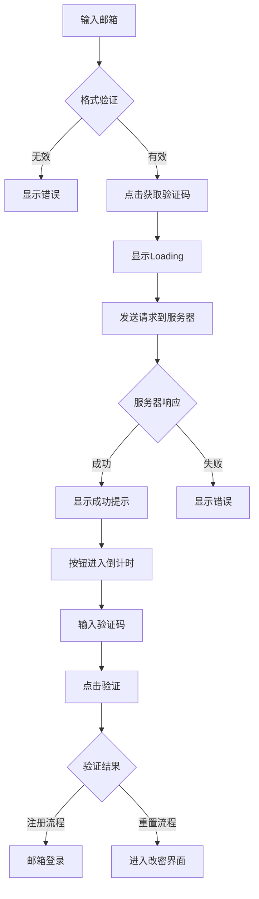

# 邮箱验证系统

## 功能概述

邮箱验证系统提供了发送验证码、验证邮箱、邮箱登录和密码找回等功能。系统支持两个独立的邮箱验证流程：注册验证和密码重置。

## 技术实现

### 核心流程



### 实现代码

#### UI绑定

```csharp title="AccountAuthController.cs - 邮箱验证绑定"
private void BindEmailVerification(VisualElement root)
{
    // 注册流程的邮箱验证
    var regEmailField = root.Q<TextField>("RegEmail");
    var regCodeField = root.Q<TextField>("RegCode");
    root.Q<Button>("RegSendCodeBtn").clicked += () => 
        SendEmailCode(regEmailField, root.Q<Button>("RegSendCodeBtn"));
    root.Q<Button>("RegVerifyBtn").clicked += () => 
        OnClickVerify(regEmailField, regCodeField);

    // 密码重置流程的邮箱验证
    var rstEmailField = root.Q<TextField>("RstEmail");
    var rstCodeField = root.Q<TextField>("RstCode");
    root.Q<Button>("RstSendCodeBtn").clicked += () => 
        SendEmailCode(rstEmailField, root.Q<Button>("RstSendCodeBtn"));
    root.Q<Button>("RstVerifyBtn").clicked += () => 
        OnClickVerify(rstEmailField, rstCodeField);
}
```

#### 发送验证码

```csharp title="AccountAuthController.cs - 发送验证码实现"
private void SendEmailCode(TextField emailField, Button senderBtn)
{
    string email = emailField.value.Trim();
    
    // 邮箱格式验证
    if (!IsEmailValid(email))
    {
        ShowFieldError(hinterroremail, "请输入合法邮箱地址", emailField);
        return;
    }

    SpinController.Instance.Show();

    api.GetEmailCode(
        email,
        ok: _ =>
        {
            SpinController.Instance.Hide();
            ShowFieldOk(hinterroremail, "验证码已发送，请查收邮箱", emailField);
            
            // 启动按钮倒计时
            if (cooldownCO == null)
                cooldownCO = StartCoroutine(ButtonCooldown(senderBtn, 30));
        },
        fail: msg =>
        {
            SpinController.Instance.Hide();
            PopupManager.Show("发送失败", msg);
        });
}
```

#### 验证码验证

```csharp title="AccountAuthController.cs - 验证码验证"
private void OnClickVerify(TextField emailField, TextField codeField)
{
    string email = emailField.value.Trim();
    string code = codeField.value.Trim();

    // 邮箱格式验证
    if (!IsEmailValid(email))
    {
        ShowFieldError(hinterroremail, "请输入合法邮箱地址", emailField);
        return;
    }
    
    // 验证码格式验证
    if (!Regex.IsMatch(code, @"^\d{6}$"))
    {
        ShowFieldError(hinterroremailcode, "验证码需为 6 位数字", codeField);
        return;
    }

    SpinController.Instance.Show();

    api.EmailLogin(
        email, code,
        ok: loginJson =>
        {
            SpinController.Instance.Hide();

            // 根据流程不同处理
            if (emailField.name == "RstEmail")  // 密码重置流程
            {
                Toast("验证成功，请设置新密码");
                LoginUIManager.I?.ToChangePwPanel();
            }
            else  // 注册流程
            {
                SaveSession(loginJson);

                BattleServerBridge.Connect(
                    loginJson,
                    onOk: _ =>
                    {
                        SceneManager.LoadScene("LoadingScene", LoadSceneMode.Single);
                    },
                    onFail: err =>
                    {
                        LoadingPanelManager.Instance.Hide();
                        //PopupManager.Show("连接战斗服失败", err);
                    });
            }

            ClearAllInputs();
        },
        fail: msg =>
        {
            SpinController.Instance.Hide();
            PopupManager.Show("操作失败", msg);
        });
}
```

### API接口实现

```csharp title="AuthAPI.cs - 邮箱相关接口"
// 获取邮箱验证码
public Coroutine GetEmailCode(string email,
                              Action<string> ok, Action<string> fail)
{
    long ts = DateTimeOffset.UtcNow.ToUnixTimeMilliseconds();
    string body = $"{{\"email\":\"{email}\",\"timestamp\":\"{ts}\"}}";
    string url = $"{host}/user/GetEmailCode";
    return StartCoroutine(PostJson(url, body, ok, fail));
}

// 邮箱登录/验证
public Coroutine EmailLogin(string email, string verifycode,
                            Action<string> ok, Action<string> fail)
{
    string url = $"{host}/user/EmailLogin";
    string body = $"{{\"email\":\"{email}\",\"code\":\"{verifycode}\"}}";
    return StartCoroutine(PostJson(url, body, ok, fail));
}
```

## UI实现

### 验证码输入框

```csharp title="AccountAuthController.cs - 验证码输入限制"
void Awake()
{
    // ... 其他初始化
    
    /*── 验证码框过滤 ──*/
    root.Query<TextField>(className: "verifycode-input").ForEach(tf =>
    {
        tf.maxLength = 6;  // 限制6位
        tf.RegisterValueChangedCallback(OnEmailCodeChanged);
    });
    verifyCodeField = root.Q<TextField>(className: "verifycode-input");
}

// 验证码输入过滤
private void OnEmailCodeChanged(ChangeEvent<string> evt)
{
    var field = (TextField)evt.target;
    string pure = Regex.Replace(evt.newValue ?? "", @"[^\d]", "");  // 只保留数字
    
    if (pure != evt.newValue)
    {
        field.SetValueWithoutNotify(pure);
    }
}
```

### UXML布局

#### 注册流程界面

```xml title="注册流程的邮箱验证"
<ui:VisualElement name="EmailVerificationPanel">
    <!-- 邮箱输入 -->
    <ui:VisualElement name="enterEmailPanel" class="bar">
        <ui:TextField 
            placeholder-text="输入邮箱" 
            name="RegEmail" 
            class="textinput email-input"/>
    </ui:VisualElement>
    <ui:Label name="hinterroremail" class="hint hinterroremail"/>
    
    <!-- 验证码输入 -->
    <ui:VisualElement name="emailVerifyCodePanel" class="bar">
        <ui:TextField 
            placeholder-text="输入验证码" 
            name="RegCode" 
            class="textinput verifycode-input"/>
        <ui:Button 
            text="获取验证码" 
            name="RegSendCodeBtn" 
            class="clickableBlue getemailcode"/>
    </ui:VisualElement>
    <ui:Label name="hinterroremailcode" class="hint hinterroremailcode"/>
    
    <!-- 验证按钮 -->
    <ui:Button text="验证" name="RegVerifyBtn" class="brownbutton"/>
</ui:VisualElement>
```

#### 密码重置界面

```xml title="密码重置的邮箱验证"
<ui:VisualElement name="ResetPasswordPanel">
    <!-- 邮箱输入 -->
    <ui:VisualElement class="bar">
        <ui:TextField 
            placeholder-text="输入邮箱" 
            name="RstEmail" 
            class="textinput email-input"/>
    </ui:VisualElement>
    
    <!-- 验证码输入 -->
    <ui:VisualElement class="bar">
        <ui:TextField 
            placeholder-text="输入验证码" 
            name="RstCode" 
            class="textinput verifycode-input"/>
        <ui:Button 
            text="获取验证码" 
            name="RstSendCodeBtn" 
            class="getemailcode"/>
    </ui:VisualElement>
    
    <!-- 验证按钮 -->
    <ui:Button text="验证" name="RstVerifyBtn"/>
</ui:VisualElement>
```

### 样式定义

```css title="LogInScreenStyle.uss"
.email-input {
    /* 邮箱输入框样式 */
}

.verifycode-input {
    /* 验证码输入框样式 */
}

.getemailcode {
    /* 获取验证码按钮样式 */
}

.hinterroremail {
    /* 邮箱错误提示样式 */
}

.hinterroremailcode {
    /* 验证码错误提示样式 */
}
```

## 功能特性

### 按钮倒计时

```csharp title="倒计时实现"
private IEnumerator ButtonCooldown(Button btn, int seconds)
{
    string originalText = btn.text;
    btn.SetEnabled(false);
    
    for (int i = seconds; i > 0; i--)
    {
        btn.text = $"{i}秒";
        yield return new WaitForSeconds(1f);
    }
    
    btn.text = originalText;
    btn.SetEnabled(true);
    cooldownCO = null;
}
```

### 邮箱格式验证

```csharp title="邮箱验证"
private bool IsEmailValid(string email)
{
    if (string.IsNullOrEmpty(email))
        return false;
        
    // 基本的邮箱格式正则
    string pattern = @"^[^@\s]+@[^@\s]+\.[^@\s]+$";
    return Regex.IsMatch(email, pattern);
}
```

### 流程区分

系统通过TextField的name属性区分不同流程：

```csharp
// 判断是密码重置流程还是注册流程
if (emailField.name == "RstEmail")
{
    // 密码重置流程：进入改密界面
    Toast("验证成功，请设置新密码");
    LoginUIManager.I?.ToChangePwPanel();
}
else
{
    // 注册流程：直接登录
    SaveSession(loginJson);
    // ...
}
```

## 改密功能

### 密码修改实现

```csharp title="AccountAuthController.cs - 修改密码"
private void OnClickChangePwd(TextField pwd1, TextField pwd2)
{
    string p1 = pwd1.value;
    string p2 = pwd2.value;

    if (!IsPasswordStrong(p1))
    {
        PopupManager.Show("提示", "密码需≥8位，并包含字母和数字");
        Focus(pwd1);
        return;
    }
    
    if (!IsPasswordMatch(p1, p2))
    {
        PopupManager.Show("提示", "两次输入的密码不一致");
        Focus(pwd2);
        return;
    }

    LoadingPanelManager.Instance.Show();
    LoadingPanelManager.Instance.Hide();
    Toast("（示例）本地校验通过，待接入 API");
}
```

注意：改密功能的API接口尚未完全实现，目前只有本地验证。

## 用户体验

### 错误提示

```csharp title="错误提示系统"
// 显示错误（多个Label）
private void ShowFieldError(IEnumerable<Label> lbls, string msg, TextField focus = null)
{
    foreach (var l in lbls)
    {
        l.text = msg;
        l.style.color = Color.red;
    }
}

// 显示成功（多个Label）
private void ShowFieldOk(IEnumerable<Label> lbls, string msg, TextField focus = null)
{
    foreach (var l in lbls)
    {
        l.text = msg;
        l.style.color = okColor;  // 绿色
    }
}
```

### Toast提示

```csharp
private void Toast(string message, float duration = 2f)
{
    toastText.text = message;
    toastPanel.AddToClassList("show");
    
    if (toastCO != null) StopCoroutine(toastCO);
    toastCO = StartCoroutine(HideToastAfter(duration));
}
```

## 服务器交互

### 请求格式

```http
# 获取验证码
POST /user/GetEmailCode
Content-Type: application/json
{
    "email": "user@example.com",
    "timestamp": "1234567890000"
}

# 邮箱验证/登录
POST /user/EmailLogin
Content-Type: application/json
{
    "email": "user@example.com",
    "code": "123456"
}
```

### 响应格式

成功响应与其他登录方式相同，返回完整的会话信息。

## 测试要点

### 功能测试

- 邮箱格式验证
- 验证码发送成功
- 验证码倒计时
- 验证码输入限制（6位数字）
- 验证成功后跳转
- 流程区分（注册/重置）

### 边界条件

- 无效邮箱格式
- 验证码错误
- 网络异常
- 倒计时期间重复点击
- 多个验证码输入框同时存在

### 用户体验

- Loading显示正确
- 错误提示清晰
- 成功提示明确
- 倒计时显示流畅
- 输入自动过滤

## 注意事项

### 1. 倒计时管理

```csharp
// 使用单例协程避免重复
if (cooldownCO == null)
    cooldownCO = StartCoroutine(ButtonCooldown(senderBtn, 30));
```

### 2. 多错误提示Label

系统使用List管理多个相同类型的错误提示：

```csharp
private List<Label> hinterroremail;     // 邮箱错误
private List<Label> hinterroremailcode; // 验证码错误

// 查找所有同类Label
hinterroremail = root.Query<Label>(className: "hinterroremail").ToList();
```

### 3. 未完成功能

改密API接口暂未接入，当前代码中有注释标记：

```csharp
Toast("（示例）本地校验通过，待接入 API");
```

## 常见问题

### Q: 为什么有两套邮箱验证流程？

**A:** 一套用于注册登录（RegEmail），一套用于密码重置（RstEmail），通过name属性区分。

### Q: 验证码有效期多久？

**A:** 取决于服务器设置，客户端未做限制。

### Q: 倒计时30秒是否可配置？

**A:** 目前硬编码为30秒，可以修改`ButtonCooldown`调用参数。

## 相关文档

- [账号密码登录](./account-login.md)
- [注册系统](./register-system.md)
- [安全加密](./security-encryption.md)
- [错误处理](./error-handling.md)