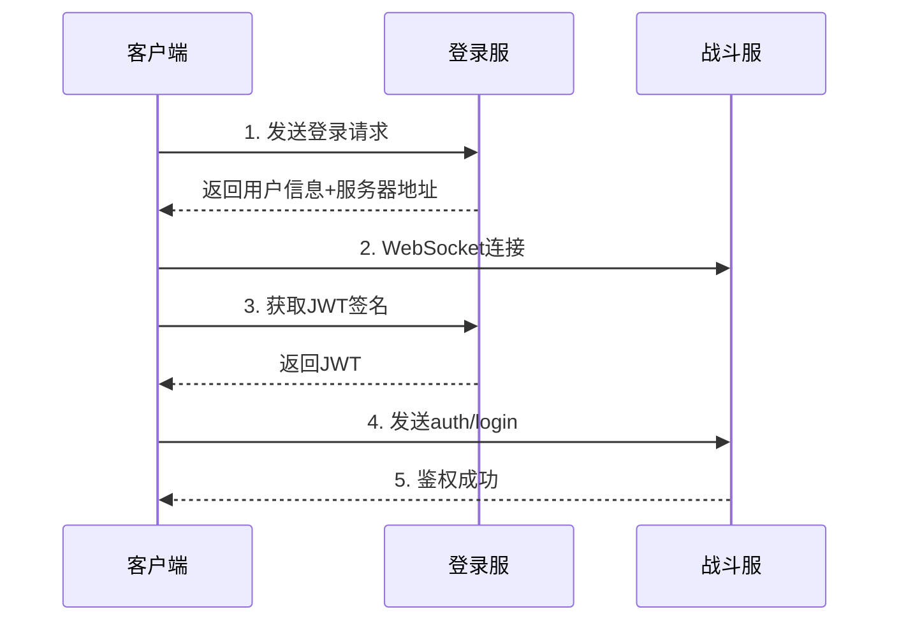

# 登录系统概述

## 系统介绍

《Realm of Legends》的登录系统采用Unity 6最新的UI Toolkit技术实现，提供多种登录方式和完善的安全机制。

## 技术架构

### 核心技术栈

| 技术领域 | 采用方案 | 说明 |
|---------|---------|------|
| UI框架 | UI Toolkit | Unity最新UI系统，性能优于UGUI |
| 网络通信 | UnityWebRequest + WebSocket | HTTP用于登录认证，WebSocket用于游戏连接 |
| 加密方案 | SHA256 + AES + RSA | 三层加密保障账号安全 |
| 第三方SDK | Apple/Google Sign In | 支持主流第三方登录 |

### 系统架构图

```
┌─────────────────────────────────────────┐
│             客户端UI层                   │
│  ┌─────────┬─────────┬─────────┬──────┐ │
│  │账号登录  │游客登录  │Google  │Apple │ │
│  └────┬────┴────┬────┴────┬────┴──┬───┘ │
│       │         │         │        │     │
│  ┌────▼─────────▼─────────▼────────▼───┐ │
│  │         AuthAPI (统一接口层)         │ │
│  └──────────────┬───────────────────────┘ │
└─────────────────┼───────────────────────┘
                  │
                  ▼ HTTP/HTTPS
        ┌─────────────────────┐
        │    登录服务器        │
        │  login.realmoflegend │
        └─────────┬───────────┘
                  │ 返回连接信息
                  ▼
        ┌─────────────────────┐
        │    战斗服务器        │
        │    WebSocket连接     │
        └─────────────────────┘
```

## 功能模块

### 1. 登录方式

系统支持四种登录方式，满足不同用户需求：

| 登录方式 | 特点 | 适用场景 |
|---------|------|---------|
| **账号密码** | 传统登录方式，支持注册 | 核心玩家 |
| **游客登录** | 无需注册，快速体验 | 新手玩家 |
| **Google登录** | 一键登录，全球通用 | 国际玩家 |
| **Apple登录** | iOS生态集成 | 苹果用户 |

### 2. 安全机制

#### 加密层级

```
原始密码 → SHA256 → AES-CBC → RSA-PKCS1 → 服务器
```

- **第一层 SHA256**: 不可逆哈希，防止明文泄露
- **第二层 AES**: 对称加密，高效安全
- **第三层 RSA**: 非对称加密，防止中间人攻击

#### 防护措施

- **时间戳验证**: 防止重放攻击
- **频率限制**: 防止暴力破解
- **设备绑定**: 游客账号安全
- **HTTPS传输**: 生产环境强制

## 文件结构

```
Assets/
├── Scripts/Network/LoginInScreen/
│   ├── AccountAuthController.cs    # 账号登录控制
│   ├── AuthAPI.cs                  # API统一封装
│   ├── VisitorLoginRequest.cs      # 游客登录
│   ├── GoogleLoginRequest.cs       # Google登录
│   └── AppleLogin.cs              # Apple登录
│
├── Scripts/UI/LogInScreen/
│   ├── LogInScreen.cs             # UI主控制器
│   ├── LogInScreenVisualTree.uxml # 界面布局
│   └── LogInScreenStyle.uss       # 样式定义
│
└── Scripts/Network/Core/
    ├── BattleServerConnector.cs   # 战斗服连接
    └── LogoutHandler.cs           # 登出处理
```

## 连接流程

### 两步验证机制



### 关键数据流

登录成功后获取的关键数据：

```json
{
    "uid": "用户唯一ID",
    "cid": "角色ID",
    "character_token": "角色令牌",
    "server_ip_address": "战斗服IP",
    "server_port": 8000,
    "connection_id": "连接ID",
    "pid": "玩家ID"
}
```

## 性能指标

### 优化措施

1. **UI优化**
   - 延迟加载非首屏元素
   - 复用UI组件避免重复创建
   - 使用对象池管理

2. **网络优化**
   - 请求合并减少往返
   - WebSocket保持长连接
   - 结果缓存机制

3. **内存管理**
   - 及时释放无用资源
   - 定期GC回收
   - 纹理压缩

## 错误处理

### 错误码规范

| 错误码范围 | 含义 | 处理方式 |
|-----------|------|---------|
| 1xx | 用户名相关 | 提示用户名错误 |
| 2xx | 密码相关 | 提示密码错误 |
| 3xx | 验证码相关 | 提示验证码错误 |
| 4xx | 请求格式错误 | 检查客户端代码 |
| 5xx | 服务器错误 | 提示稍后重试 |

### 用户体验

- **实时验证**: 输入时即时反馈
- **友好提示**: 明确的错误说明
- **Loading状态**: 请求时显示加载
- **防重复点击**: 自动禁用按钮

## 测试清单

### 功能测试

- 所有登录方式正常工作
- 注册流程完整可用
- 邮箱验证码功能正常
- 密码找回功能可用
- 页面切换流畅

### 安全测试

- 密码加密正确
- 无敏感信息泄露
- 防重放攻击有效
- SQL注入防护
- XSS攻击防护

### 兼容性测试

- iOS设备正常
- Android设备正常
- 不同分辨率适配
- 网络环境切换
- 弱网环境处理

