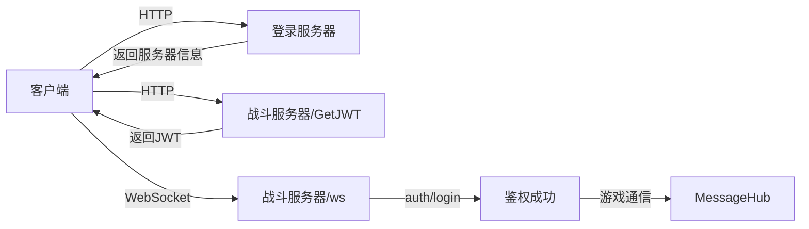

# 网络通信机制

## 概述

游戏采用两步连接机制：先通过HTTP连接登录服务器进行认证，然后通过WebSocket连接战斗服务器进行游戏通信。

## 架构设计

### 通信流程



### 核心组件

| 组件 | 职责 | 协议 |
|------|------|------|
| **AuthAPI** | 登录认证 | HTTP |
| **BattleServerBridge** | 连接入口 | - |
| **BattleServerConnector** | 战斗服连接 | HTTP+WebSocket |
| **MessageHub** | 消息中心 | WebSocket |

## BattleServerBridge（入口）

### 统一连接接口

```csharp title="BattleServerBridge.cs"
namespace Net.Core
{
    /// <summary>对外的统一入口：给我登录服 JSON，我帮你连战斗服</summary>
    public static class BattleServerBridge
    {
        /// 回调：鉴权成功 → payload；或失败 → errMsg
        public static void Connect(string loginJson,
                                   Action<BattleServerConnector.AuthSuccessPayload> onOk,
                                   Action<string> onFail)
        {
            if (string.IsNullOrEmpty(loginJson))
            {
                onFail?.Invoke("loginJson is empty");  
                return;
            }

            var info = JsonUtility.FromJson<BattleServerConnector.LoginServResp>(loginJson);
            if (info == null || info.code != 0)
            {
                onFail?.Invoke("loginJson parse error / code!=0"); 
                return;
            }

            /* ① 取 / 创建 单例 */
            var connector = BattleServerConnector.Instance;
            if (connector == null)
                connector = new GameObject("NetworkCore")
                               .AddComponent<BattleServerConnector>();

            /* ② 订一次回调 */
            connector.OnAuthSuccess = onOk;
            connector.OnError       = onFail;

            /* ③ 开始跳战斗服 */
            connector.StartConnect(info);
        }
    }
}
```

### 使用示例

```csharp title="各种登录方式都使用相同的调用"
BattleServerBridge.Connect(
    loginJson,  // 登录服返回的JSON
    onOk: _ =>
    {
        // 鉴权成功，进入游戏
        SceneManager.LoadScene("LoadingScene", LoadSceneMode.Single);
    },
    onFail: err =>
    {
        LoadingPanelManager.Instance.Hide();
        // PopupManager.Show("连接战斗服失败", err);
    }
);
```

## BattleServerConnector（连接器）

### 连接流程实现

```csharp title="BattleServerConnector.cs - 核心流程"
private IEnumerator Workflow(LoginServResp info)
{
    /* Step-1 : GetJWT */
    var jwtUrl = $"http://{info.server_ip_address}:{info.server_port}/api/user/GetJWT";
    var jwtIn = JsonUtility.ToJson(new GetJwtInput {
        uid = info.uid, 
        cid = info.cid, 
        character_token = info.character_token 
    });

    Debug.Log($"[Connector] GetJWT INPUT → {jwtIn}");
    Debug.Log($"[Connector] GetJWT URL   → {jwtUrl}");

    using var req = new UnityWebRequest(jwtUrl, "POST");
    req.uploadHandler = new UploadHandlerRaw(Encoding.UTF8.GetBytes(jwtIn));
    req.downloadHandler = new DownloadHandlerBuffer();
    req.SetRequestHeader("Content-Type", "application/json");
    yield return req.SendWebRequest();

    if (req.result != UnityWebRequest.Result.Success)
    { 
        Fail($"GetJWT HTTP error: {req.error}"); 
        yield break; 
    }

    Debug.Log($"[Connector] GetJWT RESP  → {req.downloadHandler.text}");
    var jwtResp = JsonUtility.FromJson<GetJwtResp>(req.downloadHandler.text);
    if (jwtResp.code != 0)
    { 
        Fail($"GetJWT code={jwtResp.code}"); 
        yield break; 
    }

    // 保存signature到PlayerData
    PlayerData.I.SetSession(
        info.uid, null, info.cid, info.character_token,
        info.server_port, info.server_ip_address, info.server_port,
        null, jwtResp.signed_identity.signature  // 关键：保存signature
    );

    /* Step-2 : WebSocket */
    var wsUrl = $"ws://{info.server_ip_address}:{info.server_port}/ws";
    Debug.Log($"[Connector] WS  URL      → {wsUrl}");

    _ws = new WebSocket(wsUrl);
    
    // ... WebSocket连接和认证流程
}
```

### WebSocket认证

```csharp title="WebSocket消息处理"
_ws.OnMessage += bytes =>
{
    string json = Encoding.UTF8.GetString(bytes);
    Debug.Log($"[WS] ← {json}");

    /* connect init → 发送 auth/login */
    if (!authSent && json.Contains("\"subtype\":\"connect init\""))
    {
        authSent = true;
        _timeoutCo = StartCoroutine(AuthTimeout());

        var pktJson = JsonUtility.ToJson(new AuthLoginPacket { 
            id_token = jwtResp.signed_identity 
        });
        Debug.Log($"[Connector] SEND auth/login → {pktJson}");
        _ws.SendText(pktJson);
        return;
    }

    /* 处理 auth 回包 */
    var root = JsonUtility.FromJson<AuthReplyWrapper>(json);
    if (root != null && root.type == "auth")
    {
        if (root.code == 0)
        {
            if (_timeoutCo != null) StopCoroutine(_timeoutCo);
            
            // 初始化全局 Hub（仅一次）
            if (MessageHub.I == null)      
                gameObject.AddComponent<MessageHub>().Init(_ws);

            // 触发鉴权成功回调
            OnAuthSuccess?.Invoke(root.data);
        }
        else 
        {
            Fail($"Auth failed code={root.code}");
        }
    }
};
```

### 数据结构

```csharp title="关键数据结构"
// 登录服响应
[Serializable] 
public class LoginServResp {
    public int    code;
    public string uid, cid, character_token, server_ip_address;
    public int    server_port;
}

// JWT请求
[Serializable] 
public class GetJwtInput { 
    public string uid, cid, character_token; 
}

// JWT响应
[Serializable] 
public class GetJwtResp { 
    public int code; 
    public SignedIdentity signed_identity; 
}

// 签名身份
[Serializable] 
public class SignedIdentity { 
    public string uid, cid, signature; 
}

// 鉴权成功数据
[Serializable] 
public class AuthSuccessPayload { 
    public string connection_id; 
    public int online_count, pid; 
}
```

## MessageHub（消息中心）

### 初始化

```csharp title="MessageHub.cs - 初始化"
public void Init(WebSocket ws)
{
    if (I != null && I != this) Destroy(gameObject);
    I = this; 
    DontDestroyOnLoad(gameObject);

    _ws = ws;
    _ws.OnMessage += OnWsMessage;
    _ws.OnClose += _ => StartCoroutine(EnhancedReconnectLoop());  // 增强版重连
    //_ws.OnError += e => Debug.LogError("[Hub] WS error: " + e);
}
```

### 消息发送

```csharp title="Request方法"
public void Request<T>(string method, T data,
                       Action<Response> callback,
                       bool needEcho = false,
                       float timeout = 8f)
{
    var reqId = ++_idGen;
    
    // 构建请求包
    var packet = new {
        reqId = reqId,
        method = method,
        data = data,
        echo = needEcho ? Guid.NewGuid().ToString() : null
    };
    
    // 注册回调
    _pendingId[reqId] = callback;
    
    // 发送
    string json = JsonUtility.ToJson(packet);
    _ws.SendText(json);
    
    // 超时检查
    StartCoroutine(TimeoutCheck(reqId, packet.echo, timeout));
}
```

### 重连机制

```csharp title="增强版重连"
IEnumerator EnhancedReconnectLoop()
{
    while (_isReconnecting)
    {
        float delay = retryDelays[retryCount] : 30f;
        
        UpdateLoadingUI($"重连中...({retryCount + 1}/5)");
        yield return new WaitForSecondsRealtime(delay);
        
        // Step 1: 重新获取JWT
        Debug.Log("[Hub] 重新获取JWT...");
        bool jwtSuccess = false;
        
        yield return GetNewJWT(success => jwtSuccess = success);
        
        if (!jwtSuccess)
        {
            Debug.LogError("[Hub] 获取JWT失败");
            retryCount++;
            continue;
        }
        
        // Step 2: 重新连接WebSocket
        Debug.Log("[Hub] 重新连接WebSocket...");
        
        var wsUrl = $"ws://{PlayerData.I.serverIpAddress}:{PlayerData.I.serverPort}/ws";
        _ws = new WebSocket(wsUrl);
        
        // ... 重连逻辑
    }
}
```

### JWT刷新

```csharp title="获取新JWT"
IEnumerator GetNewJWT(Action<bool> callback)
{
    // 检查PlayerData状态
    if (string.IsNullOrEmpty(PlayerData.I.uid))
    {
        // 尝试从PlayerPrefs恢复
        if (PlayerPrefs.HasKey("PlayerData_uid"))
        {
            PlayerData.I.uid = PlayerPrefs.GetString("PlayerData_uid");
            PlayerData.I.cid = PlayerPrefs.GetString("PlayerData_cid");
            PlayerData.I.characterToken = PlayerPrefs.GetString("PlayerData_characterToken");
            // ...
        }
    }
    
    var url = $"http://{PlayerData.I.serverIpAddress}:{PlayerData.I.serverPort}/api/user/GetJWT";
    
    var input = new GetJwtInput
    {
        uid = PlayerData.I.uid,
        cid = PlayerData.I.cid,
        character_token = PlayerData.I.characterToken
    };
    
    // ... 发送请求
}
```

## HTTP通信

### POST请求封装

```csharp title="AuthAPI.cs - HTTP POST"
IEnumerator PostJson(string url, string json,
                     Action<string> ok, Action<string> fail)
{
    using var req = new UnityWebRequest(url, "POST");
    req.uploadHandler = new UploadHandlerRaw(Encoding.UTF8.GetBytes(json));
    req.downloadHandler = new DownloadHandlerBuffer();
    req.SetRequestHeader("Content-Type", "application/json");

    yield return req.SendWebRequest();

    if (req.result != UnityWebRequest.Result.Success)
    {
        fail?.Invoke($"{req.responseCode} {req.error}");
        yield break;
    }

    var resp = JsonUtility.FromJson<ApiResp>(req.downloadHandler.text);
    if (resp.code == 0)
        ok?.Invoke(req.downloadHandler.text);
    else
        fail?.Invoke($"{resp.code} {resp.message}");
}
```

## WebSocket通信

### NativeWebSocket使用

```csharp title="WebSocket基本操作"
// 创建连接
_ws = new WebSocket(wsUrl);

// 事件处理
_ws.OnOpen += () => Debug.Log("Connected");
_ws.OnMessage += bytes => { /* 处理消息 */ };
_ws.OnError += e => Debug.LogError("Error: " + e);
_ws.OnClose += c => Debug.Log("Closed: " + c);

// 连接
yield return _ws.Connect();

// 发送消息
_ws.SendText(jsonString);

// 关闭连接
_ws.Close();
```

### 平台差异处理

```csharp
void Update()
{
#if !UNITY_WEBGL || UNITY_EDITOR
    _ws?.DispatchMessageQueue();
#endif
}
```

## 登出处理

### LogoutHandler实现

```csharp title="LogoutHandler.cs - 断开网络"
private static void DisconnectNetwork()
{
    // 处理BattleServerConnector的WebSocket
    if (BattleServerConnector.Instance != null)
    {
        // 通过反射获取并清理WebSocket
        var wsField = typeof(BattleServerConnector)
            .GetField("_ws", BindingFlags.NonPublic | BindingFlags.Instance);
        if (wsField != null)
        {
            var ws = wsField.GetValue(BattleServerConnector.Instance) as WebSocket;
            if (ws != null && ws.State == WebSocketState.Open)
            {
                ws.Close();
            }
        }
        
        UnityEngine.Object.Destroy(BattleServerConnector.Instance.gameObject);
    }
    
    // 处理MessageHub
    if (MessageHub.I != null)
    {
        // ... 类似处理
    }
}
```

## 错误处理

### 超时机制

```csharp title="超时检查"
IEnumerator TimeoutCheck(int id, string echo, float sec)
{
    yield return new WaitForSecondsRealtime(sec);
    if (_pendingId.TryGetValue(id, out var cb))
    {
        _pendingId.Remove(id);
        _pendingEcho.Remove(echo);
        _echo2Id.Remove(echo);
        _watchId.Remove(id);
        _watchEcho.Remove(echo);
        cb?.Invoke(new Response{ reqId=id, code=999, msg="timeout" });
    }
}

// AuthTimeout
private IEnumerator AuthTimeout()
{
    yield return new WaitForSecondsRealtime(30);
    Fail("Auth/login timeout 30s");
}
```

### 错误回调

```csharp
private void Fail(string msg)
{
    //Debug.LogError("[Connector] " + msg);
    _ws?.Close();
    OnError?.Invoke(msg);
}
```

## 性能优化

### 连接复用

- WebSocket连接保持长连接
- MessageHub单例管理所有游戏通信
- JWT缓存避免重复获取

### 消息优化

- 使用reqId管理请求响应
- Echo机制用于特殊场景
- 批量消息处理支持

## 测试要点

### 连接测试

- 正常连接流程
- JWT获取失败
- WebSocket连接失败
- 认证超时处理

### 重连测试

- 网络断开重连
- 应用切换重连
- JWT过期刷新
- 重连次数限制

### 并发测试

- 多请求并发
- 消息顺序保证
- 回调正确性

## 注意事项

### 1. WebSocket消息队列

非WebGL平台需要在Update中处理消息队列：

```csharp
#if !UNITY_WEBGL || UNITY_EDITOR
    _ws?.DispatchMessageQueue();
#endif
```

### 2. 注释的代码

部分错误提示被注释：
```csharp
//PopupManager.Show("连接战斗服失败", err);
```

### 3. 服务初始化

注意服务初始化已移至GameLoader，不在BattleServerConnector中处理。

## 常见问题

### Q: 为什么要先获取JWT再连WebSocket？

**A:** JWT作为身份凭证，避免在WebSocket中传输敏感信息。

### Q: MessageHub的作用是什么？

**A:** 统一管理所有游戏内的WebSocket通信，包括请求响应、事件推送等。

### Q: 重连机制如何工作？

**A:** 检测到断线后自动获取新JWT并重新建立WebSocket连接，最多重试5次。
