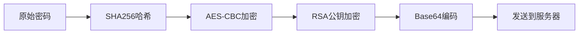

# 注册系统

## 功能概述

注册系统提供新用户创建账号的功能，采用业界领先的三层加密机制保护用户密码安全。

## 三层加密机制

### 加密流程图



### 详细实现

#### 第一层：SHA256哈希

```csharp title="SHA256加密"
// 原始密码转换为不可逆哈希
private string Sha256Hex(string input)
{
    using (SHA256 sha256 = SHA256.Create())
    {
        byte[] bytes = Encoding.UTF8.GetBytes(input);
        byte[] hash = sha256.ComputeHash(bytes);
        
        // 转换为十六进制字符串
        StringBuilder sb = new StringBuilder();
        foreach (byte b in hash)
        {
            sb.Append(b.ToString("x2"));
        }
        return sb.ToString();
    }
}
```

#### 第二层：AES-CBC加密

```csharp title="AES加密实现"
private string AesEncrypt(string plainText, long timestamp)
{
    // 固定密钥（16字节）
    const string AES_KEY = "ROLTKROLTKROLTK1";
    byte[] key = Encoding.UTF8.GetBytes(AES_KEY);
    
    // 生成IV：时间戳MD5的前16字节
    string ivSource = timestamp.ToString();
    byte[] ivHash = MD5.Create().ComputeHash(
        Encoding.UTF8.GetBytes(ivSource)
    );
    byte[] iv = new byte[16];
    Array.Copy(ivHash, iv, 16);
    
    using (Aes aes = Aes.Create())
    {
        aes.Key = key;
        aes.IV = iv;
        aes.Mode = CipherMode.CBC;
        aes.Padding = PaddingMode.PKCS7;
        
        ICryptoTransform encryptor = aes.CreateEncryptor();
        byte[] plainBytes = Encoding.UTF8.GetBytes(plainText);
        byte[] cipherBytes = encryptor.TransformFinalBlock(
            plainBytes, 0, plainBytes.Length
        );
        
        // 返回Base64编码
        return Convert.ToBase64String(cipherBytes);
    }
}
```

#### 第三层：RSA公钥加密

```csharp title="RSA加密实现"
private string RsaEncryptBase64(string plainText)
{
    // RSA公钥参数
    const string RSA_MOD_B64 = "pPOsZmpEoCDxSOiIcoB5...";  // 2048位模数
    const string RSA_EXP_B64 = "AQAB";  // 65537
    
    using (RSACryptoServiceProvider rsa = new RSACryptoServiceProvider(2048))
    {
        // 设置公钥参数
        RSAParameters rsaParams = new RSAParameters
        {
            Modulus = Convert.FromBase64String(RSA_MOD_B64),
            Exponent = Convert.FromBase64String(RSA_EXP_B64)
        };
        rsa.ImportParameters(rsaParams);
        
        // 加密
        byte[] plainBytes = Encoding.UTF8.GetBytes(plainText);
        byte[] cipherBytes = rsa.Encrypt(plainBytes, false);  // PKCS1
        
        return Convert.ToBase64String(cipherBytes);
    }
}
```

### 完整注册流程

```csharp title="AccountAuthController.cs - 注册实现"
public Coroutine AccountRegister(string account, string rawPwd,
                                 Action<string> ok, Action<string> fail)
{
    // 生成时间戳
    long ts = DateTimeOffset.UtcNow.ToUnixTimeMilliseconds();
    string tsStr = ts.ToString();
    
    // 三层加密
    string pwd1 = Sha256Hex(rawPwd);       // SHA256
    string pwd2 = AesEncrypt(pwd1, ts);    // AES-CBC
    string pwd3 = RsaEncryptBase64(pwd2);  // RSA-PKCS1
    
    // 构建请求
    string url = $"{host}/user/Register";
    string body = JsonUtility.ToJson(new {
        username = account,
        password = pwd3,
        timestamp = tsStr
    });
    
    Debug.Log($"注册请求: {body}");
    
    return StartCoroutine(PostJson(url, body, ok, fail));
}
```

## UI交互设计

### 注册面板布局

```xml title="注册界面UXML"
<ui:VisualElement name="RegisterPanel">
    <!-- 标题 -->
    <ui:Label text="创建账号" class="title"/>
    
    <!-- 账号输入 -->
    <ui:VisualElement class="bar">
        <ui:TextField 
            name="regAccField" 
            placeholder-text="设置账号名（3-20字符）"
            max-length="20"/>
        <ui:Button 
            name="checkUserBtn" 
            text="检查可用性"/>
    </ui:VisualElement>
    
    <!-- 账号错误提示 -->
    <ui:Label name="hinterror" class="hint"/>
    
    <!-- 密码输入 -->
    <ui:VisualElement class="bar">
        <ui:TextField 
            name="regPwdField1" 
            placeholder-text="设置密码（6-20字符）"
            password="true"
            max-length="20"/>
    </ui:VisualElement>
    
    <!-- 确认密码 -->
    <ui:VisualElement class="bar">
        <ui:TextField 
            name="regPwdField2" 
            placeholder-text="再次输入密码"
            password="true"
            max-length="20"/>
    </ui:VisualElement>
    
    <!-- 密码错误提示 -->
    <ui:Label name="hinterrorpwd" class="hint"/>
    
    <!-- 注册按钮 -->
    <ui:Button 
        name="RegisterBtn" 
        text="注册"
        class="brownbutton"/>
    
    <!-- 协议提示 -->
    <ui:Label text="注册即表示你已同意用户协议与隐私政策"/>
    
    <!-- 返回登录 -->
    <ui:Button 
        name="GoLoginBtn" 
        text="已有账号？去登录"/>
</ui:VisualElement>
```

### 用户名检查

#### 实时可用性检查

```csharp title="用户名验证"
private void OnClickCheckUsername(TextField userField)
{
    string username = userField.value.Trim();
    
    // 基础验证
    if (!IsUsernameValid(username))
    {
        ShowFieldError(hinterror, "账号格式不正确", userField);
        return;
    }
    
    // 检查缓存
    if (username == lastCheckedName)
    {
        if (lastNameIsUsable == true)
        {
            ShowFieldOk(hinterror, "可以使用", userField);
        }
        else
        {
            ShowFieldError(hinterror, "已被占用", userField);
        }
        return;
    }
    
    // 发送检查请求
    checkUserBtn.SetEnabled(false);
    api.CheckUsername(username,
        ok: result =>
        {
            checkUserBtn.SetEnabled(true);
            lastCheckedName = username;
            
            var resp = JsonUtility.FromJson<CheckUsernameResp>(result);
            if (resp.available)
            {
                lastNameIsUsable = true;
                ShowFieldOk(hinterror, "用户名可用", userField);
            }
            else
            {
                lastNameIsUsable = false;
                ShowFieldError(hinterror, "用户名已被占用", userField);
            }
        },
        fail: msg =>
        {
            checkUserBtn.SetEnabled(true);
            PopupManager.Show("检查失败", msg);
        });
}
```

#### 验证规则

```csharp title="AccountAuthController.cs - 实际验证代码"
// 项目中实际的账号验证
private bool IsAccountValid(string account)
{
    // 长度检查：3-20字符
    if (account.Length < 3 || account.Length > 20)
        return false;
    
    // 格式检查：仅字母数字下划线
    if (!Regex.IsMatch(account, @"^[a-zA-Z0-9_]+$"))
        return false;
    
    return true;
}

// 密码验证
private bool CheckAccountAndPwd(TextField accField, TextField pwdField)
{
    string account = accField.value.Trim();
    string password = pwdField.value;
    
    if (!IsAccountValid(account))
    {
        ShowFieldError(hinterror, "账号需≥5位，仅限英文或数字", accField);
        return false;
    }
    
    if (password.Length < 6 || password.Length > 20)
    {
        ShowFieldError(hinterrorpwd, "密码长度需6-20个字符", pwdField);
        return false;
    }
    
    return true;
}
```

### 密码匹配验证

```csharp title="AccountAuthController.cs - 实际代码"
// 项目中实际的密码匹配检查
private void OnClickRegister()
{
    // ... 其他验证
    
    if (!IsPasswordMatch(regPwdField1.value, regPwdField2.value))
    {
        ShowFieldError(hinterrorpwd, "两次输入的密码不一致", regPwdField2);
        return;
    }
    
    // ...
}

private bool IsPasswordMatch(string pwd1, string pwd2)
{
    return pwd1 == pwd2;
}
```
```

## 注册流程

### 完整注册处理

```csharp title="注册按钮点击处理"
private void OnClickRegister()
{
    // 1. 基础验证
    if (!ValidateRegisterInput()) return;
    
    string username = regAccField.value.Trim();
    string password = regPwdField1.value;
    
    // 2. 检查缓存的用户名可用性
    if (username == lastCheckedName && lastNameIsUsable == false)
    {
        ShowFieldError(hinterror, "用户名已被占用", regAccField);
        return;
    }
    
    // 3. 显示Loading
    registerBtn.SetEnabled(false);
    SpinController.Instance.Show();
    
    // 4. 发送注册请求
    api.AccountRegister(username, password,
        ok: loginJson =>
        {
            SpinController.Instance.Hide();
            registerBtn.SetEnabled(true);
            
            // 注册成功自动登录
            SaveSession(loginJson);
            
            // 连接战斗服
            BattleServerBridge.Connect(loginJson,
                onOk: _ =>
                {
                    Toast("注册成功！");
                    SceneManager.LoadScene("LoadingScene");
                },
                onFail: err =>
                {
                    LoadingPanelManager.Instance.Hide();
                    PopupManager.Show("连接失败", err);
                });
        },
        fail: msg =>
        {
            SpinController.Instance.Hide();
            registerBtn.SetEnabled(true);
            
            // 错误处理
            if (msg.StartsWith("1"))  // 用户名已存在
            {
                lastCheckedName = username;
                lastNameIsUsable = false;
                ShowFieldError(hinterror, "用户名已存在", regAccField);
            }
            else
            {
                PopupManager.Show("注册失败", msg);
            }
        });
}
```

### 输入验证

```csharp title="AccountAuthController.cs - 实际的注册验证"
private void OnClickRegister()
{
    // 基本校验
    if (!CheckAccountAndPwd(regAccField, regPwdField1)) return;
    
    // 密码匹配检查
    if (!IsPasswordMatch(regPwdField1.value, regPwdField2.value))
    {
        ShowFieldError(hinterrorpwd, "两次输入的密码不一致", regPwdField2);
        return;
    }
    
    string nameTrying = regAccField.value.Trim();
    
    // 本地缓存：若已判定为「占用」就直接提示
    if (nameTrying == lastCheckedName && lastNameIsUsable == false)
    {
        StartCoroutine(SpinAndTip("已被占用，请换一个或登录", false, regAccField));
        return;
    }
    
    // 继续注册流程...
}
```

## API接口

### 注册接口

```http
POST /user/Register
Content-Type: application/json

{
    "username": "新用户名",
    "password": "三层加密后的密码",
    "timestamp": "时间戳"
}
```

### 用户名检查接口

```http
POST /user/CheckUsername
Content-Type: application/json

{
    "username": "要检查的用户名"
}
```

### 响应格式

```json title="注册成功"
{
    "code": 0,
    "message": "注册成功",
    "uid": "user_789",
    "user_token": "token_xxx",
    "cid": "character_456",
    "character_token": "char_token_xxx",
    "server_id": 1,
    "server_ip_address": "192.168.1.100",
    "server_port": 8000
}
```

```json title="用户名检查"
{
    "code": 0,
    "available": true,
    "message": "用户名可用"
}
```

## 实际实现的安全措施

### 1. 三层加密机制（实际代码）

```csharp title="AuthAPI.cs - 真实实现"
// 这是项目中实际存在的三层加密
public Coroutine AccountRegister(string account, string rawPwd,
                                 Action<string> ok, Action<string> fail)
{
    long ts = DateTimeOffset.UtcNow.ToUnixTimeMilliseconds();
    string tsStr = ts.ToString();
    
    string pwd1 = Sha256Hex(rawPwd);      // 第一层：SHA256
    string pwd2 = AesEncrypt(pwd1, ts);   // 第二层：AES-CBC
    string pwd3 = RsaEncryptBase64(pwd2); // 第三层：RSA
    
    // 实际的请求代码
    string url = $"{host}/user/Register";
    string body = $"{{\"username\":\"{account}\",\"password\":\"{pwd3}\",\"timestamp\":\"{tsStr}\"}}";
    
    return StartCoroutine(PostJson(url, body, ok, fail));
}
```

### 2. 用户名重复检测缓存（实际代码）

```csharp title="AccountAuthController.cs - 真实实现"
// 项目中实际的缓存机制
private string lastCheckedName = null;
private bool? lastNameIsUsable = null;

// 注册时检查缓存
if (nameTrying == lastCheckedName && lastNameIsUsable == false)
{
    StartCoroutine(SpinAndTip("已被占用，请换一个或登录", false, regAccField));
    return;
}
```

### 3. 防重复点击（实际代码）

```csharp title="AccountAuthController.cs - 真实实现"
// 实际的防重复点击代码
registerBtn?.SetEnabled(false);
SpinController.Instance.Show();

api.AccountRegister(
    nameTrying,
    regPwdField1.value,
    ok: _ => {
        registerBtn?.SetEnabled(true);
        // ...
    },
    fail: _ => {
        registerBtn?.SetEnabled(true);
        // ...
    }
);
```

## 用户体验

### 1. 实时反馈

```csharp title="AccountAuthController.cs - 实际代码"
// 显示错误提示
private void ShowFieldError(Label errorLabel, string msg, TextField field)
{
    errorLabel.text = msg;
    errorLabel.style.color = new Color(0.7f, 0.14f, 0.14f);  // 红色
    field.AddToClassList("error");
}

// 显示成功提示
private void ShowFieldOk(Label label, string msg, TextField field)
{
    label.text = msg;
    label.style.color = okColor;  // 绿色
    field.RemoveFromClassList("error");
}
```

### 2. Loading状态

```csharp title="实际的Loading实现"
// 显示转圈
SpinController.Instance.Show();

// 隐藏转圈
SpinController.Instance.Hide();

// Toast提示
private void Toast(string message, float duration = 2f)
{
    toastText.text = message;
    toastPanel.AddToClassList("show");
    
    if (toastCO != null) StopCoroutine(toastCO);
    toastCO = StartCoroutine(HideToastAfter(duration));
}
```

## 测试要点

### 功能测试

- 正常注册流程
- 用户名重复检测
- 密码不一致提示
- 格式错误提示
- 注册后自动登录

### 边界测试

- 最短用户名（3字符）
- 最长用户名（20字符）
- 特殊字符过滤
- 空输入处理

### 性能测试

- 加密性能测试
- 并发注册测试
- 内存占用监控
- 网络延迟处理

## 常见问题

### Q: 为什么要三层加密？

**A:** 每层加密有不同目的：
- SHA256：确保密码不可逆
- AES：对称加密提高效率
- RSA：非对称加密防止中间人攻击

### Q: 用户名可以修改吗？

**A:** 目前不支持修改用户名，建议谨慎选择。

### Q: 注册失败怎么办？

**A:** 检查网络连接，确认用户名未被占用，密码符合要求。如持续失败请联系客服。

## 相关文档

- [账号密码登录](./account-login.md)
- [安全加密](./security-encryption.md)
- [邮箱验证](./email-verification.md)
- [错误处理](./error-handling.md)