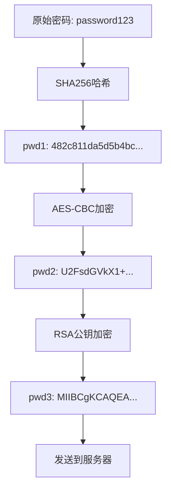

# 安全加密详解

## 概述

游戏登录系统采用多层加密机制保护用户密码安全，包括SHA256哈希、AES对称加密和RSA非对称加密。

## 加密方案对比

| 登录方式 | 加密方案 | 安全等级 | 说明 |
|---------|---------|---------|------|
| **账号登录** | 双重SHA256 | ⭐⭐⭐ | SHA256 + 时间戳 |
| **账号注册** | 三层加密 | ⭐⭐⭐⭐⭐ | SHA256 + AES + RSA |
| **游客登录** | 无加密 | ⭐ | 仅设备ID |
| **第三方登录** | OAuth Token | ⭐⭐⭐⭐ | 由第三方保证安全 |

## SHA256哈希加密

### 实现代码

```csharp title="AuthAPI.cs - SHA256实现"
static string Sha256Hex(string raw)
{
    using var sha = SHA256.Create();
    byte[] hash = sha.ComputeHash(Encoding.UTF8.GetBytes(raw));
    return BitConverter.ToString(hash).Replace("-", "").ToLower();
}
```

### 特点

- **不可逆性**: 无法从哈希值还原原文
- **固定长度**: 输出始终为256位（64个十六进制字符）
- **雪崩效应**: 输入微小变化导致输出完全不同

### 登录时的双重SHA256

```csharp title="密码登录加密流程"
public Coroutine PasswordLogin(string account, string rawPwd,
                               Action<string> ok, Action<string> fail)
{
    long ts = DateTimeOffset.UtcNow.ToUnixTimeMilliseconds();
    string tsStr = ts.ToString();

    // 第一次SHA256：原始密码哈希
    string sha1 = Sha256Hex(rawPwd);
    
    // 第二次SHA256：加入时间戳
    string sha2 = Sha256Hex(sha1 + tsStr);

    string url = $"{host}/user/PasswordLogin";
    string body = $"{{\"username\":\"{account}\"," +
                  $"\"password\":\"{sha2}\"," +
                  $"\"timestamp\":\"{tsStr}\"}}";

    return StartCoroutine(PostJson(url, body, ok, fail));
}
```

**为什么要两次SHA256？**
1. 第一次：确保密码不可逆
2. 第二次+时间戳：防止重放攻击

## AES对称加密

### 实现代码

```csharp title="AuthAPI.cs - AES加密实现"
static string AesEncrypt(string plainHex, long tsMillis)
{
    // 固定密钥（16字节）
    byte[] key = Encoding.ASCII.GetBytes(AES_KEY);  // "ROLTKROLTKROLTK1"
    
    // 使用时间戳生成IV（16字节）
    byte[] iv = Encoding.ASCII.GetBytes(tsMillis.ToString() + "000");

    using var aes = Aes.Create();
    aes.Key = key;
    aes.IV = iv;
    aes.Mode = CipherMode.CBC;      // CBC模式
    aes.Padding = PaddingMode.PKCS7; // PKCS7填充

    using var enc = aes.CreateEncryptor();
    byte[] bytes = Encoding.UTF8.GetBytes(plainHex);
    byte[] cipher = enc.TransformFinalBlock(bytes, 0, bytes.Length);
    
    return Convert.ToBase64String(cipher);
}
```

### AES参数说明

| 参数 | 值 | 说明 |
|------|-----|------|
| **密钥** | `ROLTKROLTKROLTK1` | 16字节固定密钥 |
| **IV向量** | 时间戳+"000" | 16字节初始化向量 |
| **模式** | CBC | 密码块链接模式 |
| **填充** | PKCS7 | 标准填充方式 |
| **输出** | Base64 | 便于传输 |

### CBC模式特点

- 每个明文块与前一个密文块异或后加密
- 需要初始化向量（IV）
- 相同明文不会产生相同密文
- 适合加密长数据

## RSA非对称加密

### RSA公钥配置

```csharp title="AuthAPI.cs - RSA公钥"
// RSA公钥（PEM格式，用于备份）
const string RSA_PUB_PEM =
@"-----BEGIN PUBLIC KEY-----
MIIBIjANBgkqhkiG9w0BAQEFAAOCAQ8AMIIBCgKCAQEApPOsZmpEoCDxSOiIcoB5
JckxzUh4O/0jJEUt+pIDZSJHfryKvchnlYMO/Kgx5Mb2D55MYnuHKy4StJ6gwxVm
gh92k6P8IiqQuXeptSK+Ze3kmziPHX7g9ycoBTBo73thzIufmWd12W+sG6SZkpyb
kIhRfDN7bJGxc0nApWqNzC14octYSnrqcRWGwj4kMeGkK9ELwye5gxl45iND+cD4
IWjkCgDwhKq9o0PZWYk2hkAMLwbxpKVaaU/rIcW5QxUisOUuWxxtt6m0ua5+AgQR
we5P5ZPHZXCA54OEslgQgxi+VLN8C1cZXvXIjHJNC8jy2EMsuDpxqn02IaJ86t3P
mwIDAQAB
-----END PUBLIC KEY-----";

// 分解后的模数和指数（实际使用）
const string RSA_MOD_B64 = "pPOsZmpEoCDxSOiIcoB5...";  // 2048位模数
const string RSA_EXP_B64 = "AQAB";                      // 65537
```

### RSA加密实现

```csharp title="AuthAPI.cs - RSA加密"
static string RsaEncryptBase64(string base64Plain)
{
    byte[] plainBytes = Convert.FromBase64String(base64Plain);

    using var rsa = RSA.Create();
    rsa.ImportParameters(new RSAParameters
    {
        Modulus = Convert.FromBase64String(RSA_MOD_B64),
        Exponent = Convert.FromBase64String(RSA_EXP_B64)
    });

    // 使用PKCS1填充
    byte[] cipher = rsa.Encrypt(plainBytes, RSAEncryptionPadding.Pkcs1);
    return Convert.ToBase64String(cipher);
}
```

### RSA特点

- **密钥长度**: 2048位
- **填充方式**: PKCS#1 v1.5
- **公钥加密**: 任何人都可以加密
- **私钥解密**: 只有服务器能解密
- **速度较慢**: 只用于加密小数据

## 三层加密流程（注册）

### 完整实现

```csharp title="AccountRegister - 三层加密"
public Coroutine AccountRegister(string account, string rawPwd,
                                 Action<string> ok, Action<string> fail)
{
    long ts = DateTimeOffset.UtcNow.ToUnixTimeMilliseconds();
    string tsStr = ts.ToString();

    // 第一层：SHA256哈希
    string pwd1 = Sha256Hex(rawPwd);
    
    // 第二层：AES-CBC加密
    string pwd2 = AesEncrypt(pwd1, ts);
    
    // 第三层：RSA公钥加密
    string pwd3 = RsaEncryptBase64(pwd2);
    
    string url = $"{host}/user/Register";
    string body = $"{{\"username\":\"{account}\"," +
                  $"\"password\":\"{pwd3}\"," +
                  $"\"timestamp\":\"{tsStr}\"}}";
    
    Debug.Log("Body = " + body);
    return StartCoroutine(PostJson(url, body, ok, fail));
}
```

### 加密流程图



### 各层作用

| 层级 | 算法 | 目的 | 输出格式 |
|------|------|------|---------|
| **第一层** | SHA256 | 不可逆，防止明文泄露 | 十六进制字符串 |
| **第二层** | AES-CBC | 对称加密，高效安全 | Base64字符串 |
| **第三层** | RSA-PKCS1 | 非对称加密，防中间人 | Base64字符串 |

## 时间戳机制

### 作用

1. **防重放攻击**: 相同请求不能重复使用
2. **生成唯一IV**: AES加密需要随机IV
3. **请求时效性**: 服务器可验证请求新鲜度

### 使用方式

```csharp
// 生成毫秒级时间戳
long ts = DateTimeOffset.UtcNow.ToUnixTimeMilliseconds();

// 用于SHA256
string sha2 = Sha256Hex(sha1 + ts.ToString());

// 用于AES的IV
byte[] iv = Encoding.ASCII.GetBytes(ts.ToString() + "000");
```

## 安全性分析

### 攻击防护

| 攻击类型 | 防护措施 | 效果 |
|---------|---------|------|
| **暴力破解** | SHA256哈希 | 计算成本极高 |
| **重放攻击** | 时间戳验证 | 请求不可重用 |
| **中间人攻击** | RSA加密 | 无私钥无法解密 |
| **彩虹表攻击** | 加盐（时间戳） | 预计算表失效 |
| **密文分析** | AES-CBC模式 | 相同明文不同密文 |

### 安全建议

1. **密钥管理**
   - AES密钥不应硬编码
   - RSA私钥必须安全存储
   - 定期更换密钥

2. **传输安全**
   - 生产环境使用HTTPS
   - 考虑证书固定

3. **客户端安全**
   - 代码混淆
   - 防调试保护
   - 关键逻辑服务器验证

## 密钥和常量

### 当前配置

```csharp
// 服务器地址
const string host = "http://login.threekingdom.realmoflegend.com:8000";

// AES密钥（16字节）
const string AES_KEY = "ROLTKROLTKROLTK1";

// RSA公钥指数（65537）
const string RSA_EXP_B64 = "AQAB";
```

### 注意事项

1. **AES密钥硬编码风险**
   - 当前密钥硬编码在客户端
   - 建议使用密钥交换协议

2. **HTTP传输风险**
   - 当前使用HTTP而非HTTPS
   - 生产环境必须使用HTTPS

3. **RSA密钥长度**
   - 2048位满足当前安全需求
   - 未来可考虑升级到4096位

## 性能考虑

### 算法性能对比

| 算法 | 速度 | CPU占用 | 适用场景 |
|------|------|---------|---------|
| SHA256 | 快 | 低 | 所有密码处理 |
| AES | 快 | 低 | 大量数据加密 |
| RSA | 慢 | 高 | 小数据/密钥交换 |

### 优化建议

1. **缓存优化**
   - RSA参数可预先导入
   - AES密钥可复用

2. **异步处理**
   - 加密操作异步执行
   - 避免阻塞主线程

3. **批量处理**
   - 多个请求合并加密
   - 减少RSA调用次数

## 测试验证

### 加密结果验证

```csharp
// SHA256测试
string test = Sha256Hex("password");
// 预期：5e884898da28047151d0e56f8dc62927...

// AES测试（结果随IV变化）
string aesResult = AesEncrypt("test", 1234567890000);
// Base64格式输出

// RSA测试（结果固定）
string rsaResult = RsaEncryptBase64("dGVzdA==");
// Base64格式输出
```

## 常见问题

### Q: 为什么注册用三层加密，登录只用两层？

**A:** 注册时密码是第一次传输，需要最高安全性。登录时服务器已有密码哈希，风险相对较低。

### Q: AES的IV为什么用时间戳？

**A:** 时间戳保证每次加密的IV都不同，避免相同密码产生相同密文。

### Q: RSA为什么用PKCS1而不是OAEP？

**A:** 兼容性考虑，PKCS1 v1.5在各平台支持更好。

### Q: 客户端能看到RSA私钥吗？

**A:** 不能。客户端只有公钥，私钥在服务器端。

## 相关文档

- [账号密码登录](./account-login.md)
- [注册系统](./register-system.md)
- [网络通信](./network-communication.md)