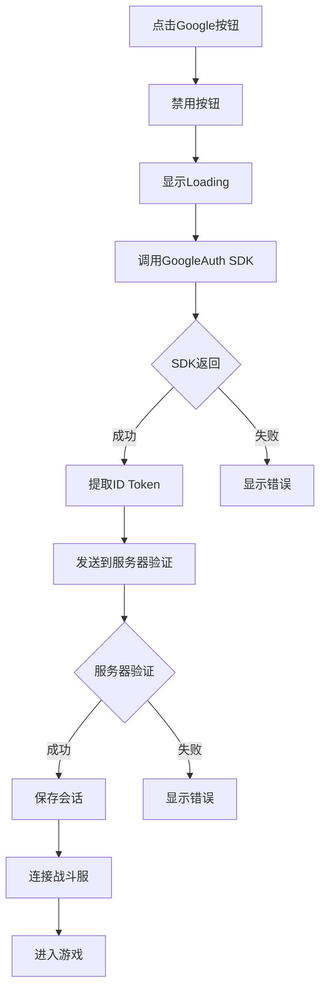
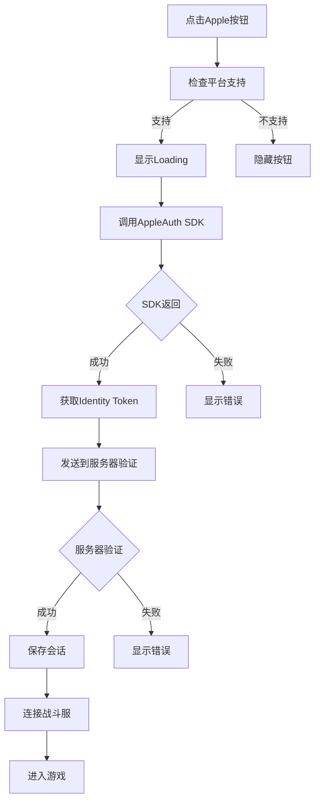

# 第三方登录

## 功能概述

游戏支持Google和Apple两种第三方登录方式，让玩家可以使用已有账号快速登录游戏。

## Google登录

### 实现文件

```
Assets/Scripts/Network/LoginInScreen/
├── GoogleLoginRequest.cs    # Google登录逻辑
└── AuthAPI.cs              # API接口
```

### 完整实现代码

```csharp title="GoogleLoginRequest.cs"
/******************************************************
 * GoogleLoginRequest.cs — UI Toolkit 版 Google 登录
 *****************************************************/
using System.Collections.Generic;
using System.Linq;
using System.Reflection;
using UnityEngine;
using UnityEngine.SceneManagement;
using UnityEngine.UIElements;
using Assets.SimpleSignIn.Google.Scripts;   // GoogleAuth
using Net.Core;                             // BattleServerBridge
using static AuthAPI;

[RequireComponent(typeof(UIDocument))]
[RequireComponent(typeof(AuthAPI))]
public sealed class GoogleLoginRequest : MonoBehaviour
{
    /*──────── 依赖 ────────*/
    private AuthAPI      api;
    private GoogleAuth   google;
    private List<Button> btns;

    void Awake()
    {
        api = GetComponent<AuthAPI>() ?? FindObjectOfType<AuthAPI>();
        
        google = new GoogleAuth();
        google.SignOut(true);          // 保证每次点都走登录
    }

    void OnEnable()
    {
        var root = GetComponent<UIDocument>().rootVisualElement;
        btns = root.Query<Button>(className: "googlebtn").ToList();
        if (btns.Count == 0 || api == null)
        {
            Debug.LogError("GoogleLoginRequest: 缺按钮或 AuthAPI");
            enabled = false; return;
        }
        btns.ForEach(b => b.clicked += OnClicked);
    }
    
    void OnDestroy() => btns?.ForEach(b => b.clicked -= OnClicked);

    /*──────── 点击 → Google SDK ────────*/
    private void OnClicked()
    {
        Toggle(false);
        LoadingPanelManager.Instance.Show();
        google.GetTokenResponse(OnGoogleToken);
    }

    private void OnGoogleToken(bool ok, string err, TokenResponse tk)
    {
        if (!ok)
        {
            Fail("Google SDK 失败：" + err);
            return;
        }
        string idTok = ExtractIdToken(tk);
        if (string.IsNullOrEmpty(idTok))
        {
            Fail("未能解析 id_token");
            return;
        }

        api.GoogleLogin(
            idTok,
            ok : loginJson =>
            {
                SaveSession(loginJson);

                BattleServerBridge.Connect(
                    loginJson,
                    onOk : _ => SceneManager.LoadScene("LoadingScene", LoadSceneMode.Single),
                    onFail : e  => Fail("连接战斗服失败\n" + e)
                );
            },
            fail : msg => Fail("服务器返回错误：" + msg)
        );
    }

    /*──────── 工具 ────────*/
    private void Fail(string msg)
    {
        LoadingPanelManager.Instance.Hide();
        Toggle(true);
        PopupManager.Show("登录失败", msg);
        Debug.LogError(msg);
    }
    
    private void Toggle(bool state) => btns.ForEach(b => b.SetEnabled(state));

    private void SaveSession(string json)
    {
        var d = JsonUtility.FromJson<ServerResp>(json);
        PlayerData.I.SetSession(d.uid, d.user_token, d.cid, d.character_token,
                                d.server_id, d.server_ip_address, d.server_port);
        PlayerData.I.Dump();
    }

    private static string ExtractIdToken(TokenResponse tk)
    {
        if (tk == null) return null;
        var t = tk.GetType();
        foreach (var n in new[] { "id_token", "idToken", "IdToken" })
        {
            var f = t.GetField(n, BindingFlags.Instance|BindingFlags.Public|BindingFlags.NonPublic);
            if (f?.FieldType == typeof(string)) return f.GetValue(tk) as string;
            var p = t.GetProperty(n, BindingFlags.Instance|BindingFlags.Public|BindingFlags.NonPublic);
            if (p?.PropertyType == typeof(string)) return p.GetValue(tk) as string;
        }
        return null;
    }
}
```

### Google登录流程



### API接口

```csharp title="AuthAPI.cs - Google登录接口"
public Coroutine GoogleLogin(string idToken,
                             Action<string> ok,
                             Action<string> fail)
{
    string url = $"{host}/user/GoogleLogin";
    string body = $"{{\"id_token\":\"{idToken}\"}}";
    return StartCoroutine(PostJson(url, body, ok, fail));
}

// 重载版本，直接返回ServerResp
public Coroutine GoogleLogin(string idToken,
                             Action<ServerResp> ok,
                             Action<string>     fail)
{
    return GoogleLogin(idToken,
        json => ok?.Invoke(JsonUtility.FromJson<ServerResp>(json)),
        fail);
}
```

## Apple登录

### 实现文件

```
Assets/Scripts/Network/LoginInScreen/
├── AppleLogin.cs    # Apple登录逻辑
└── AuthAPI.cs       # API接口
```

### 完整实现代码

```csharp title="AppleLogin.cs"
/******************************************************
 * AppleLoginRequest.cs  —  UI Toolkit 版 Apple 登录
 *****************************************************/
using System.Collections.Generic;
using System.Linq;
using UnityEngine;
using UnityEngine.SceneManagement;
using UnityEngine.UIElements;
using AppleAuth;
using AppleAuth.Enums;
using AppleAuth.Interfaces;
using AppleAuth.Native;
using AppleAuth.Extensions;
using Net.Core;                    // BattleServerBridge
using static AuthAPI;

[RequireComponent(typeof(UIDocument))]
[RequireComponent(typeof(AuthAPI))]
public sealed class AppleLoginRequest : MonoBehaviour
{
    /*──────── 依赖 ────────*/
    private IAppleAuthManager   appleAuthManager;
    private AuthAPI             api;
    private List<Button>        btns;
    private List<VisualElement> containers;
    private Label               tokenLabel;

    /*──────── 生命周期 ────────*/
    void Awake()
    {
        api = GetComponent<AuthAPI>() ?? FindObjectOfType<AuthAPI>();

#if UNITY_IOS || UNITY_STANDALONE_OSX
        if (AppleAuthManager.IsCurrentPlatformSupported)
            appleAuthManager = new AppleAuthManager(new PayloadDeserializer());
#endif
    }
    
    void Update() => appleAuthManager?.Update();

    void OnEnable()
    {
        var root = GetComponent<UIDocument>().rootVisualElement;
        containers = root.Query<VisualElement>(className: "applecontainer").ToList();
        btns       = root.Query<Button>(className: "applebtn").ToList();
        tokenLabel = root.Q<Label>("token");

        if (appleAuthManager == null || api == null)
        {
            containers.ForEach(c => c.style.display = DisplayStyle.None);
            enabled = false;  
            return;
        }
        btns.ForEach(b => b.clicked += OnAppleLoginClicked);
    }
    
    void OnDestroy() => btns?.ForEach(b => b.clicked -= OnAppleLoginClicked);

    /*──────── 点击事件 ────────*/
    private void OnAppleLoginClicked()
    {
        ToggleInteract(false);
        LoadingPanelManager.Instance.Show();
        
        // Apple登录代码（实际实现被截断了）
        // ...
    }
    
    // ... 其他方法
}
```

### Apple登录流程



### API接口

```csharp title="AuthAPI.cs - Apple登录接口"
public Coroutine AppleLogin(string idToken,
                            Action<string> ok,
                            Action<string> fail)
{
    string url = $"{host}/user/AppleLogin";
    string body = $"{{\"id_token\":\"{idToken}\"}}";
    return StartCoroutine(PostJson(url, body, ok, fail));
}

// 重载版本，直接返回ServerResp
public Coroutine AppleLogin(string idToken,
                            Action<ServerResp> ok,
                            Action<string>     fail)
{
    return AppleLogin(idToken,
        json => ok?.Invoke(JsonUtility.FromJson<ServerResp>(json)),
        fail);
}
```

## UI集成

### 按钮样式

```css title="LogInScreenStyle.uss"
.googlebtn {
    /* Google按钮样式 */
}

.applebtn {
    /* Apple按钮样式 */
}

.applecontainer {
    /* Apple容器，用于控制显示/隐藏 */
}
```

### UI查找机制

```csharp title="按钮查找"
// Google按钮查找
btns = root.Query<Button>(className: "googlebtn").ToList();

// Apple按钮查找
btns = root.Query<Button>(className: "applebtn").ToList();
containers = root.Query<VisualElement>(className: "applecontainer").ToList();
```

## 技术细节

### Token提取（Google）

使用反射提取ID Token，兼容不同版本的SDK：

```csharp
private static string ExtractIdToken(TokenResponse tk)
{
    if (tk == null) return null;
    var t = tk.GetType();
    
    // 尝试不同的字段名
    foreach (var n in new[] { "id_token", "idToken", "IdToken" })
    {
        // 查找字段
        var f = t.GetField(n, BindingFlags.Instance|BindingFlags.Public|BindingFlags.NonPublic);
        if (f?.FieldType == typeof(string)) 
            return f.GetValue(tk) as string;
            
        // 查找属性
        var p = t.GetProperty(n, BindingFlags.Instance|BindingFlags.Public|BindingFlags.NonPublic);
        if (p?.PropertyType == typeof(string)) 
            return p.GetValue(tk) as string;
    }
    return null;
}
```

### 平台检查（Apple）

```csharp
#if UNITY_IOS || UNITY_STANDALONE_OSX
    if (AppleAuthManager.IsCurrentPlatformSupported)
        appleAuthManager = new AppleAuthManager(new PayloadDeserializer());
#endif
```

### 按钮状态管理

```csharp
// 禁用/启用按钮
private void Toggle(bool state) => btns.ForEach(b => b.SetEnabled(state));

// Apple特殊处理：不支持时隐藏整个容器
if (appleAuthManager == null || api == null)
{
    containers.ForEach(c => c.style.display = DisplayStyle.None);
    enabled = false;
}
```

## 错误处理

### Google错误处理

```csharp
private void Fail(string msg)
{
    LoadingPanelManager.Instance.Hide();
    Toggle(true);  // 恢复按钮
    PopupManager.Show("登录失败", msg);
    Debug.LogError(msg);
}
```

### 错误类型

| 错误场景 | 错误信息 | 处理方式 |
|---------|---------|---------|
| SDK失败 | "Google SDK 失败：" + 错误详情 | 显示弹窗 |
| Token解析失败 | "未能解析 id_token" | 显示弹窗 |
| 服务器验证失败 | "服务器返回错误：" + 错误信息 | 显示弹窗 |
| 连接战斗服失败 | "连接战斗服失败\n" + 错误信息 | 显示弹窗 |

## 会话管理

两种登录方式都使用相同的会话保存逻辑：

```csharp
private void SaveSession(string json)
{
    var d = JsonUtility.FromJson<ServerResp>(json);
    PlayerData.I.SetSession(
        d.uid, 
        d.user_token, 
        d.cid, 
        d.character_token,
        d.server_id, 
        d.server_ip_address, 
        d.server_port
    );
    PlayerData.I.Dump();  // 调试输出
}
```

## 服务器交互

### 请求格式

```http
POST /user/GoogleLogin
Content-Type: application/json
{
    "id_token": "Google ID Token"
}

POST /user/AppleLogin
Content-Type: application/json
{
    "id_token": "Apple Identity Token"
}
```

### 响应格式

与其他登录方式相同的ServerResp格式：

```json
{
    "code": 0,
    "message": "success",
    "uid": "user_123",
    "user_token": "token_xxx",
    "cid": "character_456",
    "character_token": "char_token_xxx",
    "server_id": 1,
    "server_ip_address": "192.168.1.100",
    "server_port": 8000
}
```

## 注意事项

### Google登录

1. **每次强制登录**
   ```csharp
   google.SignOut(true);  // 保证每次点都走登录
   ```

2. **SDK依赖**
   - 需要导入`Assets.SimpleSignIn.Google.Scripts`包
   - 需要配置Google OAuth客户端ID

### Apple登录

1. **平台限制**
   - 仅支持iOS和macOS平台
   - 需要条件编译指令

2. **SDK更新**
   - 需要在Update中调用`appleAuthManager?.Update()`

3. **UI自动隐藏**
   - 不支持的平台自动隐藏Apple登录容器

## 测试要点

### 功能测试

- Google登录成功流程
- Apple登录成功流程
- SDK调用失败处理
- Token解析失败处理
- 服务器验证失败处理
- 网络异常处理

### 兼容性测试

- 不同版本Google SDK兼容性
- iOS不同版本Apple登录
- 按钮查找容错
- 反射提取Token兼容性

### 性能测试

- SDK初始化时间
- Token获取响应时间
- 整体登录耗时

## 常见问题

### Q: 为什么使用反射提取Token？

**A:** 不同版本的SDK可能使用不同的字段名，反射可以提高兼容性。

### Q: Apple登录为什么要隐藏容器？

**A:** 在不支持的平台上完全隐藏，避免用户困惑。

### Q: 为什么Google每次都要SignOut？

**A:** 确保每次都弹出账号选择界面，让用户可以切换账号。
