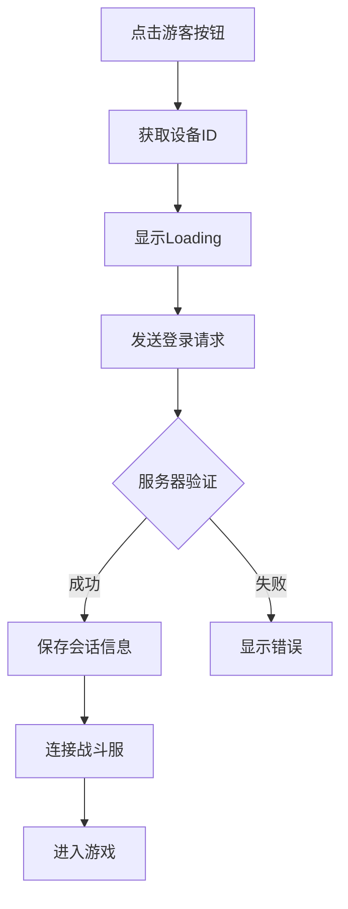

# 游客登录

## 功能概述

游客登录允许玩家无需注册即可快速体验游戏，通过设备唯一标识符自动创建临时账号。

## 技术实现

### 实现文件

```
Assets/Scripts/Network/LoginInScreen/
├── VisitorLoginRequest.cs    # 游客登录逻辑
├── AuthAPI.cs               # API接口
└── AccountAuthController.cs  # UI绑定
```

### 核心流程



### 完整实现代码

```csharp title="VisitorLoginRequest.cs"
/***************************************************************
 * VisitorLoginRequest.cs —— 游客登录入口
 *
 * 依赖：
 *   • AuthAPI            — 提供 VisitorLogin HTTP 调用
 *   • BattleServerBridge — 封装 BattleServerConnector 跳转
 *   • LoadingPanelManager(单例) + LoadingScene
 *
 * 用法：
 *   在 UI 按钮 onClick 中拖拽本脚本，调用 SendVisitorPlay()
 ****************************************************************/
using UnityEngine;
using UnityEngine.SceneManagement;
using Net.Core;              // BattleServerBridge
using static AuthAPI;         // 若 AuthAPI 内有公共 DTO，可保留

[RequireComponent(typeof(AuthAPI))]
public class VisitorLoginRequest : MonoBehaviour
{
    /*──────── 依赖 ────────*/
    private AuthAPI api;

    void Awake() => api = GetComponent<AuthAPI>();

    /*──────── 外部触发 ────────*/
    public void SendVisitorPlay()
    {
        string deviceId = SystemInfo.deviceUniqueIdentifier;
        LoadingPanelManager.Instance.Show();           // 显示转圈

        api.VisitorLogin(
            deviceId,
            onSuccess: loginJson =>
            {
                /* ① 解析并缓存会话（可选） */
                var s = JsonUtility.FromJson<ServerResp>(loginJson);
                PlayerData.I.SetSession(
                    s.uid, s.user_token,
                    s.cid, s.character_token,
                    s.server_id, s.server_ip_address, s.server_port);
                PlayerData.I.Dump();

                /* ② 连接战斗服 */
                BattleServerBridge.Connect(
                    loginJson,
                    onOk: _ =>
                    {
                        // 鉴权通过：进入 LoadingScene，由 Loader.cs 负责后台加载 MainUI
                        SceneManager.LoadScene("LoadingScene", LoadSceneMode.Single);
                    },
                    onFail: err =>
                    {
                        LoadingPanelManager.Instance.Hide();
                        //PopupManager.Show("连接战斗服失败", err);
                    });
            },
            onFail: msg =>
            {
                LoadingPanelManager.Instance.Hide();
                PopupManager.Show("游客登录失败！\n" + msg);
            });
    }
}
```

### API接口实现

```csharp title="AuthAPI.cs - 游客登录接口"
/*──────────────────────────────────────────────────────
 *  访客登录
 *──────────────────────────────────────────────────────*/
public Coroutine VisitorLogin(string deviceId,
                              Action<string> onSuccess,
                              Action<string> onFail)
{
    string url = $"{host}/user/VisitorPlay";
    string body = $"{{\"device_id\":\"{deviceId}\"}}";
    return StartCoroutine(PostJson(url, body, onSuccess, onFail));
}
```

## UI集成

### 按钮绑定

```csharp title="AccountAuthController.cs - UI绑定"
void Awake()
{
    var root = GetComponent<UIDocument>().rootVisualElement;
    api = GetComponent<AuthAPI>();
    visitorApi = GetComponent<VisitorLoginRequest>();
    
    /*── 游客按钮 ──*/
    root.Query<Button>(className: "visitorbtn")
        .ForEach(b => b.clicked += visitorApi.SendVisitorPlay);
        
    // ... 其他初始化
}
```

### UXML布局

```xml title="LogInScreenVisualTree.uxml"
<ui:VisualElement name="GuestlogInContainer" style="flex-grow: 0; align-items: center; justify-content: center; flex-shrink: 0; width: 20%;">
    <ui:Button 
        name="GuestLogo" 
        class="buttons border visitorbtn" 
        style="background-image: url('accounticon.png'); background-size: 50% 50%;" />
    <ui:Label text="游客" name="GuestText" class="englishText" />
</ui:VisualElement>
```

### 样式定义

```css title="LogInScreenStyle.uss"
.visitorbtn {
    /* 游客按钮样式通过class定义 */
}
```

## 设备ID获取

### Unity内置方法

```csharp
// 获取设备唯一标识符
string deviceId = SystemInfo.deviceUniqueIdentifier;
```

### 平台差异

| 平台 | 标识符来源 | 持久性 |
|------|-----------|--------|
| iOS | IdentifierForVendor | 应用卸载后重置 |
| Android | Android ID | 恢复出厂设置后重置 |
| PC | 硬件信息哈希 | 硬件不变则不变 |
| WebGL | 浏览器指纹 | 清除缓存后可能变化 |

## 服务器交互

### 请求格式

```http
POST /user/VisitorPlay
Content-Type: application/json

{
    "device_id": "设备唯一标识符"
}
```

### 响应格式

```json title="成功响应"
{
    "code": 0,
    "message": "success",
    "uid": "visitor_123456",
    "user_token": "token_xxxxx",
    "cid": "character_789",
    "character_token": "char_token_xxx",
    "server_id": 1,
    "server_ip_address": "192.168.1.100",
    "server_port": 8000
}
```

### 错误处理

```csharp
// 失败时的处理
onFail: msg =>
{
    LoadingPanelManager.Instance.Hide();
    PopupManager.Show("游客登录失败！\n" + msg);
}
```

## 会话管理

### PlayerData存储

```csharp title="保存游客会话信息"
var s = JsonUtility.FromJson<ServerResp>(loginJson);
PlayerData.I.SetSession(
    s.uid,                  // 游客用户ID
    s.user_token,          // 用户令牌
    s.cid,                 // 角色ID
    s.character_token,     // 角色令牌
    s.server_id,           // 服务器ID
    s.server_ip_address,   // 服务器IP
    s.server_port          // 服务器端口
);
PlayerData.I.Dump();  // 调试输出
```

## 连接战斗服

### BattleServerBridge使用

```csharp
BattleServerBridge.Connect(
    loginJson,  // 登录服返回的JSON
    onOk: _ =>
    {
        // 鉴权通过：进入LoadingScene
        SceneManager.LoadScene("LoadingScene", LoadSceneMode.Single);
    },
    onFail: err =>
    {
        LoadingPanelManager.Instance.Hide();
        // 注意：这里PopupManager.Show被注释了
        //PopupManager.Show("连接战斗服失败", err);
    }
);
```

## 用户体验

### Loading显示

```csharp
// 开始请求时显示
LoadingPanelManager.Instance.Show();

// 失败时隐藏
LoadingPanelManager.Instance.Hide();
```

### 错误提示

```csharp
// 使用PopupManager显示错误
PopupManager.Show("游客登录失败！\n" + msg);
```

## 注意事项

### 1. 设备绑定

- 游客账号绑定到设备ID
- 更换设备将无法找回账号
- 建议引导用户后续绑定正式账号

### 2. 数据安全

- 游客数据可能丢失
- 卸载应用可能导致账号无法找回
- 重要进度应提醒用户注册

### 3. 注释代码

```csharp
// 连接战斗服失败时的提示被注释了
//PopupManager.Show("连接战斗服失败", err);
```
这可能是为了避免重复提示或有其他处理机制。

## 测试要点

### 功能测试

- 首次游客登录
- 重复游客登录（同设备）
- 网络异常处理
- Loading显示正确

### 边界条件

- 设备ID获取失败
- 服务器返回错误
- 连接战斗服失败

### 兼容性测试

- 各平台设备ID获取
- 不同网络环境
- 应用重装后的表现

## 常见问题

### Q: 游客账号可以转正吗？

**A:** 项目代码中暂未看到游客转正功能的实现。

### Q: 游客数据会保存多久？

**A:** 取决于服务器策略，客户端只要设备ID不变就能登录同一账号。
