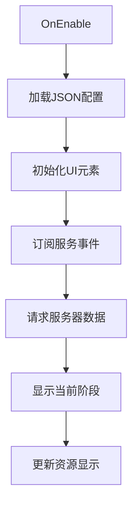
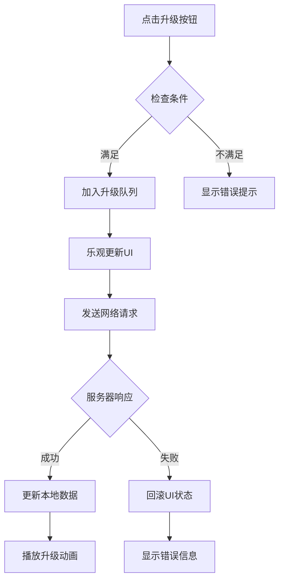
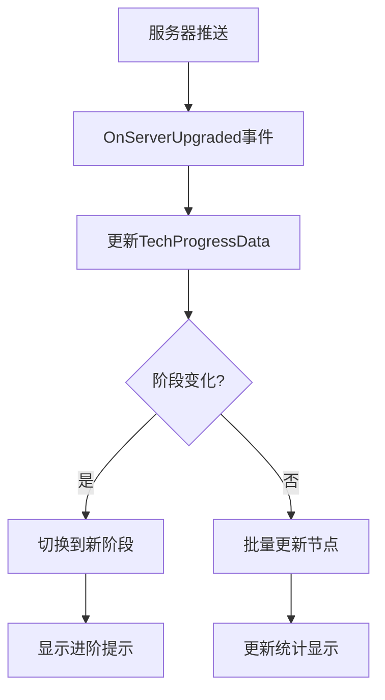

# 个人科技树系统

## 系统概述

个人科技树是一个多阶段渐进式成长系统，玩家通过消耗科技卷轴升级各项科技获得永久属性加成。

### 核心特性
- **8个发展阶段**：每阶段10-16个可升级节点
- **20种属性加成**：涵盖资源、战斗、行军等各方面
- **自动进阶机制**：完成当前阶段70%自动解锁下一阶段
- **实时数据同步**：客户端服务器双向同步
- **防并发机制**：队列处理防止重复升级

## 系统架构

### 模块组成

```
┌─────────────────────────────────────────────┐
│                  UI层                        │
│         ProSkillTree (SkillTree.cs)         │
│     负责：界面渲染、交互处理、动画效果         │
└─────────────────────────────────────────────┘
                      ↕
┌─────────────────────────────────────────────┐
│                 业务逻辑层                    │
│         TechTreeService.cs                  │
│     负责：升级队列、并发控制、状态管理         │
└─────────────────────────────────────────────┘
                      ↕
┌─────────────────────────────────────────────┐
│                 网络通信层                    │
│           MessageHub / NetworkCore          │
│     负责：请求发送、响应处理、错误重试         │
└─────────────────────────────────────────────┘
                      ↕
┌─────────────────────────────────────────────┐
│                 数据层                       │
│   TechProgressData.cs / TechTreeCalculator  │
│     负责：数据存储、加成计算、配置解析         │
└─────────────────────────────────────────────┘
```

### 核心类职责

#### ProSkillTree (SkillTree.cs)
```csharp
// 文件：Assets/Scripts/SkillTree/SkillTree.cs
// 主控制器，管理整个科技树UI
public class ProSkillTree : MonoBehaviour
{
    // 核心职责：
    // 1. 管理UI元素和用户交互
    // 2. 处理节点选中和升级请求
    // 3. 显示动画和视觉反馈
    // 4. 同步服务器数据到UI
}
```

#### TechTreeService
```csharp
// 文件：Assets/Scripts/Network/Core/Service/TechTreeService.cs
// 网络服务层，处理与服务器通信
public class TechTreeService : MonoBehaviour
{
    // 核心职责：
    // 1. 管理升级请求队列
    // 2. 防止并发升级冲突
    // 3. 处理网络请求和响应
    // 4. 触发数据更新事件
}
```

#### TechTreeCalculator
```csharp
// 文件：Assets/Scripts/SkillTree/TechTreeCalculator.cs
// 静态计算器，处理加成计算
public static class TechTreeCalculator
{
    // 核心职责：
    // 1. 解析techtree.json配置
    // 2. 根据进度计算总加成
    // 3. 提供加成查询接口
}
```

#### TechProgressData
```csharp
// 文件：Assets/Scripts/SkillTree/TechProgressData.cs
// ScriptableObject数据容器
public sealed class TechProgressData : ScriptableObject
{
    // 核心数据：
    // - CurrentStage: 当前阶段(1-8)
    // - Progress: 进度字符串如"0032020020"
    // - StageLayouts: 各阶段节点布局
    // - Bonus: 计算后的总加成
}
```

## 工作流程

### 初始化流程


### 升级流程


### 数据同步流程


## 关键机制

### 1. 并发控制机制
- **节点级锁定**：每个节点独立的升级状态标记
- **升级队列**：FIFO队列确保请求顺序执行
- **状态检查**：请求前验证节点是否已在升级中

### 2. 乐观更新机制
- **即时反馈**：点击后立即更新UI显示
- **临时状态**：使用optimisticLevels字典存储
- **失败回滚**：请求失败时恢复原始状态

### 3. 自动进阶机制
- **进度计算**：实时统计当前阶段完成度
- **阈值检测**：达到70%自动触发进阶
- **无缝切换**：保持UI状态平滑过渡

### 4. 数据持久化
- **ScriptableObject存储**：进度数据持久化到asset文件
- **自动保存**：每次升级后自动标记dirty
- **布局缓存**：首次生成的随机布局永久保存

## 性能优化

### UI优化
- **对象池复用**：节点元素复用减少GC
- **批量更新**：同时更新多个节点减少重绘
- **延迟加载**：仅渲染当前阶段节点

### 网络优化
- **请求合并**：队列机制避免频繁请求
- **本地缓存**：减少重复数据请求
- **增量更新**：仅同步变化的数据

### 内存优化
- **按需加载**：JSON数据延迟解析
- **资源释放**：切换阶段时清理旧数据
- **事件解绑**：OnDisable时解除所有订阅

## 扩展性设计

### 新增阶段
1. 在techtree.json添加新阶段配置
2. 无需修改代码，自动识别和加载

### 新增属性
1. 在AllStatKeys数组添加属性名
2. 在BonusData类添加对应字段
3. 配置JSON中的加成数值

### 自定义动画
1. 继承并重写ShowUpgradeAnimation方法
2. 自定义FloatingTextAnimation协程
3. 修改视觉效果参数

## 注意事项

### 关键约定
1. **进度字符串**：每个字符代表对应位置节点的等级(0-9)
2. **节点索引**：从1开始，需转换为0基索引
3. **阶段编号**：1-8，跳过某些编号(如7)也能正常工作

### 常见问题
1. **数据不同步**：检查TechProgressData是否正确更新
2. **升级失败**：查看队列状态和网络日志
3. **UI不刷新**：确认事件订阅是否正确

### 调试技巧
1. 使用Debug.Log输出关键状态变化
2. 检查nodeUpgradeStates字典了解升级状态
3. 监控upgradeQueue队列了解请求积压